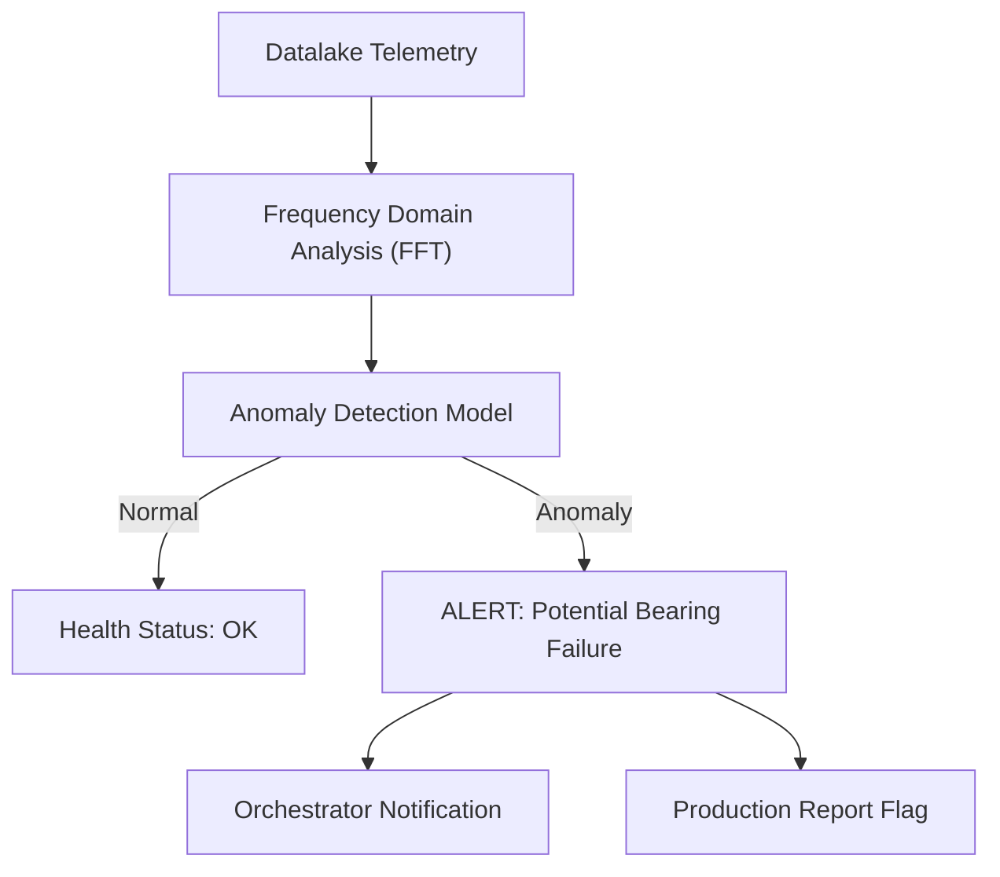

<p align="center">
  
</p>

# 🔍 HYDRA-UMC-ANOMALY-DETECTOR

<p align="center">🇺🇸 <b>English</b> | <a href="README_spa.md">🇪🇸 Español</a> | <a href="README_fra.md">🇫🇷 Français</a> | <a href="README_ita.md">🇮🇹 Italiano</a> | <a href="README_deu.md">🇩🇪 Deutsch</a> | <a href="README_zho.md">🇨🇳 简体中文</a> | <a href="README_jpn.md">🇯🇵 日本語</a></p>

### 🧠 AI-Driven Predictive Maintenance & Motor Vibration Analysis

<p align="left">
  
  
  
</p>

---

## 1. 🛠️ TECHNICAL OVERVIEW

**HYDRA-UMC-ANOMALY-DETECTOR** is the proactive guardian of robotic health. It uses AI models to analyze high-frequency telemetry (vibrations, motor current signatures, and thermal profiles) to detect failures before they happen.

By monitoring the "digital fingerprint" of every motor and tool head, it can identify bearing wear, loose belts, or cooling failures weeks in advance, enabling scheduled maintenance instead of emergency repairs.

### Key Features:
* 🔍 **Signature Analysis:** Real-time FFT (Fast Fourier Transform) of motor currents to detect mechanical imbalance.
* 📉 **Predictive Maintenance:** AI-driven RUL (Remaining Useful Life) estimation for NEMA motors and URTC tools.
* 🚨 **Early Warning System:** Triggers alerts in the Studio and Watch interfaces when abnormal patterns emerge.
* 🧬 **Learning Models:** Continuously improves detection accuracy by learning from the Datalake's history.
* 🏷️ **Model Versioning:** Every `Verdict` carries the real, monotonic model version and threshold it was scored against - a refit is a real, traceable event. *(implemented)*
* 📐 **Precision/Recall Metrics:** Real, computed precision/recall/F1 over a labeled fixture (`metrics.py`), not just prose claims about score separation. *(implemented)*
* 📈 **Simulated Drift Detection:** `DriftMonitor` flags a real, sustained rolling-mean elevation distinct from any single window's own anomaly flag. *(implemented)*

---

## 2. 🔄 DETECTION PIPELINE



---

## 3. 🧱 ARCHITECTURE & DESIGN DECISIONS

* **Why this is a sibling, not a submodule, of HYDRA-UMC-DATALAKE.** Anomaly detection is a read-only analytics workload against already-stored telemetry - keeping it separate means a detector crash or a slow model inference never blocks HYDRA-UMC-TELEMETRY-COLLECTOR's own writes into the same store.
* **Why FFT + a statistical baseline today, not a trained neural network yet.** The README calls this "AI-driven" - what's real and shipping in this first pass is a legitimate, real signal-processing technique (`src/hydra_umc_anomaly_detector/fft.py`, numpy's own FFT) plus a per-frequency-bin statistical baseline learned from known-healthy windows (`baseline.py`) and a max-z-score verdict (`detector.py`) - not a trained deep-learning model. It works, it's tested against real synthetic fault signatures, and it's the right foundation a learned model gets built on top of later (see the ROADMAP section below) - but calling it a neural network here would overstate what's actually running.
* **Why a max-z-score across every bin, not a fixed threshold.** A fixed threshold ('motor temp > 80C') misses gradual drift and false-alarms on legitimate load spikes - comparing the LIVE spectrum's every bin against this specific motor's OWN learned healthy baseline catches a new/shifted frequency peak (a real bearing-defect signature) without either failure mode. The default cutoff (10.0) was picked from real empirical separation, not guessed - see `detector.py`'s own docstring for the actual numbers from this project's synthetic healthy-vs-faulty test fixtures.
* **How this fits the rest of the ecosystem.** A sibling service under HYDRA-UMC-DATALAKE - runs anomaly detection over the telemetry HYDRA-UMC-TELEMETRY-COLLECTOR already wrote there.
* **Why `DriftMonitor` is a separate mechanism from `AnomalyDetector.score()`, not a bigger threshold.** They answer different real questions: "is THIS window anomalous" (a single-shot verdict) versus "has the RECENT average quietly shifted" (a rolling trend, robust to one noisy outlier window). A real simulated-drift test found and honestly documents that for this detector's max-z-score design, a single window's own flag actually trips *before* the rolling drift signal for a new-frequency-type fault - `DriftMonitor`'s real value here is a sustained-trend confirmation, not an earlier warning, and the code says so rather than overselling it.
* **Why `metrics.py` computes precision/recall instead of leaving the threshold's quality as prose.** `detector.py`'s own docstring used to only claim "healthy scored up to ~5.3, faulty scored in the hundreds" - real, but not a number a future re-tuning could regress-test against. `precision_recall()` over the same real fixture gives that a real, checkable value (1.0/1.0 today).

---

## 📂 DIRECTORY STRUCTURE

Pure-software service (ML/analytics) with no hardware, firmware or OS of its own; those folders are omitted by the repository structure policy.

```text
HYDRA-UMC-ANOMALY-DETECTOR/
├── src/hydra_umc_anomaly_detector/  # Source code
│   ├── __init__.py                  # Package version
│   ├── fft.py                       # Real FFT-based spectrum (numpy)
│   ├── baseline.py                  # Per-bin healthy statistical profile (mean/std)
│   ├── detector.py                  # Fits a Baseline, scores live windows against it
│   ├── metrics.py                   # Real precision/recall/F1 over a labeled fixture
│   ├── drift.py                     # Real rolling-mean drift detection
│   ├── api.py                        # Plain JSON/HTTP handlers wrapping the detector
│   └── main.py                       # Entry point: wires everything, starts the HTTP server
├── tests/                   # pytest - FFT correctness, baseline stats, real fault detection, metrics, simulated drift
├── docs/
│   └── API.md               # Real HTTP endpoint reference (requests, responses, status codes)
├── images/                  # Media and diagrams
├── systemd/
│   └── hydra-umc-anomaly-detector.service # Local CM5 anomaly-detection API systemd unit
├── tools/
│   ├── build_test.py        # Build/compile check without bumping version
│   └── ci_validate.py       # Manifest/CHANGELOG/docs validation used by CI
├── build/                   # Build output (gitignored)
├── pyproject.toml           # Package metadata, version, dependencies (numpy)
├── bump_version.py          # Odometer-style version bump (run by build)
├── bump_manifest_version.py # Syncs hydra-umc.project.json's version to the native one (--sync)
├── build.sh / build.bat     # Real build: venv + editable install + bump + tests
├── run.sh / run.bat         # Real run: starts the HTTP API
└── README.md
```

Pruned from the original template: `hardware/`, `firmware/` and `os/` —
this is a pure software service (Python package) with no dedicated
hardware or firmware of its own and no operating system image to
maintain. See [`docs/API.md`](docs/API.md) for the full HTTP endpoint
reference.

---

## 4. ⚙️ BUILD & RUN GUIDE

Requires Python >= 3.10. Real FFT-based anomaly detection with an HTTP
API, not just a skeleton that imports.

```bash
# Linux/macOS
./build.sh
./run.sh --port 8097

# Windows
build.bat
run.bat --port 8097
```

`build` creates/activates a local `.venv`, installs the package (editable,
with dev extras, including `numpy`) into it, verifies the import, and runs
the real test suite (`pytest`). `run` starts the HTTP API and forwards any
flags to it (`--addr`, `--port`, `--sample-rate`, `--threshold`).

```bash
# Calibrate against known-healthy signal windows (JSON arrays of floats,
# same sample rate as --sample-rate)
curl -X POST localhost:8097/baseline/fit -d '{"windows": [[...], [...], ...]}'

# Score a live window against the fitted baseline
curl -X POST localhost:8097/detect -d '{"window": [...]}'
# -> {"score": 6.3, "anomalous": false, "worstBinFreqHz": 276.0}

curl localhost:8097/stats
```

```bash
python -m pytest tests/ -v   # fft.py (a known sine wave's peak frequency
                              # is found correctly, DC is genuinely
                              # dropped), baseline.py (correct mean/std,
                              # the zero-std floor prevents a real
                              # division-by-zero), detector.py (the
                              # actual promise: a synthetic fault signal
                              # is flagged, a healthy-looking one is not,
                              # with real separation margin - not a
                              # knife-edge threshold), and api.py (real
                              # HTTP round-trips via a genuine
                              # ThreadingHTTPServer)
```

---

## 🚀 ROADMAP
* **Phase 1:** Datalake high-throughput ingestion and indexing for historical analysis.
* **Phase 2:** Telemetry collector edge-compression and secure transmission protocols.
* **Phase 3:** Anomaly detection using unsupervised learning and motor vibration analysis.
* **Phase 4:** Integration of acoustic analysis for "hearing" early mechanical issues and AI-driven predictive insights.

---

## 🔗 Related Projects

This project is part of the HYDRA-UMC robotics ecosystem by the same author (JuanenRac / Electro Hobby 3D). Worth knowing about, since a request might actually be about one of these rather than this repository.

**Parent Project**
- **[HYDRA-UMC-DATALAKE](https://github.com/JuanenRac/HYDRA-UMC-DATALAKE)** — real sqlite3-backed time-series store with a real ingest/query HTTP API; the parent this repo is one specific analytics service of, within its own data-and-analytics layer.

**Sibling Projects** — the other analytics services of HYDRA-UMC-DATALAKE's own data-and-analytics layer
- **[HYDRA-UMC-TELEMETRY-COLLECTOR](https://github.com/JuanenRac/HYDRA-UMC-TELEMETRY-COLLECTOR)** — real CAN/WebSocket ingestion pipeline into DATALAKE, with sequence deduplication.
- **[HYDRA-UMC-PRODUCTION-REPORTS](https://github.com/JuanenRac/HYDRA-UMC-PRODUCTION-REPORTS)** — real OEE/availability calculation over DATALAKE history, with reproducible CSV export.

**Directly Related**
- **[HYDRA-UMC-STUDIO](https://github.com/JuanenRac/HYDRA-UMC-STUDIO)** — web control dashboard with real-time multi-robot 3D visualization — surfaces this detector's real early-warning alerts directly in the control UI.
- **[HYDRA-UMC-WATCH](https://github.com/JuanenRac/HYDRA-UMC-WATCH)** — WearOS companion app with real haptic alerts and a paired-phone voice relay — the same alert surface, for whoever is watching fleet health rather than driving a robot.
- **[URTC](https://github.com/JuanenRac/URTC)** — firmware for the physical Universal Robot Tool Controller PCB, 25+ tool profiles over CAN bus — RUL estimation here covers URTC's own tool heads too, not just the NEMA motors in the arms themselves.

**Also Part of the Ecosystem**

*Core Hardware & Platform*
- **[HYDRA-UMC](https://github.com/JuanenRac/HYDRA-UMC)** — the physical robot-arm motherboard: CM5 host + dual-core STM32H745, orchestrating up to 8 tool arms over CAN-OTA/SPI-OTA.
- **[HYDRA-UMC-OS](https://github.com/JuanenRac/HYDRA-UMC-OS)** — reproducible Raspberry Pi OS product layer for the CM5: read-only agent, validated config/profiles, WiFi first-contact provisioning.
- **[HYDRA-UMC-SDK](https://github.com/JuanenRac/HYDRA-UMC-SDK)** — the shared JSON-Schema contract and safety-gate boundary every bridge validates its commands against.

*Core Backend & Clients*
- **[HYDRA-UMC-SERVER](https://github.com/JuanenRac/HYDRA-UMC-SERVER)** — the real headless backend (REST/WebSocket) every control client actually talks to.
- **[HYDRA-UMC-SUITE](https://github.com/JuanenRac/HYDRA-UMC-SUITE)** — desktop (PySide6) swarm command center for multiple servers at once, packaged as a standalone executable.
- **[HYDRA-UMC-ANDROID-CONTROL](https://github.com/JuanenRac/HYDRA-UMC-ANDROID-CONTROL)** — native Android control app with biometric login and a paired Wear OS companion.
- **[HYDRA-UMC-IOS-CONTROL](https://github.com/JuanenRac/HYDRA-UMC-IOS-CONTROL)** — iOS/iPadOS control app (Flutter) with real-time WebSocket sync.
- **[HYDRA-UMC-DSI](https://github.com/JuanenRac/HYDRA-UMC-DSI)** — native touch UI for the onboard 7" DSI touchscreen, embedded on the CM5 itself.
- **[HYDRA-UMC-EDITOR-URDF](https://github.com/JuanenRac/HYDRA-UMC-EDITOR-URDF)** — desktop graphical URDF creator/editor that pushes finished models into STUDIO's own catalog.
- **[HYDRA-UMC-BRIDGE-AMR](https://github.com/JuanenRac/HYDRA-UMC-BRIDGE-AMR)** — coordination boundary for AGV/AMR fleets via a real VDA 5050 MQTT publisher.
- **[HYDRA-UMC-BRIDGE-CNC](https://github.com/JuanenRac/HYDRA-UMC-BRIDGE-CNC)** — high-level CNC-cell coordinator with real GRBL status/control-byte access.
- **[HYDRA-UMC-BRIDGE-DROIDS](https://github.com/JuanenRac/HYDRA-UMC-BRIDGE-DROIDS)** — coordination boundary for legged/humanoid droids, with a real Boston Dynamics Spot command sender.
- **[HYDRA-UMC-BRIDGE-LASER](https://github.com/JuanenRac/HYDRA-UMC-BRIDGE-LASER)** — laser-cell safety coordinator reading 3 real key/enclosure/interlock GPIO safeguards.
- **[HYDRA-UMC-BRIDGE-OPENPNP](https://github.com/JuanenRac/HYDRA-UMC-BRIDGE-OPENPNP)** — safe high-level board-flow coordinator for OpenPnP pick-and-place.
- **[HYDRA-UMC-BRIDGE-PRINTER3D](https://github.com/JuanenRac/HYDRA-UMC-BRIDGE-PRINTER3D)** — safe coordination boundary for Moonraker/Klipper 3D printers, with real gated job commands.
- **[HYDRA-UMC-BRIDGE-ROS2](https://github.com/JuanenRac/HYDRA-UMC-BRIDGE-ROS2)** — safety coordinator with a real, lazily-imported rclpy ROS 2 transport.
- **[HYDRA-UMC-BRIDGE-UAV](https://github.com/JuanenRac/HYDRA-UMC-BRIDGE-UAV)** — coordination boundary for camera-equipped UAVs, with a real MAVLink command sender.

*URTC Tool Platform*
- **[URTC-FLASHER](https://github.com/JuanenRac/URTC-FLASHER)** — desktop GUI flashing tool for URTC boards, CAN-OTA plus full-chip SWD/JTAG.
- **[URTC-TESTER](https://github.com/JuanenRac/URTC-TESTER)** — desktop live CAN-bus diagnostic tool for URTC boards, one panel per tool profile.
- **[URTC-WEB-STUDIO](https://github.com/JuanenRac/URTC-WEB-STUDIO)** — browser-based alternative to URTC-TESTER via the Web Serial API, no local install needed.

*Vision AI Node (Hailo-8)*
- **[HYDRA-UMC-VISION-NODE](https://github.com/JuanenRac/HYDRA-UMC-VISION-NODE)** — integration hub for the Hailo-8 vision pipeline, with a real per-stage hardware-readiness check.
- **[HYDRA-UMC-DETECTION-HEF](https://github.com/JuanenRac/HYDRA-UMC-DETECTION-HEF)** — real compiled-model registry with Hailo-architecture/checksum safe-load verification.
- **[HYDRA-UMC-VISION-STREAMER](https://github.com/JuanenRac/HYDRA-UMC-VISION-STREAMER)** — real GStreamer pipeline + MediaMTX config generator with a real HailoRT integration boundary.
- **[HYDRA-UMC-VISUAL-SERVOING-API](https://github.com/JuanenRac/HYDRA-UMC-VISUAL-SERVOING-API)** — real Position-Based Visual Servoing correction law, safety-gated on upstream zone state.
- **[HYDRA-UMC-SAFETY-ZONES](https://github.com/JuanenRac/HYDRA-UMC-SAFETY-ZONES)** — real zone-breach checking and E-STOP requesting, with calibration-freshness enforcement.

*Cognitive AI Node (Hailo-10)*
- **[HYDRA-UMC-COGNITIVE-NODE](https://github.com/JuanenRac/HYDRA-UMC-COGNITIVE-NODE)** — integration hub for the Hailo-10 cognitive pipeline (LLM/VLA/voice orchestration).
- **[HYDRA-UMC-VLA-ENGINE](https://github.com/JuanenRac/HYDRA-UMC-VLA-ENGINE)** — real action-token encoding/decoding and trajectory generation for a Vision-Language-Action model.
- **[HYDRA-UMC-VOICE-UI](https://github.com/JuanenRac/HYDRA-UMC-VOICE-UI)** — real voice front-end (VAD + intent parser) with a bounded, confirmation-gated Watch relay.
- **[HYDRA-UMC-SEMANTIC-PLANNER](https://github.com/JuanenRac/HYDRA-UMC-SEMANTIC-PLANNER)** — real rule-based task decomposition and semantic error recovery over MCU error codes.
- **[HYDRA-UMC-DOCS-QA](https://github.com/JuanenRac/HYDRA-UMC-DOCS-QA)** — real stdlib-only TF-IDF document search over this ecosystem's own Markdown docs.

*Orchestration & Swarm*
- **[HYDRA-UMC-ORCHESTRATOR](https://github.com/JuanenRac/HYDRA-UMC-ORCHESTRATOR)** — integration hub with a real gRPC/Protobuf health-report contract and mission state machine.
- **[HYDRA-UMC-JOB-DISPATCHER](https://github.com/JuanenRac/HYDRA-UMC-JOB-DISPATCHER)** — real priority-based job queue with deduplication, over a real HTTP API.
- **[HYDRA-UMC-NODE-HEALING](https://github.com/JuanenRac/HYDRA-UMC-NODE-HEALING)** — real gRPC-based fleet health watchdog with retry/backoff and identity-mismatch detection.
- **[HYDRA-UMC-PATH-PLANNER-3D](https://github.com/JuanenRac/HYDRA-UMC-PATH-PLANNER-3D)** — real RRT-based 3D path planner with real obstacle/workspace collision validation.
- **[HYDRA-UMC-SWARM-SYNC](https://github.com/JuanenRac/HYDRA-UMC-SWARM-SYNC)** — real CRDT LWW-Element-Map state sync, property-tested for multi-cell convergence.

*Digital Twin & Simulation*
- **[HYDRA-UMC-TWIN](https://github.com/JuanenRac/HYDRA-UMC-TWIN)** — integration hub for the digital-twin engine, with a real version-compatibility sync contract.
- **[HYDRA-UMC-HIL-BRIDGE](https://github.com/JuanenRac/HYDRA-UMC-HIL-BRIDGE)** — real hardware-in-the-loop safety interlock routing commands between simulation and real hardware.
- **[HYDRA-UMC-PHYSICS-REPLICA](https://github.com/JuanenRac/HYDRA-UMC-PHYSICS-REPLICA)** — real forward kinematics and joint-limit validation over a real URDF subset.
- **[HYDRA-UMC-SYNTHETIC-DATA-GEN](https://github.com/JuanenRac/HYDRA-UMC-SYNTHETIC-DATA-GEN)** — real procedural 2D scene generator with YOLO/COCO annotation export.

*Industrial Gateway*
- **[HYDRA-UMC-GATEWAY-INDUSTRIAL](https://github.com/JuanenRac/HYDRA-UMC-GATEWAY-INDUSTRIAL)** — integration hub relaying to industrial protocols, with a real command allowlist/backpressure layer.
- **[HYDRA-UMC-OPCUA-SERVER](https://github.com/JuanenRac/HYDRA-UMC-OPCUA-SERVER)** — real OPC-UA address space, verified with a real binary-protocol client session.
- **[HYDRA-UMC-MQTT-BROKER](https://github.com/JuanenRac/HYDRA-UMC-MQTT-BROKER)** — real MQTT broker with optional per-client authentication and topic ACLs.
- **[HYDRA-UMC-MTCONNECT-ADAPTER](https://github.com/JuanenRac/HYDRA-UMC-MTCONNECT-ADAPTER)** — real MTConnect `/probe` and `/current` XML endpoints with degraded-mode output.

*Complementary Tools & Ecosystem Operations*
- **[HYDRA-UMC-DASHBOARD-AI](https://github.com/JuanenRac/HYDRA-UMC-DASHBOARD-AI)** — Smart Summaries and Anomaly Highlighting panels over DATALAKE/ANOMALY-DETECTOR, with an honest statistical fallback.
- **[HYDRA-UMC-TOOL-CLI](https://github.com/JuanenRac/HYDRA-UMC-TOOL-CLI)** — fleet CLI with a real, stable exit-code contract, a genuine live client of HYDRA-UMC-SERVER's own API.
- **[URTC-SMART-RACK](https://github.com/JuanenRac/URTC-SMART-RACK)** — firmware for a board-mounting rack with real tool-ID decoding and Smart Idle pre-heating logic.
- **[URTC-VISION-TOOL](https://github.com/JuanenRac/URTC-VISION-TOOL)** — firmware plus a real Python vision companion for a thermal/RGB inspection tool head.
- **[HYDRA-UMC-UPDATER](https://github.com/JuanenRac/HYDRA-UMC-UPDATER)** — administrative desktop tool that discovers, clones and updates every repo in this ecosystem.


---

## 📚 Documentation & Community

- **[CONTRIBUTING.md](CONTRIBUTING.md)** — tech stack and coding guidelines for a pull request.
- **[CODE_OF_CONDUCT.md](CODE_OF_CONDUCT.md)** — the standards of behavior expected in this community.
- **[SECURITY.md](SECURITY.md)** — how to report a vulnerability, and this project's own real security focus areas.
- **[SUPPORT.md](SUPPORT.md)** — where to ask questions and report bugs.
- **[LICENSE.md](LICENSE.md)** — this project's own license.

## 👤 AUTHOR
**JuanenRac** (Electro Hobby 3D)
📧 electrohobby3d@gmail.com
📺 [youtube.com/@electrohobby3d](https://youtube.com/@electrohobby3d)

## 📜 LICENSE
GPL-3.0 - See LICENSE for details.
