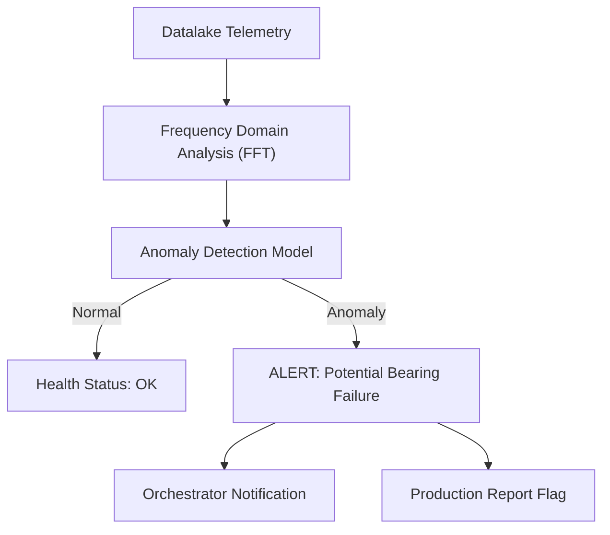

<p align="center">
  
</p>

# 🔍 HYDRA-UMC-ANOMALY-DETECTOR

<p align="center">🇺🇸 <b>English</b> | <a href="README_spa.md">🇪🇸 Español</a> | <a href="README_fra.md">🇫🇷 Français</a> | <a href="README_ita.md">🇮🇹 Italiano</a> | <a href="README_deu.md">🇩🇪 Deutsch</a> | <a href="README_zho.md">🇨🇳 简体中文</a> | <a href="README_jpn.md">🇯🇵 日本語</a></p>

### 🧠 AI-Driven Predictive Maintenance & Motor Vibration Analysis

<p align="left">
  
  
  
</p>

---

## 1. 🛠️ TECHNICAL OVERVIEW

**HYDRA-UMC-ANOMALY-DETECTOR** is the proactive guardian of robotic health. It uses AI models to analyze high-frequency telemetry (vibrations, motor current signatures, and thermal profiles) to detect failures before they happen.

By monitoring the "digital fingerprint" of every motor and tool head, it can identify bearing wear, loose belts, or cooling failures weeks in advance, enabling scheduled maintenance instead of emergency repairs.

### Key Features:
* 🔍 **Signature Analysis:** Real-time FFT (Fast Fourier Transform) of motor currents to detect mechanical imbalance.
* 📉 **Predictive Maintenance:** AI-driven RUL (Remaining Useful Life) estimation for NEMA motors and URTC tools.
* 🚨 **Early Warning System:** Triggers alerts in the Studio and Watch interfaces when abnormal patterns emerge.
* 🧬 **Learning Models:** Continuously improves detection accuracy by learning from the Datalake's history.
* 🏷️ **Model Versioning:** Every `Verdict` carries the real, monotonic model version and threshold it was scored against - a refit is a real, traceable event. *(implemented)*
* 📐 **Precision/Recall Metrics:** Real, computed precision/recall/F1 over a labeled fixture (`metrics.py`), not just prose claims about score separation. *(implemented)*
* 📈 **Simulated Drift Detection:** `DriftMonitor` flags a real, sustained rolling-mean elevation distinct from any single window's own anomaly flag. *(implemented)*

---

## 2. 🔄 DETECTION PIPELINE



---

## 3. 🧱 ARCHITECTURE & DESIGN DECISIONS

* **Why this is a sibling, not a submodule, of HYDRA-UMC-DATALAKE.** Anomaly detection is a read-only analytics workload against already-stored telemetry - keeping it separate means a detector crash or a slow model inference never blocks HYDRA-UMC-TELEMETRY-COLLECTOR's own writes into the same store.
* **Why FFT + a statistical baseline today, not a trained neural network yet.** The README calls this "AI-driven" - what's real and shipping in this first pass is a legitimate, real signal-processing technique (`src/hydra_umc_anomaly_detector/fft.py`, numpy's own FFT) plus a per-frequency-bin statistical baseline learned from known-healthy windows (`baseline.py`) and a max-z-score verdict (`detector.py`) - not a trained deep-learning model. It works, it's tested against real synthetic fault signatures, and it's the right foundation a learned model gets built on top of later (see `mejoras_futuras.txt`) - but calling it a neural network here would overstate what's actually running.
* **Why a max-z-score across every bin, not a fixed threshold.** A fixed threshold ('motor temp > 80C') misses gradual drift and false-alarms on legitimate load spikes - comparing the LIVE spectrum's every bin against this specific motor's OWN learned healthy baseline catches a new/shifted frequency peak (a real bearing-defect signature) without either failure mode. The default cutoff (10.0) was picked from real empirical separation, not guessed - see `detector.py`'s own docstring for the actual numbers from this project's synthetic healthy-vs-faulty test fixtures.
* **How this fits the rest of the ecosystem.** A sibling service under HYDRA-UMC-DATALAKE - runs anomaly detection over the telemetry HYDRA-UMC-TELEMETRY-COLLECTOR already wrote there.
* **Why `DriftMonitor` is a separate mechanism from `AnomalyDetector.score()`, not a bigger threshold.** They answer different real questions: "is THIS window anomalous" (a single-shot verdict) versus "has the RECENT average quietly shifted" (a rolling trend, robust to one noisy outlier window). A real simulated-drift test found and honestly documents that for this detector's max-z-score design, a single window's own flag actually trips *before* the rolling drift signal for a new-frequency-type fault - `DriftMonitor`'s real value here is a sustained-trend confirmation, not an earlier warning, and the code says so rather than overselling it.
* **Why `metrics.py` computes precision/recall instead of leaving the threshold's quality as prose.** `detector.py`'s own docstring used to only claim "healthy scored up to ~5.3, faulty scored in the hundreds" - real, but not a number a future re-tuning could regress-test against. `precision_recall()` over the same real fixture gives that a real, checkable value (1.0/1.0 today).

---

## 📂 DIRECTORY STRUCTURE

Pure-software service (ML/analytics) with no hardware, firmware or OS of its own; those folders are omitted by the repository structure policy.

```text
HYDRA-UMC-ANOMALY-DETECTOR/
├── src/hydra_umc_anomaly_detector/  # Source code
│   ├── __init__.py                  # Package version
│   ├── fft.py                       # Real FFT-based spectrum (numpy)
│   ├── baseline.py                  # Per-bin healthy statistical profile (mean/std)
│   ├── detector.py                  # Fits a Baseline, scores live windows against it
│   ├── metrics.py                   # Real precision/recall/F1 over a labeled fixture
│   ├── drift.py                     # Real rolling-mean drift detection
│   ├── api.py                        # Plain JSON/HTTP handlers wrapping the detector
│   └── main.py                       # Entry point: wires everything, starts the HTTP server
├── tests/                   # pytest - FFT correctness, baseline stats, real fault detection, metrics, simulated drift
├── docs/
│   └── API.md               # Real HTTP endpoint reference (requests, responses, status codes)
├── images/                  # Media and diagrams
├── systemd/
│   └── hydra-umc-anomaly-detector.service # Local CM5 anomaly-detection API systemd unit
├── tools/
│   ├── build_test.py        # Build/compile check without bumping version
│   └── ci_validate.py       # Manifest/CHANGELOG/docs validation used by CI
├── build/                   # Build output (gitignored)
├── pyproject.toml           # Package metadata, version, dependencies (numpy)
├── bump_version.py          # Odometer-style version bump (run by build)
├── bump_manifest_version.py # Syncs hydra-umc.project.json's version to the native one (--sync)
├── build.sh / build.bat     # Real build: venv + editable install + bump + tests
├── run.sh / run.bat         # Real run: starts the HTTP API
└── README.md
```

Pruned from the original template: `hardware/`, `firmware/` and `os/` —
this is a pure software service (Python package) with no dedicated
hardware or firmware of its own and no operating system image to
maintain. See [`docs/API.md`](docs/API.md) for the full HTTP endpoint
reference.

---

## 4. ⚙️ BUILD & RUN GUIDE

Requires Python >= 3.10. Real FFT-based anomaly detection with an HTTP
API, not just a skeleton that imports.

```bash
# Linux/macOS
./build.sh
./run.sh --port 8097

# Windows
build.bat
run.bat --port 8097
```

`build` creates/activates a local `.venv`, installs the package (editable,
with dev extras, including `numpy`) into it, verifies the import, and runs
the real test suite (`pytest`). `run` starts the HTTP API and forwards any
flags to it (`--addr`, `--port`, `--sample-rate`, `--threshold`).

```bash
# Calibrate against known-healthy signal windows (JSON arrays of floats,
# same sample rate as --sample-rate)
curl -X POST localhost:8097/baseline/fit -d '{"windows": [[...], [...], ...]}'

# Score a live window against the fitted baseline
curl -X POST localhost:8097/detect -d '{"window": [...]}'
# -> {"score": 6.3, "anomalous": false, "worstBinFreqHz": 276.0}

curl localhost:8097/stats
```

```bash
python -m pytest tests/ -v   # fft.py (a known sine wave's peak frequency
                              # is found correctly, DC is genuinely
                              # dropped), baseline.py (correct mean/std,
                              # the zero-std floor prevents a real
                              # division-by-zero), detector.py (the
                              # actual promise: a synthetic fault signal
                              # is flagged, a healthy-looking one is not,
                              # with real separation margin - not a
                              # knife-edge threshold), and api.py (real
                              # HTTP round-trips via a genuine
                              # ThreadingHTTPServer)
```

---

## 🚀 ROADMAP
* **Phase 1:** Datalake high-throughput ingestion and indexing for historical analysis.
* **Phase 2:** Telemetry collector edge-compression and secure transmission protocols.
* **Phase 3:** Anomaly detection using unsupervised learning and motor vibration analysis.
* **Phase 4:** Integration of acoustic analysis for "hearing" early mechanical issues and AI-driven predictive insights.

---

## 🔗 Related Projects

This project is part of a larger robotics ecosystem by the same author (JuanenRac / Electro Hobby 3D), spanning firmware, control software, AI nodes, and fleet tooling. Worth knowing about, since a request might actually be about one of these rather than this repository.

### Family

**Parent:** **[HYDRA-UMC-DATALAKE](https://github.com/JuanenRac/HYDRA-UMC-DATALAKE)** — the integration parent whose stored telemetry this detector analyzes.

**Siblings:**
- **[HYDRA-UMC-TELEMETRY-COLLECTOR](https://github.com/JuanenRac/HYDRA-UMC-TELEMETRY-COLLECTOR)** — sibling analytics service, same parent.
- **[HYDRA-UMC-PRODUCTION-REPORTS](https://github.com/JuanenRac/HYDRA-UMC-PRODUCTION-REPORTS)** — sibling analytics service, same parent.

### Directly Related (outside the family)

- **[HYDRA-UMC-STUDIO](https://github.com/JuanenRac/HYDRA-UMC-STUDIO)** — surfaces this detector's real early-warning alerts directly in the control UI, per Key Features above.
- **[HYDRA-UMC-WATCH](https://github.com/JuanenRac/HYDRA-UMC-WATCH)** — same alert surface, for whoever is watching fleet health rather than driving a robot.
- **[URTC](https://github.com/JuanenRac/URTC)** — RUL estimation covers URTC tool heads, not just the NEMA motors in the arms themselves.

### Rest of the Ecosystem

**HYDRA-UMC platform** — the multi-robot micro-factory cell
- **[HYDRA-UMC](https://github.com/JuanenRac/HYDRA-UMC)** — the CM5 + STM32H745 motherboard orchestrating up to 8 robot arms.
- **[HYDRA-UMC-SERVER](https://github.com/JuanenRac/HYDRA-UMC-SERVER)** — the Express/WebSocket backend every control client talks to.
- **[HYDRA-UMC-STUDIO](https://github.com/JuanenRac/HYDRA-UMC-STUDIO)** — web-based control dashboard, multi-robot 3D visualization.
- **[HYDRA-UMC-ANDROID-CONTROL](https://github.com/JuanenRac/HYDRA-UMC-ANDROID-CONTROL)** — Android control app over Wi-Fi/Bluetooth.
- **[HYDRA-UMC-IOS-CONTROL](https://github.com/JuanenRac/HYDRA-UMC-IOS-CONTROL)** — iOS/iPadOS control app built in Flutter.
- **[HYDRA-UMC-SUITE](https://github.com/JuanenRac/HYDRA-UMC-SUITE)** — desktop swarm command center (Python/PySide6).
- **[HYDRA-UMC-EDITOR-URDF](https://github.com/JuanenRac/HYDRA-UMC-EDITOR-URDF)** — desktop URDF model editor for the robot catalog.
- **[HYDRA-UMC-DSI](https://github.com/JuanenRac/HYDRA-UMC-DSI)** — native touch UI for the onboard DSI touchscreen.

**URTC platform** — the tool head controller every HYDRA-UMC robot arm carries
- **[URTC](https://github.com/JuanenRac/URTC)** — CAN bus tool head controller, 25 tool profiles.
- **[URTC-FLASHER](https://github.com/JuanenRac/URTC-FLASHER)** — desktop CAN-OTA + SWD/JTAG flashing tool.
- **[URTC-TESTER](https://github.com/JuanenRac/URTC-TESTER)** — desktop live CAN-bus diagnostic tool.
- **[URTC-WEB-STUDIO](https://github.com/JuanenRac/URTC-WEB-STUDIO)** — browser-based alternative via Web Serial API.

**🎥 Vision AI Node (Hailo-8)**
- [HYDRA-UMC-VISION-NODE](https://github.com/JuanenRac/HYDRA-UMC-VISION-NODE)
- [HYDRA-UMC-VISION-STREAMER](https://github.com/JuanenRac/HYDRA-UMC-VISION-STREAMER)
- [HYDRA-UMC-DETECTION-HEF](https://github.com/JuanenRac/HYDRA-UMC-DETECTION-HEF)
- [HYDRA-UMC-SAFETY-ZONES](https://github.com/JuanenRac/HYDRA-UMC-SAFETY-ZONES)
- [HYDRA-UMC-VISUAL-SERVOING-API](https://github.com/JuanenRac/HYDRA-UMC-VISUAL-SERVOING-API)

**🧠 Cognitive AI Node (Hailo-10)**
- [HYDRA-UMC-COGNITIVE-NODE](https://github.com/JuanenRac/HYDRA-UMC-COGNITIVE-NODE)
- [HYDRA-UMC-VLA-ENGINE](https://github.com/JuanenRac/HYDRA-UMC-VLA-ENGINE)
- [HYDRA-UMC-VOICE-UI](https://github.com/JuanenRac/HYDRA-UMC-VOICE-UI)
- [HYDRA-UMC-SEMANTIC-PLANNER](https://github.com/JuanenRac/HYDRA-UMC-SEMANTIC-PLANNER)
- [HYDRA-UMC-DOCS-QA](https://github.com/JuanenRac/HYDRA-UMC-DOCS-QA)

**🐝 Orchestration & Swarm**
- [HYDRA-UMC-ORCHESTRATOR](https://github.com/JuanenRac/HYDRA-UMC-ORCHESTRATOR)
- [HYDRA-UMC-SWARM-SYNC](https://github.com/JuanenRac/HYDRA-UMC-SWARM-SYNC)
- [HYDRA-UMC-PATH-PLANNER-3D](https://github.com/JuanenRac/HYDRA-UMC-PATH-PLANNER-3D)
- [HYDRA-UMC-JOB-DISPATCHER](https://github.com/JuanenRac/HYDRA-UMC-JOB-DISPATCHER)
- [HYDRA-UMC-NODE-HEALING](https://github.com/JuanenRac/HYDRA-UMC-NODE-HEALING)

**🎮 Digital Twin & Simulation**
- [HYDRA-UMC-TWIN](https://github.com/JuanenRac/HYDRA-UMC-TWIN)
- [HYDRA-UMC-PHYSICS-REPLICA](https://github.com/JuanenRac/HYDRA-UMC-PHYSICS-REPLICA)
- [HYDRA-UMC-HIL-BRIDGE](https://github.com/JuanenRac/HYDRA-UMC-HIL-BRIDGE)
- [HYDRA-UMC-SYNTHETIC-DATA-GEN](https://github.com/JuanenRac/HYDRA-UMC-SYNTHETIC-DATA-GEN)

**🏭 Industrial Gateway**
- [HYDRA-UMC-GATEWAY-INDUSTRIAL](https://github.com/JuanenRac/HYDRA-UMC-GATEWAY-INDUSTRIAL)
- [HYDRA-UMC-OPCUA-SERVER](https://github.com/JuanenRac/HYDRA-UMC-OPCUA-SERVER)
- [HYDRA-UMC-MQTT-BROKER](https://github.com/JuanenRac/HYDRA-UMC-MQTT-BROKER)
- [HYDRA-UMC-MTCONNECT-ADAPTER](https://github.com/JuanenRac/HYDRA-UMC-MTCONNECT-ADAPTER)

**🛠️ Complementary Tools**
- [URTC-SMART-RACK](https://github.com/JuanenRac/URTC-SMART-RACK)
- [URTC-VISION-TOOL](https://github.com/JuanenRac/URTC-VISION-TOOL)
- [HYDRA-UMC-WATCH](https://github.com/JuanenRac/HYDRA-UMC-WATCH)
- [HYDRA-UMC-TOOL-CLI](https://github.com/JuanenRac/HYDRA-UMC-TOOL-CLI)
- [HYDRA-UMC-DASHBOARD-AI](https://github.com/JuanenRac/HYDRA-UMC-DASHBOARD-AI)


## 👤 AUTHOR
**JuanenRac** (Electro Hobby 3D)
📧 electrohobby3d@gmail.com
📺 [youtube.com/@electrohobby3d](https://youtube.com/@electrohobby3d)

## 📜 LICENSE
GPL-3.0 - See LICENSE for details.
