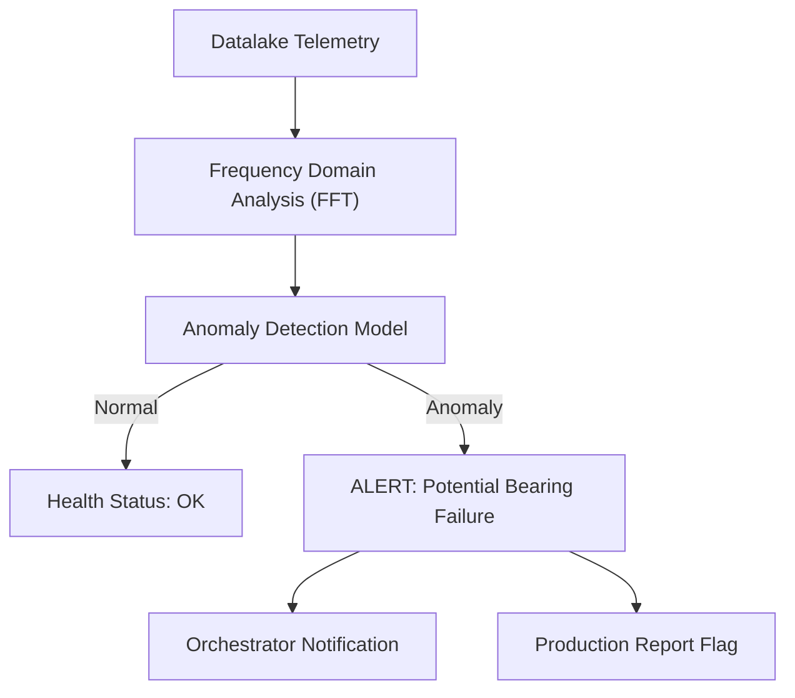

<p align="center">
  
</p>

# 🔍 HYDRA-UMC-ANOMALY-DETECTOR

<p align="center">🇺🇸 <b>English</b> | <a href="README_spa.md">🇪🇸 Español</a> | <a href="README_fra.md">🇫🇷 Français</a> | <a href="README_ita.md">🇮🇹 Italiano</a> | <a href="README_deu.md">🇩🇪 Deutsch</a> | <a href="README_zho.md">🇨🇳 简体中文</a> | <a href="README_jpn.md">🇯🇵 日本語</a> | <a href="README_por.md">🇵🇹 Português</a></p>

### 🧠 Statistical Anomaly Detection & Motor Vibration Analysis (no machine-learning model)

<p align="center">
  
  
  
</p>

---

> **Honesty check - what actually runs today:** the FFT spectrum (`fft.py`), the per-bin statistical baseline (`baseline.py`), the max-z-score anomaly detector (`detector.py`), precision/recall/F1 metrics over a labeled fixture (`metrics.py`), rolling-mean drift detection (`drift.py`), the real HYDRA-UMC-DATALAKE HTTP client (`datalake_client.py`), and the plain JSON/HTTP API (`api.py`) are real and tested (87 passing tests: `pytest tests/` - `test_fft.py`, `test_baseline.py`, `test_detector.py`, `test_metrics.py`, `test_drift.py`, `test_datalake_client.py`, `test_api.py`). "AI-driven" and "Learning Models" below describe real signal processing plus a statistical baseline fit from known-healthy windows - not a trained neural network, and not continuous background learning: a baseline is fit once, either at startup from real DATALAKE history or via an explicit `POST /baseline/fit` call, and stays exactly that model version until the next explicit refit (see `detector.py`'s own model-versioning). ROADMAP Phases 3 and 4 below (unsupervised learning, acoustic analysis) are fully aspirational - no code for either exists in this repo yet. See `CHANGELOG.md` for exactly what has shipped so far.

---

> **Safety and security status:** this ecosystem is not a certified safety system. There is no hardware E-STOP path, no firmware-enforced limits or interlocks and no verified motion command yet; firmware images are checked with CRC32 and a shared-key HMAC-SHA256, not with an asymmetric signature; TLS and mutual TLS are optional and off by default; no custom board has been populated or tested yet. Read the [security baseline](https://github.com/JuanenRac/HYDRA-UMC-DOCS/blob/main/docs/SECURITY_BASELINE.md) and the [threat model](https://github.com/JuanenRac/HYDRA-UMC-DOCS/blob/main/docs/THREAT_MODEL.md) before relying on any statement here for the safety of a person.

## 📋 At a glance

| | |
|---|---|
| Version | `0.1.7` |
| Maturity | Functional |
| Tests | 112 (`pytest tests/`) |
| Stack | Python / FFT / statistical baseline detection |
| Target | The Raspberry Pi CM5 of a HYDRA-UMC cell |
| On real hardware | Not yet: no run on real hardware is recorded for this version |

## 1. 🛠️ TECHNICAL OVERVIEW

**HYDRA-UMC-ANOMALY-DETECTOR** is meant to become the proactive guardian of robotic health. It applies an FFT and a statistical baseline (no machine-learning model) to telemetry samples (vibrations, motor current signatures, and thermal profiles) and flags departures from a healthy baseline; it does not predict failures yet.

The aim is to monitor the "digital fingerprint" of every motor and tool head so that bearing wear, loose belts or cooling failures could be spotted weeks in advance, enabling scheduled maintenance instead of emergency repairs (planned: no failure-prediction code exists yet).

### Key Features:
* **One detector per series (`/detectors/{sourceId}/{kind}/{field}/...`).** A motor and a spindle do not vibrate alike, and one shared baseline called the other one anomalous. `POST /detectors/{sourceId}/{kind}/{field}/fit` fits the baseline of that series (the triple DATALAKE stores it under), `.../detect` scores a window against it, `.../drift/init` and `.../drift/observe` give it its own drift monitor, and `GET /detectors` lists the series and whether each is fitted. A series is created by its first successful fit and holds at most `--max-series` (64); scoring a series that was never fitted is `409`, never a verdict from another baseline; fitting a series never touches another or the shared one. Writing needs the token like the shared baseline, scoring only with `--protect-reads`. `--baseline-dir` saves one baseline per series and restores them at start. The original routes are unchanged. *(implemented, tested in `tests/test_series.py`)*
* **Reads can be protected too (`--protect-reads`).** With a token set, `POST /detect` also demands `Authorization: Bearer <token>` (`--protect-reads` or `HYDRA_UMC_ANOMALY_PROTECT_READS=1`; it needs a token); only `GET /stats`, the health path, stays open. Off by default, because DASHBOARD-AI and the other callers of `/detect` do not send a token yet.
* 🔍 **Signature Analysis:** FFT (Fast Fourier Transform) of motor current samples to detect mechanical imbalance. *(implemented)*
* 📉 **Predictive Maintenance:** RUL (Remaining Useful Life) estimation for NEMA motors and URTC tools - aspirational, no code for it exists in this repo yet.
* 🚨 **Early Warning System:** Surfacing alerts directly in the Studio and Watch interfaces - aspirational; today the detector only exposes its verdicts over its own plain HTTP API (`api.py`), the consuming UIs don't poll it yet.
* 🧬 **Baseline Learning:** Fits its statistical baseline from the Datalake's own known-healthy history - not continuous background learning, but a real, explicit refit whenever one is requested. *(implemented)*
* 🏷️ **Model Versioning:** Every `Verdict` carries the real, monotonic model version and threshold it was scored against - a refit is a real, traceable event. It also reports how many healthy windows the baseline was calibrated from, so an alarm can be explained and reproduced. *(implemented)*
* 📐 **Precision/Recall Metrics:** Real, computed precision/recall/F1 over a labeled fixture (`metrics.py`), not just prose claims about score separation. *(implemented)*
* 📈 **Simulated Drift Detection:** `DriftMonitor` flags a real, sustained rolling-mean elevation distinct from any single window's own anomaly flag. *(implemented)*

---

## 2. 🔄 DETECTION PIPELINE


```mermaid
flowchart TB
    DATA["Datalake Telemetry"] --> FFT["Frequency Domain Analysis (FFT)"]
    FFT --> AI["Anomaly Detection Model"]
    AI -- Normal --> LOG["Health Status: OK"]
    AI -- Anomaly --> ALRT["ALERT: Potential Bearing Failure"]
    ALRT --> ORCH["Orchestrator Notification"]
    ALRT --> REP["Production Report Flag"]
```

---

## 3. 🧱 ARCHITECTURE & DESIGN DECISIONS

* **Why this is a sibling, not a submodule, of HYDRA-UMC-DATALAKE.** Anomaly detection is a read-only analytics workload against already-stored telemetry - keeping it separate means a detector crash or a slow model inference never blocks HYDRA-UMC-TELEMETRY-COLLECTOR's own writes into the same store.
* **Why FFT + a statistical baseline today, not a trained neural network yet.** The README calls this "AI-driven" - what's real and shipping in this first pass is a legitimate, real signal-processing technique (`src/hydra_umc_anomaly_detector/fft.py`, numpy's own FFT) plus a per-frequency-bin statistical baseline learned from known-healthy windows (`baseline.py`) and a max-z-score verdict (`detector.py`) - not a trained deep-learning model. It works, it's tested against real synthetic fault signatures, and it's the right foundation a learned model gets built on top of later (see the ROADMAP section below) - but calling it a neural network here would overstate what's actually running.
* **Why a max-z-score across every bin, not a fixed threshold.** A fixed threshold ('motor temp > 80C') misses gradual drift and false-alarms on legitimate load spikes - comparing the LIVE spectrum's every bin against this specific motor's OWN learned healthy baseline catches a new/shifted frequency peak (a real bearing-defect signature) without either failure mode. The default cutoff (10.0) was picked from real empirical separation, not guessed - see `detector.py`'s own docstring for the actual numbers from this project's synthetic healthy-vs-faulty test fixtures.
* **How this fits the rest of the ecosystem.** A sibling service under HYDRA-UMC-DATALAKE - runs anomaly detection over the telemetry HYDRA-UMC-TELEMETRY-COLLECTOR already wrote there.
* **Why `DriftMonitor` is a separate mechanism from `AnomalyDetector.score()`, not a bigger threshold.** They answer different real questions: "is THIS window anomalous" (a single-shot verdict) versus "has the RECENT average quietly shifted" (a rolling trend, robust to one noisy outlier window). A real simulated-drift test found and honestly documents that for this detector's max-z-score design, a single window's own flag actually trips *before* the rolling drift signal for a new-frequency-type fault - `DriftMonitor`'s real value here is a sustained-trend confirmation, not an earlier warning, and the code says so rather than overselling it.
* **Why `metrics.py` computes precision/recall instead of leaving the threshold's quality as prose.** `detector.py`'s own docstring used to only claim "healthy scored up to ~5.3, faulty scored in the hundreds" - real, but not a number a future re-tuning could regress-test against. `precision_recall()` over the same real fixture gives that a real, checkable value (1.0/1.0 today).

---

## 📂 DIRECTORY STRUCTURE

Pure-software service (ML/analytics) with no hardware, firmware or OS of its own; those folders are omitted by the repository structure policy.

```text
HYDRA-UMC-ANOMALY-DETECTOR/
├── src/hydra_umc_anomaly_detector/  # Source code
│   ├── __init__.py                  # Package version
│   ├── fft.py                       # Real FFT-based spectrum (numpy)
│   ├── baseline.py                  # Per-bin healthy statistical profile (mean/std)
│   ├── detector.py                  # Fits a Baseline, scores live windows against it
│   ├── metrics.py                   # Real precision/recall/F1 over a labeled fixture
│   ├── drift.py                     # Real rolling-mean drift detection
│   ├── datalake_client.py            # Pulls timestamp-ordered points from HYDRA-UMC-DATALAKE, chunks them into fixed-length windows
│   ├── registry.py                   # One detector per (sourceId, kind, field): bounded, persisted by key digest
│   ├── api.py                        # Plain JSON/HTTP handlers wrapping the detector
│   └── main.py                       # Entry point: wires everything, starts the HTTP server
├── tests/                   # pytest - FFT correctness, baseline stats, real fault detection, metrics, simulated drift
├── docs/
│   └── API.md               # Real HTTP endpoint reference (requests, responses, status codes)
├── images/                  # Media and diagrams
├── systemd/
│   └── hydra-umc-anomaly-detector.service # Local CM5 anomaly-detection API systemd unit
├── tools/
│   ├── build_test.py        # Build/compile check without bumping version
│   └── ci_validate.py       # Manifest/CHANGELOG/docs validation used by CI
├── build/                   # Build output (gitignored)
├── pyproject.toml           # Package metadata, version, dependencies (numpy)
├── bump_version.py          # Odometer-style version bump (run only by the explicit `bump` command)
├── bump_manifest_version.py # Syncs hydra-umc.project.json's version to the native one (--sync)
├── build.sh / build.bat     # Real build: venv + editable install + tests
├── run.sh / run.bat         # Real run: starts the HTTP API
└── README.md
```

Pruned from the original template: `hardware/`, `firmware/` and `os/` —
this is a pure software service (Python package) with no dedicated
hardware or firmware of its own and no operating system image to
maintain. See [`docs/API.md`](docs/API.md) for the full HTTP endpoint
reference.

---

## 4. ⚙️ BUILD & RUN GUIDE

Requires Python >= 3.10. Real FFT-based anomaly detection with an HTTP
API, not just a skeleton that imports.

```bash
# Linux/macOS
./build.sh
./run.sh --port 8097

# Windows
build.bat
run.bat --port 8097
```

`build` creates/activates a local `.venv`, installs the package (editable,
with dev extras, including `numpy`) into it, verifies the import, and runs
the real test suite (`pytest`). `run` starts the HTTP API and forwards any
flags to it (`--addr`, `--port`, `--sample-rate`, `--threshold`,
`--baseline-path`, `--datalake-url`/`--source-id`/`--kind`/`--field`/
`--window-size`).

Three more options, all conservative by default: `--window hann` removes the mean and applies a Hann window before the FFT (the default `none` is the original behaviour; the numbers differ, so a baseline remembers its window, a detector refuses to restore one made with another, and `--threshold` has to be recalibrated with real healthy recordings before Hann is trusted). The training history read from DATALAKE is now paged (oldest first), cut where the timestamps are not about `1/sample-rate` apart and stripped of repeated timestamps, and a read that stops at `--max-train-points` says so (`--train-start`/`--train-end` pick the range). `--token-file` (or `HYDRA_UMC_ANOMALY_TOKEN`) makes `POST /baseline/fit`, `/drift/init` and `/drift/observe` demand a bearer token, and a non-loopback `--addr` is refused without one. Tested against fakes; never against real machine recordings.

The fitted baseline can now survive a restart, and can be fit from real
HYDRA-UMC-DATALAKE history instead of pasting arrays by hand:

```bash
# Persist every fit to disk, and restore it automatically on the next start
./run.sh --port 8097 --baseline-path /var/lib/hydra-umc-anomaly-detector/baseline.npz

# Fit a fresh baseline at startup from real DATALAKE history, then persist it
./run.sh --port 8097 --baseline-path baseline.npz \
  --datalake-url http://127.0.0.1:8095 --source-id motor-1 --kind vibration --field value --window-size 200
```

```bash
# Calibrate against known-healthy signal windows (JSON arrays of floats,
# same sample rate as --sample-rate)
curl -X POST localhost:8097/baseline/fit -d '{"windows": [[...], [...], ...]}'

# Score a live window against the fitted baseline
curl -X POST localhost:8097/detect -d '{"window": [...]}'
# -> {"score": 6.3, "anomalous": false, "worstBinFreqHz": 276.0}

curl localhost:8097/stats
```

```bash
python -m pytest tests/ -v   # fft.py (a known sine wave's peak frequency
                              # is found correctly, DC is genuinely
                              # dropped), baseline.py (correct mean/std,
                              # the zero-std floor prevents a real
                              # division-by-zero), detector.py (the
                              # actual promise: a synthetic fault signal
                              # is flagged, a healthy-looking one is not,
                              # with real separation margin - not a
                              # knife-edge threshold), and api.py (real
                              # HTTP round-trips via a genuine
                              # ThreadingHTTPServer)
```

---

## 🚀 ROADMAP
* **Phase 1:** Datalake high-throughput ingestion and indexing for historical analysis.
* **Phase 2:** Telemetry collector edge-compression and secure transmission protocols.
* **Phase 3:** Anomaly detection using unsupervised learning and motor vibration analysis.
* **Phase 4:** Integration of acoustic analysis for "hearing" early mechanical issues and AI-driven predictive insights.

---

## 🔗 Related Projects

This project is part of the HYDRA-UMC robotics ecosystem by the same author (JuanenRac / Electro Hobby 3D). Worth knowing about, since a request might actually be about one of these rather than this repository.

**Parent Project**
- **[HYDRA-UMC-DATALAKE](https://github.com/JuanenRac/HYDRA-UMC-DATALAKE)** — real sqlite3-backed time-series store with a real ingest/query HTTP API; the parent this repo is one specific analytics service of, within its own data-and-analytics layer.

**Sibling Projects** — the other analytics services of HYDRA-UMC-DATALAKE's own data-and-analytics layer
- **[HYDRA-UMC-TELEMETRY-COLLECTOR](https://github.com/JuanenRac/HYDRA-UMC-TELEMETRY-COLLECTOR)** — real CAN/WebSocket ingestion pipeline into DATALAKE, with sequence deduplication.
- **[HYDRA-UMC-PRODUCTION-REPORTS](https://github.com/JuanenRac/HYDRA-UMC-PRODUCTION-REPORTS)** — real OEE/availability calculation over DATALAKE history, with reproducible CSV export.

**Directly Related**
- **[HYDRA-UMC-STUDIO](https://github.com/JuanenRac/HYDRA-UMC-STUDIO)** — web control dashboard with real-time multi-robot 3D visualization — surfaces this detector's real early-warning alerts directly in the control UI.
- **[HYDRA-UMC-WATCH](https://github.com/JuanenRac/HYDRA-UMC-WATCH)** — WearOS companion app with haptic alert patterns and a paired-phone voice relay (not yet run on a physical watch) — the same alert surface, for whoever is watching fleet health rather than driving a robot.
- **[URTC](https://github.com/JuanenRac/URTC)** — firmware for the physical Universal Robot Tool Controller PCB, 25+ tool profiles over CAN bus — RUL estimation here covers URTC's own tool heads too, not just the NEMA motors in the arms themselves.

**Also Part of the Ecosystem**

*Core Hardware & Platform*
- **[HYDRA-UMC](https://github.com/JuanenRac/HYDRA-UMC)** — the robot-arm motherboard design: CM5 host + dual-core STM32H745, meant to orchestrate up to 8 tool arms over CAN-OTA/SPI-OTA (firmware at an early stage; no populated board yet).
- **[HYDRA-UMC-OS](https://github.com/JuanenRac/HYDRA-UMC-OS)** — reproducible Raspberry Pi OS product layer for the CM5: read-only agent, validated config/profiles, WiFi first-contact provisioning.
- **[HYDRA-UMC-SDK](https://github.com/JuanenRac/HYDRA-UMC-SDK)** — the shared JSON-Schema contract and software job-gate boundary every bridge validates its commands against (not a certified safety function).
- **[HYDRA-UMC-CONNECTOR-HUB](https://github.com/JuanenRac/HYDRA-UMC-CONNECTOR-HUB)** — declarative adapter-manifest registry and validator for external-machine connectors; extends the SDK's own contract idea to external machines without replacing the industrial-gateway projects.

*Core Backend & Clients*
- **[HYDRA-UMC-SERVER](https://github.com/JuanenRac/HYDRA-UMC-SERVER)** — the real headless backend (REST/WebSocket) every control client actually talks to.
- **[HYDRA-UMC-SUITE](https://github.com/JuanenRac/HYDRA-UMC-SUITE)** — desktop (PySide6) swarm command center for multiple servers at once, packaged as a standalone executable.
- **[HYDRA-UMC-ANDROID-CONTROL](https://github.com/JuanenRac/HYDRA-UMC-ANDROID-CONTROL)** — native Android control app with biometric login and a paired Wear OS companion.
- **[HYDRA-UMC-IOS-CONTROL](https://github.com/JuanenRac/HYDRA-UMC-IOS-CONTROL)** — iOS/iPadOS control app (Flutter) with real-time WebSocket sync.
- **[HYDRA-UMC-DSI](https://github.com/JuanenRac/HYDRA-UMC-DSI)** — native touch UI for the onboard 7" DSI touchscreen, embedded on the CM5 itself.
- **[HYDRA-UMC-EDITOR-URDF](https://github.com/JuanenRac/HYDRA-UMC-EDITOR-URDF)** — desktop graphical URDF creator/editor that pushes finished models into STUDIO's own catalog.
- **[HYDRA-UMC-EDITOR-STL](https://github.com/JuanenRac/HYDRA-UMC-EDITOR-STL)** — desktop STL model editor, transforming/replacing/removing/adding real parts in the same model catalog HYDRA-UMC-EDITOR-URDF also edits.
- **[HYDRA-UMC-BRIDGE-AMR](https://github.com/JuanenRac/HYDRA-UMC-BRIDGE-AMR)** — coordination boundary for AGV/AMR fleets via a VDA 5050 MQTT publisher (tested against an emulated fleet only).
- **[HYDRA-UMC-BRIDGE-CNC](https://github.com/JuanenRac/HYDRA-UMC-BRIDGE-CNC)** — high-level CNC-cell coordinator with GRBL status/control-byte access (tested against an emulator only).
- **[HYDRA-UMC-BRIDGE-DROIDS](https://github.com/JuanenRac/HYDRA-UMC-BRIDGE-DROIDS)** — coordination boundary for legged/humanoid droids, with a Boston Dynamics Spot command sender (tested against an emulator only).
- **[HYDRA-UMC-BRIDGE-LASER](https://github.com/JuanenRac/HYDRA-UMC-BRIDGE-LASER)** — laser-cell coordinator reading 3 key/enclosure/interlock GPIO signals (tested against a fake chip only; it cannot arm or fire a laser).
- **[HYDRA-UMC-BRIDGE-OPENPNP](https://github.com/JuanenRac/HYDRA-UMC-BRIDGE-OPENPNP)** — safe high-level board-flow coordinator for OpenPnP pick-and-place.
- **[HYDRA-UMC-BRIDGE-PRINTER3D](https://github.com/JuanenRac/HYDRA-UMC-BRIDGE-PRINTER3D)** — safe coordination boundary for Moonraker/Klipper 3D printers, with real gated job commands.
- **[HYDRA-UMC-BRIDGE-ROS2](https://github.com/JuanenRac/HYDRA-UMC-BRIDGE-ROS2)** — coordinator with a lazily imported rclpy ROS 2 transport (not yet run against a ROS 2 installation).
- **[HYDRA-UMC-BRIDGE-UAV](https://github.com/JuanenRac/HYDRA-UMC-BRIDGE-UAV)** — coordination boundary for camera-equipped UAVs, with a MAVLink command sender (tested against an emulator only).

*URTC Tool Platform*
- **[URTC-FLASHER](https://github.com/JuanenRac/URTC-FLASHER)** — desktop GUI flashing tool for URTC boards, CAN-OTA plus full-chip SWD/JTAG.
- **[URTC-TESTER](https://github.com/JuanenRac/URTC-TESTER)** — desktop live CAN-bus diagnostic tool for URTC boards, one panel per tool profile.
- **[URTC-WEB-STUDIO](https://github.com/JuanenRac/URTC-WEB-STUDIO)** — browser-based alternative to URTC-TESTER via the Web Serial API, no local install needed.
- **[URTC-GATEWAY](https://github.com/JuanenRac/URTC-GATEWAY)** — gateway in front of the URTC CAN bus: an allowed list of identifiers, a rate limit and a session key; software tested on a computer, not yet on a real bus.

*Vision AI Node (Hailo-8)*
- **[HYDRA-UMC-VISION-NODE](https://github.com/JuanenRac/HYDRA-UMC-VISION-NODE)** — integration hub for the Hailo-8 vision pipeline, with a real per-stage hardware-readiness check.
- **[HYDRA-UMC-DETECTION-HEF](https://github.com/JuanenRac/HYDRA-UMC-DETECTION-HEF)** — real compiled-model registry with Hailo-architecture/checksum safe-load verification.
- **[HYDRA-UMC-VISION-STREAMER](https://github.com/JuanenRac/HYDRA-UMC-VISION-STREAMER)** — real GStreamer pipeline + MediaMTX config generator with a real HailoRT integration boundary.
- **[HYDRA-UMC-VISUAL-SERVOING-API](https://github.com/JuanenRac/HYDRA-UMC-VISUAL-SERVOING-API)** — Position-Based Visual Servoing correction law with authorisation gated on the zone state; no camera pose estimation yet.
- **[HYDRA-UMC-SAFETY-ZONES](https://github.com/JuanenRac/HYDRA-UMC-SAFETY-ZONES)** — v0 zone-breach, calibration-freshness and E-STOP-request logic that takes object positions from a file; no detector feeds it and no physical E-STOP is wired to it yet.

*Cognitive AI Node (Hailo-10)*
- **[HYDRA-UMC-COGNITIVE-NODE](https://github.com/JuanenRac/HYDRA-UMC-COGNITIVE-NODE)** — integration hub for the Hailo-10 cognitive pipeline (LLM/VLA/voice orchestration).
- **[HYDRA-UMC-VLA-ENGINE](https://github.com/JuanenRac/HYDRA-UMC-VLA-ENGINE)** — real action-token encoding/decoding and trajectory generation for a Vision-Language-Action model.
- **[HYDRA-UMC-VOICE-UI](https://github.com/JuanenRac/HYDRA-UMC-VOICE-UI)** — real voice front-end (VAD + intent parser) with a bounded, confirmation-gated Watch relay.
- **[HYDRA-UMC-SEMANTIC-PLANNER](https://github.com/JuanenRac/HYDRA-UMC-SEMANTIC-PLANNER)** — real rule-based task decomposition and semantic error recovery over MCU error codes.
- **[HYDRA-UMC-DOCS-QA](https://github.com/JuanenRac/HYDRA-UMC-DOCS-QA)** — real stdlib-only TF-IDF document search over this ecosystem's own Markdown docs.
- **[HYDRA-UMC-LOCAL-TECHNICIAN](https://github.com/JuanenRac/HYDRA-UMC-LOCAL-TECHNICIAN)** — local, policy-gated AI maintenance technician for the ecosystem itself - observes, diagnoses and proposes fixes; the two highest risk levels are deliberately not implemented yet.

*Orchestration & Swarm*
- **[HYDRA-UMC-ORCHESTRATOR](https://github.com/JuanenRac/HYDRA-UMC-ORCHESTRATOR)** — integration hub with a real gRPC/Protobuf health-report contract and mission state machine.
- **[HYDRA-UMC-JOB-DISPATCHER](https://github.com/JuanenRac/HYDRA-UMC-JOB-DISPATCHER)** — real priority-based job queue with deduplication, over a real HTTP API.
- **[HYDRA-UMC-NODE-HEALING](https://github.com/JuanenRac/HYDRA-UMC-NODE-HEALING)** — real gRPC-based fleet health watchdog with retry/backoff and identity-mismatch detection.
- **[HYDRA-UMC-PATH-PLANNER-3D](https://github.com/JuanenRac/HYDRA-UMC-PATH-PLANNER-3D)** — real RRT-based 3D path planner with real obstacle/workspace collision validation.
- **[HYDRA-UMC-SWARM-SYNC](https://github.com/JuanenRac/HYDRA-UMC-SWARM-SYNC)** — real CRDT LWW-Element-Map state sync, property-tested for multi-cell convergence.

*Digital Twin & Simulation*
- **[HYDRA-UMC-TWIN](https://github.com/JuanenRac/HYDRA-UMC-TWIN)** — integration hub for the digital-twin engine, with a real version-compatibility sync contract.
- **[HYDRA-UMC-HIL-BRIDGE](https://github.com/JuanenRac/HYDRA-UMC-HIL-BRIDGE)** — hardware-in-the-loop router with a software collision interlock between simulation and real hardware (tested without real hardware).
- **[HYDRA-UMC-PHYSICS-REPLICA](https://github.com/JuanenRac/HYDRA-UMC-PHYSICS-REPLICA)** — real forward kinematics and joint-limit validation over a real URDF subset.
- **[HYDRA-UMC-SYNTHETIC-DATA-GEN](https://github.com/JuanenRac/HYDRA-UMC-SYNTHETIC-DATA-GEN)** — real procedural 2D scene generator with YOLO/COCO annotation export.

*Industrial Gateway*
- **[HYDRA-UMC-GATEWAY-INDUSTRIAL](https://github.com/JuanenRac/HYDRA-UMC-GATEWAY-INDUSTRIAL)** — integration hub relaying to industrial protocols, with a real command allowlist/backpressure layer.
- **[HYDRA-UMC-OPCUA-SERVER](https://github.com/JuanenRac/HYDRA-UMC-OPCUA-SERVER)** — real OPC-UA address space, verified with a real binary-protocol client session.
- **[HYDRA-UMC-MQTT-BROKER](https://github.com/JuanenRac/HYDRA-UMC-MQTT-BROKER)** — real MQTT broker with optional per-client authentication and topic ACLs.
- **[HYDRA-UMC-MTCONNECT-ADAPTER](https://github.com/JuanenRac/HYDRA-UMC-MTCONNECT-ADAPTER)** — real MTConnect `/probe` and `/current` XML endpoints with degraded-mode output.

*Complementary Tools & Ecosystem Operations*
- **[HYDRA-UMC-DASHBOARD-AI](https://github.com/JuanenRac/HYDRA-UMC-DASHBOARD-AI)** — Smart Summaries and Anomaly Highlighting panels over DATALAKE/ANOMALY-DETECTOR, with an honest statistical fallback.
- **[HYDRA-UMC-TOOL-CLI](https://github.com/JuanenRac/HYDRA-UMC-TOOL-CLI)** — fleet CLI with a real, stable exit-code contract, a genuine live client of HYDRA-UMC-SERVER's own API.
- **[URTC-SMART-RACK](https://github.com/JuanenRac/URTC-SMART-RACK)** — firmware for a board-mounting rack with real tool-ID decoding and Smart Idle pre-heating logic.
- **[URTC-VISION-TOOL](https://github.com/JuanenRac/URTC-VISION-TOOL)** — firmware plus a real Python vision companion for a thermal/RGB inspection tool head.
- **[HYDRA-UMC-UPDATER](https://github.com/JuanenRac/HYDRA-UMC-UPDATER)** — administrative desktop tool that discovers, clones and updates every repo in this ecosystem.
- **[HYDRA-UMC-OS-REBUILDER](https://github.com/JuanenRac/HYDRA-UMC-OS-REBUILDER)** — Windows/Linux desktop tool that builds a ready-to-flash CM5 image pre-loaded with the ecosystem's most current versions, with Raspberry-Pi-Imager-style first-boot Wi-Fi/user/SSH configuration.
- **[HYDRA-UMC-OPS-AGENT](https://github.com/JuanenRac/HYDRA-UMC-OPS-AGENT)** — maintenance-incident coordinator: a low-privilege edge role collects a sanitized inventory/health snapshot, a control-plane role renders it read-only and asks an AI provider to suggest a diagnosis - never applies a patch or deploys anything.
- **[HYDRA-UMC-DEV-SERVER](https://github.com/JuanenRac/HYDRA-UMC-DEV-SERVER)** — reproducible development host (Raspberry Pi 5 / CM5) that stores the ecosystem's source and runs bounded build/test tasks under a durable queue; a dedicated dev role, explicitly not an operational CM5.


---

## 📚 Documentation & Community

- **[CONTRIBUTING.md](CONTRIBUTING.md)** — tech stack and coding guidelines for a pull request.
- **[CODE_OF_CONDUCT.md](CODE_OF_CONDUCT.md)** — the standards of behavior expected in this community.
- **[SECURITY.md](SECURITY.md)** — how to report a vulnerability, and this project's own real security focus areas.
- **[SUPPORT.md](SUPPORT.md)** — where to ask questions and report bugs.
- **[LICENSE.md](LICENSE.md)** — this project's own license.

## 👤 AUTHOR
**JuanenRac** (Electro Hobby 3D)
📧 electrohobby3d@gmail.com
📺 [youtube.com/@electrohobby3d](https://youtube.com/@electrohobby3d)

## 📜 LICENSE
GPL-3.0-or-later - See LICENSE for details.
