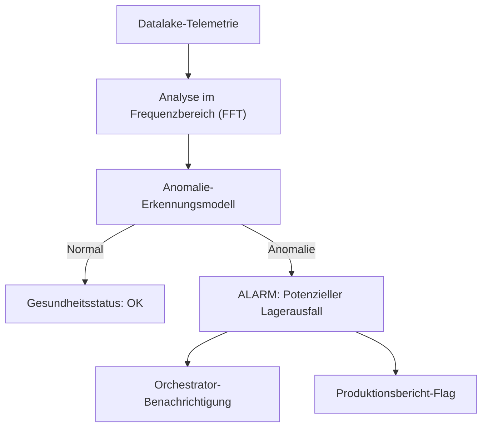

<p align="center">
  
</p>

# 🔍 HYDRA-UMC-ANOMALY-DETECTOR

<p align="center"><a href="README.md">🇺🇸 English</a> | <a href="README_spa.md">🇪🇸 Español</a> | <a href="README_fra.md">🇫🇷 Français</a> | <a href="README_ita.md">🇮🇹 Italiano</a> | 🇩🇪 <b>Deutsch</b> | <a href="README_zho.md">🇨🇳 简体中文</a> | <a href="README_jpn.md">🇯🇵 日本語</a></p>

### 🧠 KI-gestützte vorausschauende Wartung & Motorvibrationsanalyse

<p align="left">
  
  
  
</p>

---

## 1. 🛠️ TECHNISCHER ÜBERBLICK

**HYDRA-UMC-ANOMALY-DETECTOR** ist der proaktive Wächter der Robotergesundheit. Er nutzt KI-Modelle zur Analyse von Hochfrequenz-Telemetrie (Vibrationen, Motorstromsignaturen und thermische Profile), um Ausfälle zu erkennen, bevor sie auftreten.

Durch die Überwachung des "digitalen Fingerabdrucks" jedes Motors und Werkzeugkopfs kann er Lagerverschleiß, lose Riemen oder Kühlungsausfälle Wochen im Voraus identifizieren und so eine geplante Wartung anstelle von Notreparaturen ermöglichen.

### Hauptmerkmale:
* 🔍 **Signaturanalyse:** Echtzeit-FFT (Fast Fourier Transform) von Motorströmen zur Erkennung mechanischer Unwuchten.
* 📉 **Vorausschauende Wartung:** KI-gestützte RUL-Schätzung (Remaining Useful Life) für NEMA-Motoren und URTC-Werkzeuge.
* 🚨 **Frühwarnsystem:** Löst Alarme in den Studio- und Watch-Schnittstellen aus, wenn abnormale Muster auftreten.
* 🧬 **Lernmodelle:** Verbessert kontinuierlich die Erkennungsgenauigkeit durch Lernen aus der Datalake-Historie.

---

## 2. 🔄 ERKENNUNGS-PIPELINE



---

## 3. 🧱 ARCHITEKTUR & DESIGNENTSCHEIDUNGEN

* **Warum es Geschwister, kein Submodul, von HYDRA-UMC-DATALAKE ist.** Anomalieerkennung ist eine reine Lese-Analytics-Arbeitslast über bereits gespeicherte Telemetrie - sie getrennt zu halten bedeutet, dass ein Absturz des Detektors oder eine langsame Modellinferenz nie die eigenen Schreibvorgänge von HYDRA-UMC-TELEMETRY-COLLECTOR in denselben Speicher blockieren.
* **Warum heute FFT + eine statistische Baseline, noch kein trainiertes neuronales Netz.** Das README nennt dies "KI-gestützt" - was in diesem ersten Durchgang echt ist und läuft, ist eine echte Signalverarbeitungstechnik (`src/hydra_umc_anomaly_detector/fft.py`, numpys eigene FFT) plus ein pro Frequenzbin gelerntes statistisches Profil aus bekannt gesunden Fenstern (`baseline.py`) und ein Max-Z-Score-Urteil (`detector.py`) - kein trainiertes Deep-Learning-Modell. Es funktioniert, ist gegen echte synthetische Fehlersignaturen getestet, und ist das richtige Fundament, auf dem später ein gelerntes Modell aufgebaut wird (siehe `mejoras_futuras.txt`) - aber es hier ein neuronales Netz zu nennen würde übertreiben, was tatsächlich läuft.
* **Warum ein Max-Z-Score über alle Bins, kein fester Schwellenwert.** Ein fester Schwellenwert ('Motortemperatur > 80C') übersieht allmähliche Drift und löst Fehlalarme bei legitimen Lastspitzen aus - jeden Bin des LIVE-Spektrums gegen die GELERNTE eigene gesunde Baseline dieses konkreten Motors zu vergleichen erkennt einen neuen/verschobenen Frequenzpeak (eine echte Lagerdefekt-Signatur) ohne einen dieser beiden Fehlermodi. Der Standard-Schwellenwert (10.0) wurde aus echter empirischer Trennung gewählt, nicht geraten - siehe das eigene Docstring von `detector.py` für die tatsächlichen Zahlen aus den synthetischen gesund-vs-fehlerhaft-Testfixtures dieses Projekts.
* **Wie sich das ins restliche Ökosystem einfügt.** Ein Geschwisterdienst unter HYDRA-UMC-DATALAKE - führt Anomalieerkennung über die Telemetrie aus, die HYDRA-UMC-TELEMETRY-COLLECTOR dort bereits geschrieben hat.

---

## 📂 VERZEICHNISSTRUKTUR

Reiner Software-Dienst (ML/Analytik) ohne eigene Hardware, Firmware oder OS; diese Ordner sind gemäß der Repository-Strukturregel ausgelassen.

```text
HYDRA-UMC-ANOMALY-DETECTOR/
├── src/hydra_umc_anomaly_detector/  # Quellcode
│   ├── __init__.py                  # Paketversion
│   ├── fft.py                       # Echtes FFT-basiertes Spektrum (numpy)
│   ├── baseline.py                  # Gesundes statistisches Profil pro Bin (Mittelwert/Std)
│   ├── detector.py                  # Passt eine Baseline an, bewertet Live-Fenster dagegen
│   ├── api.py                        # Einfache JSON/HTTP-Handler, die den Detektor umschließen
│   └── main.py                       # Einstiegspunkt: verbindet alles, startet den HTTP-Server
├── tests/                   # pytest - FFT-Korrektheit, Baseline-Statistik, echte Fehlererkennung
├── build/                   # Build-Ausgabe (von git ignoriert)
├── pyproject.toml           # Paketmetadaten, Version, Abhängigkeiten (numpy)
├── bump_version.py          # Versionserhöhung im "Kilometerzähler"-Stil (vom Build ausgeführt)
├── build.sh / build.bat     # Echter Build: venv + editierbare Installation + Bump + Tests
├── run.sh / run.bat         # Echte Ausführung: startet die HTTP-API
└── README.md
```

Aus der ursprünglichen Vorlage entfernt: `hardware/`, `firmware/`, `os/`,
`docs/`, `images/` und `scripts/` — dies ist ein reiner Softwaredienst
(Python-Paket) ohne eigene Hardware oder Firmware, ohne zu pflegendes
Betriebssystem-Image, und ohne Dokumentations-/Medien-/Utility-Skript-
Inhalt, der eigene Ordner bislang rechtfertigen würde.

---

## 4. ⚙️ BUILD & AUSFÜHRUNG

Erfordert Python >= 3.10. Echte FFT-basierte Anomalieerkennung mit
HTTP-API, nicht nur ein Skelett, das sich importieren lässt.

```bash
# Linux/macOS
./build.sh
./run.sh --port 8097

# Windows
build.bat
run.bat --port 8097
```

`build` erstellt/aktiviert eine lokale `.venv`, installiert das Paket
(editierbar, mit Dev-Extras, einschließlich `numpy`) darin, prüft den
Import und führt die echte Testsuite (`pytest`) aus. `run` startet die
HTTP-API und reicht jedes Flag weiter (`--addr`, `--port`,
`--sample-rate`, `--threshold`).

```bash
# Gegen bekannt gesunde Signalfenster kalibrieren (JSON-Arrays von Floats,
# gleiche Abtastrate wie --sample-rate)
curl -X POST localhost:8097/baseline/fit -d '{"windows": [[...], [...], ...]}'

# Ein Live-Fenster gegen die angepasste Baseline bewerten
curl -X POST localhost:8097/detect -d '{"window": [...]}'
# -> {"score": 6.3, "anomalous": false, "worstBinFreqHz": 276.0}

curl localhost:8097/stats
```

```bash
python -m pytest tests/ -v   # fft.py (der Peak einer bekannten Sinuswelle
                              # wird korrekt gefunden, DC wird wirklich
                              # verworfen), baseline.py (korrekte Mittelwerte/
                              # Std, die Null-Std-Untergrenze verhindert eine
                              # echte Division durch Null), detector.py (das
                              # eigentliche Versprechen: ein synthetisches
                              # Fehlersignal wird markiert, ein gesund
                              # aussehendes nicht, mit echter Trennmarge,
                              # keinem Schwellenwert auf Messers Schneide),
                              # und api.py (echte HTTP-Roundtrips via einen
                              # echten ThreadingHTTPServer)
```

---

## 🚀 ROADMAP
* **Phase 1:** Hochdurchsatz-Ingestion und Indexierung des Datalakes für historische Analysen.
* **Phase 2:** Edge-Kompression des Telemetrie-Collectors und sichere Übertragungsprotokolle.
* **Phase 3:** Anomalieerkennung mittels unüberwachtem Lernen und Motorvibrationsanalyse.
* **Phase 4:** Integration der akustischen Analyse zum "Hören" früher mechanischer Probleme und KI-gestützte prädiktive Einblicke.

---

## 🔗 Verwandte Projekte

Dieses Projekt ist Teil eines größeren Robotik-Ökosystems desselben Autors (JuanenRac / Electro Hobby 3D), das Firmware, Steuerungssoftware, KI-Knoten und Flotten-Tools umfasst. Gut zu wissen, denn eine Anfrage könnte tatsächlich eines dieser Projekte betreffen statt dieses Repository.

### Familie

**Elternteil:** **[HYDRA-UMC-DATALAKE](https://github.com/JuanenRac/HYDRA-UMC-DATALAKE)** — der Integrations-Elternteil, dessen gespeicherte Telemetrie dieser Detektor analysiert.

**Geschwister:**
- **[HYDRA-UMC-TELEMETRY-COLLECTOR](https://github.com/JuanenRac/HYDRA-UMC-TELEMETRY-COLLECTOR)** — Geschwister-Analysedienst, gleicher Elternteil.
- **[HYDRA-UMC-PRODUCTION-REPORTS](https://github.com/JuanenRac/HYDRA-UMC-PRODUCTION-REPORTS)** — Geschwister-Analysedienst, gleicher Elternteil.

### Direkte Beziehung (außerhalb der Familie)

Dieses Projekt hat keine direkte Beziehung außerhalb der Data & Analytics-Familie (laut der eigenen Beziehungskarte des Ökosystems) - siehe "Restliches Ökosystem" unten für alles andere.

### Restliches Ökosystem

**HYDRA-UMC-Plattform** — die Multi-Roboter-Mikrofabrikzelle
- **[HYDRA-UMC](https://github.com/JuanenRac/HYDRA-UMC)** — das CM5 + STM32H745-Motherboard, das bis zu 8 Roboterarme orchestriert.
- **[HYDRA-UMC-SERVER](https://github.com/JuanenRac/HYDRA-UMC-SERVER)** — das Express/WebSocket-Backend, mit dem jeder Steuerungsclient spricht.
- **[HYDRA-UMC-STUDIO](https://github.com/JuanenRac/HYDRA-UMC-STUDIO)** — webbasiertes Steuerungs-Dashboard, Multi-Roboter-3D-Visualisierung.
- **[HYDRA-UMC-ANDROID-CONTROL](https://github.com/JuanenRac/HYDRA-UMC-ANDROID-CONTROL)** — Android-Steuerungs-App über Wi-Fi/Bluetooth.
- **[HYDRA-UMC-IOS-CONTROL](https://github.com/JuanenRac/HYDRA-UMC-IOS-CONTROL)** — iOS/iPadOS-Steuerungs-App, gebaut in Flutter.
- **[HYDRA-UMC-SUITE](https://github.com/JuanenRac/HYDRA-UMC-SUITE)** — Desktop-Schwarm-Kommandozentrale (Python/PySide6).
- **[HYDRA-UMC-EDITOR-URDF](https://github.com/JuanenRac/HYDRA-UMC-EDITOR-URDF)** — Desktop-URDF-Modelleditor für den Roboterkatalog.
- **[HYDRA-UMC-DSI](https://github.com/JuanenRac/HYDRA-UMC-DSI)** — native Touch-UI für den eingebauten DSI-Touchscreen.

**URTC-Plattform** — der Werkzeugkopf-Controller, den jeder HYDRA-UMC-Roboterarm trägt
- **[URTC](https://github.com/JuanenRac/URTC)** — CAN-Bus-Werkzeugkopf-Controller, 25 Werkzeugprofile.
- **[URTC-FLASHER](https://github.com/JuanenRac/URTC-FLASHER)** — Desktop-Tool für CAN-OTA + SWD/JTAG-Flashing.
- **[URTC-TESTER](https://github.com/JuanenRac/URTC-TESTER)** — Desktop-Tool für Live-CAN-Bus-Diagnose.
- **[URTC-WEB-STUDIO](https://github.com/JuanenRac/URTC-WEB-STUDIO)** — browserbasierte Alternative über die Web-Serial-API.

**🎥 Vision AI Node (Hailo-8)**
- [HYDRA-UMC-VISION-NODE](https://github.com/JuanenRac/HYDRA-UMC-VISION-NODE)
- [HYDRA-UMC-VISION-STREAMER](https://github.com/JuanenRac/HYDRA-UMC-VISION-STREAMER)
- [HYDRA-UMC-DETECTION-HEF](https://github.com/JuanenRac/HYDRA-UMC-DETECTION-HEF)
- [HYDRA-UMC-SAFETY-ZONES](https://github.com/JuanenRac/HYDRA-UMC-SAFETY-ZONES)
- [HYDRA-UMC-VISUAL-SERVOING-API](https://github.com/JuanenRac/HYDRA-UMC-VISUAL-SERVOING-API)

**🧠 Cognitive AI Node (Hailo-10)**
- [HYDRA-UMC-COGNITIVE-NODE](https://github.com/JuanenRac/HYDRA-UMC-COGNITIVE-NODE)
- [HYDRA-UMC-VLA-ENGINE](https://github.com/JuanenRac/HYDRA-UMC-VLA-ENGINE)
- [HYDRA-UMC-VOICE-UI](https://github.com/JuanenRac/HYDRA-UMC-VOICE-UI)
- [HYDRA-UMC-SEMANTIC-PLANNER](https://github.com/JuanenRac/HYDRA-UMC-SEMANTIC-PLANNER)
- [HYDRA-UMC-DOCS-QA](https://github.com/JuanenRac/HYDRA-UMC-DOCS-QA)

**🐝 Orchestration & Swarm**
- [HYDRA-UMC-ORCHESTRATOR](https://github.com/JuanenRac/HYDRA-UMC-ORCHESTRATOR)
- [HYDRA-UMC-SWARM-SYNC](https://github.com/JuanenRac/HYDRA-UMC-SWARM-SYNC)
- [HYDRA-UMC-PATH-PLANNER-3D](https://github.com/JuanenRac/HYDRA-UMC-PATH-PLANNER-3D)
- [HYDRA-UMC-JOB-DISPATCHER](https://github.com/JuanenRac/HYDRA-UMC-JOB-DISPATCHER)
- [HYDRA-UMC-NODE-HEALING](https://github.com/JuanenRac/HYDRA-UMC-NODE-HEALING)

**🎮 Digital Twin & Simulation**
- [HYDRA-UMC-TWIN](https://github.com/JuanenRac/HYDRA-UMC-TWIN)
- [HYDRA-UMC-PHYSICS-REPLICA](https://github.com/JuanenRac/HYDRA-UMC-PHYSICS-REPLICA)
- [HYDRA-UMC-HIL-BRIDGE](https://github.com/JuanenRac/HYDRA-UMC-HIL-BRIDGE)
- [HYDRA-UMC-SYNTHETIC-DATA-GEN](https://github.com/JuanenRac/HYDRA-UMC-SYNTHETIC-DATA-GEN)

**🏭 Industrial Gateway**
- [HYDRA-UMC-GATEWAY-INDUSTRIAL](https://github.com/JuanenRac/HYDRA-UMC-GATEWAY-INDUSTRIAL)
- [HYDRA-UMC-OPCUA-SERVER](https://github.com/JuanenRac/HYDRA-UMC-OPCUA-SERVER)
- [HYDRA-UMC-MQTT-BROKER](https://github.com/JuanenRac/HYDRA-UMC-MQTT-BROKER)
- [HYDRA-UMC-MTCONNECT-ADAPTER](https://github.com/JuanenRac/HYDRA-UMC-MTCONNECT-ADAPTER)

**🛠️ Complementary Tools**
- [URTC-SMART-RACK](https://github.com/JuanenRac/URTC-SMART-RACK)
- [URTC-VISION-TOOL](https://github.com/JuanenRac/URTC-VISION-TOOL)
- [HYDRA-UMC-WATCH](https://github.com/JuanenRac/HYDRA-UMC-WATCH)
- [HYDRA-UMC-TOOL-CLI](https://github.com/JuanenRac/HYDRA-UMC-TOOL-CLI)
- [HYDRA-UMC-DASHBOARD-AI](https://github.com/JuanenRac/HYDRA-UMC-DASHBOARD-AI)


## 👤 AUTOR
**JuanenRac** (Electro Hobby 3D)
📧 electrohobby3d@gmail.com

## 📜 LIZENZ
GPL-3.0 - Siehe LICENSE für Details.

## 🛠️ BUILD & RUN

Verwenden Sie den Build-Check ohne Versionierung vor einem Release-Build:

| Aktion | Windows | Linux / macOS |
|---|---|---|
| Build-Check (ohne Änderung von Version oder CHANGELOG) | `build-test.bat` | `./build-test.sh` |
| Ausführung / Entwicklung (falls vorhanden) | `run*.bat` oder `dev*.bat` | `./run*.sh` oder `./dev*.sh` |

`build-test.bat` und `build-test.sh` kompilieren oder validieren den Projekt-Stack, ohne `hydra-umc.project.json` zu erhöhen oder `CHANGELOG.md` zu verändern. Sie dürfen nur normale Compiler-Ausgaben erzeugen. Die vorhandenen Skripte `build*.bat`, `build*.sh`, `run*` und `dev*` behalten ihr projektbezogenes Versions- oder Laufzeitverhalten bei; verwenden Sie sie, wenn dieses Verhalten benötigt wird.