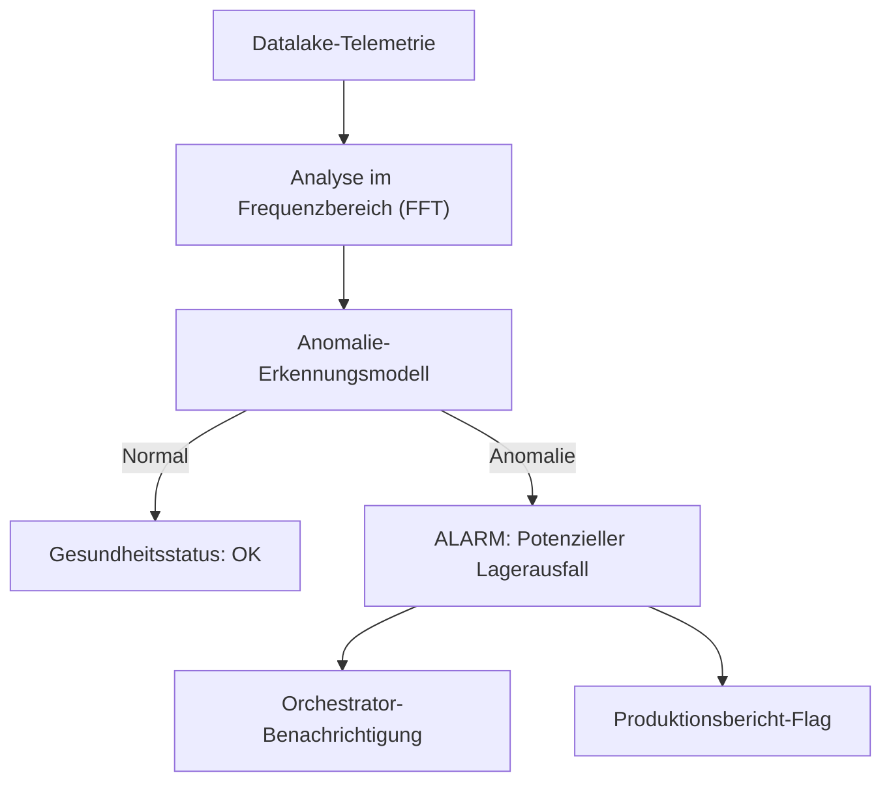

<p align="center">
  
</p>

# 🔍 HYDRA-UMC-ANOMALY-DETECTOR

<p align="center"><a href="README.md">🇺🇸 English</a> | <a href="README_spa.md">🇪🇸 Español</a> | <a href="README_fra.md">🇫🇷 Français</a> | <a href="README_ita.md">🇮🇹 Italiano</a> | 🇩🇪 <b>Deutsch</b> | <a href="README_zho.md">🇨🇳 简体中文</a> | <a href="README_jpn.md">🇯🇵 日本語</a></p>

### 🧠 KI-gestützte vorausschauende Wartung & Motorvibrationsanalyse

<p align="left">
  
  
  
</p>

---

## 1. 🛠️ TECHNISCHER ÜBERBLICK

**HYDRA-UMC-ANOMALY-DETECTOR** ist der proaktive Wächter der Robotergesundheit. Er nutzt KI-Modelle zur Analyse von Hochfrequenz-Telemetrie (Vibrationen, Motorstromsignaturen und thermische Profile), um Ausfälle zu erkennen, bevor sie auftreten.

Durch die Überwachung des "digitalen Fingerabdrucks" jedes Motors und Werkzeugkopfs kann er Lagerverschleiß, lose Riemen oder Kühlungsausfälle Wochen im Voraus identifizieren und so eine geplante Wartung anstelle von Notreparaturen ermöglichen.

### Hauptmerkmale:
* 🔍 **Signaturanalyse:** Echtzeit-FFT (Fast Fourier Transform) von Motorströmen zur Erkennung mechanischer Unwuchten.
* 📉 **Vorausschauende Wartung:** KI-gestützte RUL-Schätzung (Remaining Useful Life) für NEMA-Motoren und URTC-Werkzeuge.
* 🚨 **Frühwarnsystem:** Löst Alarme in den Studio- und Watch-Schnittstellen aus, wenn abnormale Muster auftreten.
* 🧬 **Lernmodelle:** Verbessert kontinuierlich die Erkennungsgenauigkeit durch Lernen aus der Datalake-Historie.
* 🏷️ **Modellversionierung:** Jedes `Verdict` trägt die echte, monoton steigende Modellversion und den Schwellenwert, gegen den es bewertet wurde - ein Refit ist ein echtes, nachvollziehbares Ereignis. *(implementiert)*
* 📐 **Precision/Recall-Metriken:** Echte, berechnete Precision/Recall/F1-Werte über eine gelabelte Fixture (`metrics.py`), nicht nur Prosa-Behauptungen über die Score-Trennung. *(implementiert)*
* 📈 **Simulierte Drift-Erkennung:** `DriftMonitor` meldet eine echte, anhaltende Erhöhung des gleitenden Mittelwerts, die sich vom eigenen Anomalie-Flag eines einzelnen Fensters unterscheidet. *(implementiert)*

---

## 2. 🔄 ERKENNUNGS-PIPELINE



---

## 3. 🧱 ARCHITEKTUR & DESIGNENTSCHEIDUNGEN

* **Warum es Geschwister, kein Submodul, von HYDRA-UMC-DATALAKE ist.** Anomalieerkennung ist eine reine Lese-Analytics-Arbeitslast über bereits gespeicherte Telemetrie - sie getrennt zu halten bedeutet, dass ein Absturz des Detektors oder eine langsame Modellinferenz nie die eigenen Schreibvorgänge von HYDRA-UMC-TELEMETRY-COLLECTOR in denselben Speicher blockieren.
* **Warum heute FFT + eine statistische Baseline, noch kein trainiertes neuronales Netz.** Das README nennt dies "KI-gestützt" - was in diesem ersten Durchgang echt ist und läuft, ist eine echte Signalverarbeitungstechnik (`src/hydra_umc_anomaly_detector/fft.py`, numpys eigene FFT) plus ein pro Frequenzbin gelerntes statistisches Profil aus bekannt gesunden Fenstern (`baseline.py`) und ein Max-Z-Score-Urteil (`detector.py`) - kein trainiertes Deep-Learning-Modell. Es funktioniert, ist gegen echte synthetische Fehlersignaturen getestet, und ist das richtige Fundament, auf dem später ein gelerntes Modell aufgebaut wird (siehe den Abschnitt FAHRPLAN weiter unten) - aber es hier ein neuronales Netz zu nennen würde übertreiben, was tatsächlich läuft.
* **Warum ein Max-Z-Score über alle Bins, kein fester Schwellenwert.** Ein fester Schwellenwert ('Motortemperatur > 80C') übersieht allmähliche Drift und löst Fehlalarme bei legitimen Lastspitzen aus - jeden Bin des LIVE-Spektrums gegen die GELERNTE eigene gesunde Baseline dieses konkreten Motors zu vergleichen erkennt einen neuen/verschobenen Frequenzpeak (eine echte Lagerdefekt-Signatur) ohne einen dieser beiden Fehlermodi. Der Standard-Schwellenwert (10.0) wurde aus echter empirischer Trennung gewählt, nicht geraten - siehe das eigene Docstring von `detector.py` für die tatsächlichen Zahlen aus den synthetischen gesund-vs-fehlerhaft-Testfixtures dieses Projekts.
* **Wie sich das ins restliche Ökosystem einfügt.** Ein Geschwisterdienst unter HYDRA-UMC-DATALAKE - führt Anomalieerkennung über die Telemetrie aus, die HYDRA-UMC-TELEMETRY-COLLECTOR dort bereits geschrieben hat.
* **Warum `DriftMonitor` ein von `AnomalyDetector.score()` getrennter Mechanismus ist, kein größerer Schwellenwert.** Sie beantworten unterschiedliche echte Fragen: "ist DIESES Fenster anomal" (ein einmaliges Urteil) versus "hat sich der JÜNGSTE Durchschnitt still verschoben" (ein gleitender Trend, robust gegenüber einem einzelnen verrauschten Ausreißer-Fenster). Ein echter simulierter Drift-Test hat gefunden und dokumentiert ehrlich, dass beim Max-Z-Score-Design dieses Detektors bei einem Fehler eines neuen Frequenztyps das eigene Flag eines einzelnen Fensters tatsächlich *vor* dem gleitenden Drift-Signal auslöst - der eigentliche Wert von `DriftMonitor` liegt hier in einer Bestätigung eines anhaltenden Trends, nicht in einer früheren Warnung, und der Code sagt das auch so, statt es zu übertreiben.
* **Warum `metrics.py` Precision/Recall berechnet, statt die Qualität des Schwellenwerts als Prosa stehen zu lassen.** Das eigene Docstring von `detector.py` behauptete früher nur "gesund bewertet bis zu ~5.3, fehlerhaft bewertet in den Hunderten" - echt, aber keine Zahl, gegen die eine künftige Neujustierung regressionstesten könnte. `precision_recall()` über dasselbe echte Fixture gibt dem einen echten, überprüfbaren Wert (heute 1.0/1.0).

---

## 📂 VERZEICHNISSTRUKTUR

Reiner Software-Dienst (ML/Analytik) ohne eigene Hardware, Firmware oder OS; diese Ordner sind gemäß der Repository-Strukturregel ausgelassen.

```text
HYDRA-UMC-ANOMALY-DETECTOR/
├── src/hydra_umc_anomaly_detector/  # Quellcode
│   ├── __init__.py                  # Paketversion
│   ├── fft.py                       # Echtes FFT-basiertes Spektrum (numpy)
│   ├── baseline.py                  # Gesundes statistisches Profil pro Bin (Mittelwert/Std)
│   ├── detector.py                  # Passt eine Baseline an, bewertet Live-Fenster dagegen
│   ├── metrics.py                   # Echte Precision/Recall/F1-Werte über eine gelabelte Fixture
│   ├── drift.py                     # Echte Drift-Erkennung über gleitenden Mittelwert
│   ├── api.py                        # Einfache JSON/HTTP-Handler, die den Detektor umschließen
│   └── main.py                       # Einstiegspunkt: verbindet alles, startet den HTTP-Server
├── tests/                   # pytest - FFT-Korrektheit, Baseline-Statistik, echte Fehlererkennung, Metriken, simulierte Drift
├── docs/
│   └── API.md               # Echte HTTP-Endpunktreferenz (Requests, Responses, Statuscodes)
├── images/                  # Medien und Diagramme
├── systemd/
│   └── hydra-umc-anomaly-detector.service # systemd-Unit der lokalen Anomalieerkennungs-API auf der CM5
├── tools/
│   ├── build_test.py        # Build-/Kompilierprüfung ohne Versionserhöhung
│   └── ci_validate.py       # Manifest-/CHANGELOG-/Doku-Validierung, von der CI genutzt
├── build/                   # Build-Ausgabe (von git ignoriert)
├── pyproject.toml           # Paketmetadaten, Version, Abhängigkeiten (numpy)
├── bump_version.py          # Versionserhöhung im "Kilometerzähler"-Stil (vom Build ausgeführt)
├── bump_manifest_version.py # Synchronisiert die Version von hydra-umc.project.json mit der nativen (--sync)
├── build.sh / build.bat     # Echter Build: venv + editierbare Installation + Bump + Tests
├── run.sh / run.bat         # Echte Ausführung: startet die HTTP-API
└── README.md
```

Aus der ursprünglichen Vorlage entfernt: `hardware/`, `firmware/` und
`os/` — dies ist ein reiner Softwaredienst (Python-Paket) ohne eigene
Hardware oder Firmware und ohne zu pflegendes Betriebssystem-Image. Siehe
[`docs/API.md`](docs/API.md) für die vollständige HTTP-Endpunktreferenz.

---

## 4. ⚙️ BUILD & AUSFÜHRUNG

Erfordert Python >= 3.10. Echte FFT-basierte Anomalieerkennung mit
HTTP-API, nicht nur ein Skelett, das sich importieren lässt.

```bash
# Linux/macOS
./build.sh
./run.sh --port 8097

# Windows
build.bat
run.bat --port 8097
```

`build` erstellt/aktiviert eine lokale `.venv`, installiert das Paket
(editierbar, mit Dev-Extras, einschließlich `numpy`) darin, prüft den
Import und führt die echte Testsuite (`pytest`) aus. `run` startet die
HTTP-API und reicht jedes Flag weiter (`--addr`, `--port`,
`--sample-rate`, `--threshold`).

```bash
# Gegen bekannt gesunde Signalfenster kalibrieren (JSON-Arrays von Floats,
# gleiche Abtastrate wie --sample-rate)
curl -X POST localhost:8097/baseline/fit -d '{"windows": [[...], [...], ...]}'

# Ein Live-Fenster gegen die angepasste Baseline bewerten
curl -X POST localhost:8097/detect -d '{"window": [...]}'
# -> {"score": 6.3, "anomalous": false, "worstBinFreqHz": 276.0}

curl localhost:8097/stats
```

```bash
python -m pytest tests/ -v   # fft.py (der Peak einer bekannten Sinuswelle
                              # wird korrekt gefunden, DC wird wirklich
                              # verworfen), baseline.py (korrekte Mittelwerte/
                              # Std, die Null-Std-Untergrenze verhindert eine
                              # echte Division durch Null), detector.py (das
                              # eigentliche Versprechen: ein synthetisches
                              # Fehlersignal wird markiert, ein gesund
                              # aussehendes nicht, mit echter Trennmarge,
                              # keinem Schwellenwert auf Messers Schneide),
                              # und api.py (echte HTTP-Roundtrips via einen
                              # echten ThreadingHTTPServer)
```

---

## 🚀 FAHRPLAN
* **Phase 1:** Hochdurchsatz-Ingestion und Indexierung des Datalakes für historische Analysen.
* **Phase 2:** Edge-Kompression des Telemetrie-Collectors und sichere Übertragungsprotokolle.
* **Phase 3:** Anomalieerkennung mittels unüberwachtem Lernen und Motorvibrationsanalyse.
* **Phase 4:** Integration der akustischen Analyse zum "Hören" früher mechanischer Probleme und KI-gestützte prädiktive Einblicke.

---

## 🔗 Verwandte Projekte

Dieses Projekt ist Teil des HYDRA-UMC-Robotik-Ökosystems desselben Autors (JuanenRac / Electro Hobby 3D). Gut zu wissen, da eine Anfrage eigentlich eines dieser Projekte betreffen könnte statt dieses Repositorys.

**Übergeordnetes Projekt**
- **[HYDRA-UMC-DATALAKE](https://github.com/JuanenRac/HYDRA-UMC-DATALAKE)** — echter sqlite3-gestützter Zeitreihenspeicher mit einer echten Ingest-/Abfrage-HTTP-API; das übergeordnete Projekt, dessen spezifischer Analysedienst dieses Repository innerhalb seiner eigenen Daten- und Analytik-Schicht ist.

**Geschwisterprojekte** — die übrigen Analysedienste der eigenen Daten- und Analytik-Schicht von HYDRA-UMC-DATALAKE
- **[HYDRA-UMC-TELEMETRY-COLLECTOR](https://github.com/JuanenRac/HYDRA-UMC-TELEMETRY-COLLECTOR)** — echte CAN/WebSocket-Ingestion-Pipeline in DATALAKE, mit Sequenz-Deduplizierung.
- **[HYDRA-UMC-PRODUCTION-REPORTS](https://github.com/JuanenRac/HYDRA-UMC-PRODUCTION-REPORTS)** — echte OEE-/Verfügbarkeitsberechnung über den DATALAKE-Verlauf, mit reproduzierbarem CSV-Export.

**Direkt verwandt**
- **[HYDRA-UMC-STUDIO](https://github.com/JuanenRac/HYDRA-UMC-STUDIO)** — Web-Steuerungs-Dashboard mit Echtzeit-3D-Visualisierung mehrerer Roboter — zeigt die echten Frühwarnungen dieses Detektors direkt in der Steuerungsoberfläche an.
- **[HYDRA-UMC-WATCH](https://github.com/JuanenRac/HYDRA-UMC-WATCH)** — WearOS-Begleit-App mit echten haptischen Alarmen und einem Sprach-Relay zum gekoppelten Telefon — dieselbe Alarmoberfläche, für alle, die die Flottengesundheit im Blick behalten statt einen Roboter zu steuern.
- **[URTC](https://github.com/JuanenRac/URTC)** — Firmware für die physische Universal-Robot-Tool-Controller-Platine, 25+ Werkzeugprofile über CAN-Bus — die RUL-Schätzung hier deckt auch die eigenen Werkzeugköpfe von URTC ab, nicht nur die NEMA-Motoren der Arme selbst.

**Ebenfalls Teil des Ökosystems**

*Kern-Hardware & Plattform*
- **[HYDRA-UMC](https://github.com/JuanenRac/HYDRA-UMC)** — das physische Motherboard des Roboterarms: CM5-Host + Dual-Core-STM32H745, koordiniert bis zu 8 Werkzeugarme über CAN-OTA/SPI-OTA.
- **[HYDRA-UMC-OS](https://github.com/JuanenRac/HYDRA-UMC-OS)** — reproduzierbare Raspberry-Pi-OS-Produktschicht für den CM5: schreibgeschützter Agent, validierte Konfiguration/Profile, WiFi-Ersteinrichtung.
- **[HYDRA-UMC-SDK](https://github.com/JuanenRac/HYDRA-UMC-SDK)** — der gemeinsame JSON-Schema-Vertrag und die Sicherheitsschranke, gegen die jede Bridge ihre Befehle validiert.

*Kern-Backend & Clients*
- **[HYDRA-UMC-SERVER](https://github.com/JuanenRac/HYDRA-UMC-SERVER)** — das reale Headless-Backend (REST/WebSocket), mit dem jeder Steuerungsclient tatsächlich spricht.
- **[HYDRA-UMC-SUITE](https://github.com/JuanenRac/HYDRA-UMC-SUITE)** — Desktop-Schwarmleitstand (PySide6) für mehrere Server gleichzeitig, verpackt als eigenständige ausführbare Datei.
- **[HYDRA-UMC-ANDROID-CONTROL](https://github.com/JuanenRac/HYDRA-UMC-ANDROID-CONTROL)** — native Android-Steuerungs-App mit biometrischem Login und einer gekoppelten Wear-OS-Begleit-App.
- **[HYDRA-UMC-IOS-CONTROL](https://github.com/JuanenRac/HYDRA-UMC-IOS-CONTROL)** — iOS/iPadOS-Steuerungs-App (Flutter) mit Echtzeit-WebSocket-Synchronisierung.
- **[HYDRA-UMC-DSI](https://github.com/JuanenRac/HYDRA-UMC-DSI)** — native Touch-UI für das eingebaute 7"-DSI-Touchscreen, direkt auf dem CM5 eingebettet.
- **[HYDRA-UMC-EDITOR-URDF](https://github.com/JuanenRac/HYDRA-UMC-EDITOR-URDF)** — grafischer Desktop-URDF-Ersteller/-Editor, der fertige Modelle in STUDIOs eigenen Katalog überträgt.
- **[HYDRA-UMC-BRIDGE-AMR](https://github.com/JuanenRac/HYDRA-UMC-BRIDGE-AMR)** — Koordinationsschranke für AGV-/AMR-Flotten über einen echten VDA-5050-MQTT-Publisher.
- **[HYDRA-UMC-BRIDGE-CNC](https://github.com/JuanenRac/HYDRA-UMC-BRIDGE-CNC)** — High-Level-Koordinator für CNC-Zellen mit echtem GRBL-Status-/Steuerbyte-Zugriff.
- **[HYDRA-UMC-BRIDGE-DROIDS](https://github.com/JuanenRac/HYDRA-UMC-BRIDGE-DROIDS)** — Koordinationsschranke für laufende/humanoide Droiden, mit einem echten Boston-Dynamics-Spot-Befehlssender.
- **[HYDRA-UMC-BRIDGE-LASER](https://github.com/JuanenRac/HYDRA-UMC-BRIDGE-LASER)** — Sicherheitskoordinator für Laserzellen, liest 3 echte Schlüssel-/Gehäuse-/Verriegelungs-GPIO-Sicherungen.
- **[HYDRA-UMC-BRIDGE-OPENPNP](https://github.com/JuanenRac/HYDRA-UMC-BRIDGE-OPENPNP)** — sicherer High-Level-Koordinator für den Leiterplattenfluss von OpenPnP Pick-and-Place.
- **[HYDRA-UMC-BRIDGE-PRINTER3D](https://github.com/JuanenRac/HYDRA-UMC-BRIDGE-PRINTER3D)** — sichere Koordinationsschranke für Moonraker/Klipper-3D-Drucker, mit echten gesicherten Job-Befehlen.
- **[HYDRA-UMC-BRIDGE-ROS2](https://github.com/JuanenRac/HYDRA-UMC-BRIDGE-ROS2)** — Sicherheitskoordinator mit einem echten, träge importierten rclpy-ROS-2-Transport.
- **[HYDRA-UMC-BRIDGE-UAV](https://github.com/JuanenRac/HYDRA-UMC-BRIDGE-UAV)** — Koordinationsschranke für kameraausgestattete UAVs, mit einem echten MAVLink-Befehlssender.

*URTC-Werkzeugplattform*
- **[URTC-FLASHER](https://github.com/JuanenRac/URTC-FLASHER)** — Desktop-GUI-Flash-Tool für URTC-Platinen, CAN-OTA plus Full-Chip-SWD/JTAG.
- **[URTC-TESTER](https://github.com/JuanenRac/URTC-TESTER)** — Desktop-Live-CAN-Bus-Diagnosetool für URTC-Platinen, ein Panel pro Werkzeugprofil.
- **[URTC-WEB-STUDIO](https://github.com/JuanenRac/URTC-WEB-STUDIO)** — browserbasierte Alternative zu URTC-TESTER über die Web-Serial-API, ohne lokale Installation.

*Vision-KI-Knoten (Hailo-8)*
- **[HYDRA-UMC-VISION-NODE](https://github.com/JuanenRac/HYDRA-UMC-VISION-NODE)** — Integrationsknoten für die Hailo-8-Vision-Pipeline, mit einer echten stufenweisen Hardware-Bereitschaftsprüfung.
- **[HYDRA-UMC-DETECTION-HEF](https://github.com/JuanenRac/HYDRA-UMC-DETECTION-HEF)** — echte Registry für kompilierte Modelle mit Hailo-Architektur-/Prüfsummen-Safe-Load-Verifizierung.
- **[HYDRA-UMC-VISION-STREAMER](https://github.com/JuanenRac/HYDRA-UMC-VISION-STREAMER)** — echter GStreamer-Pipeline- + MediaMTX-Konfigurationsgenerator mit einer echten HailoRT-Integrationsschranke.
- **[HYDRA-UMC-VISUAL-SERVOING-API](https://github.com/JuanenRac/HYDRA-UMC-VISUAL-SERVOING-API)** — echtes Position-Based-Visual-Servoing-Korrekturgesetz, sicherheitsgesteuert nach vorgelagertem Zonenstatus.
- **[HYDRA-UMC-SAFETY-ZONES](https://github.com/JuanenRac/HYDRA-UMC-SAFETY-ZONES)** — echte Zonenverletzungsprüfung und E-STOP-Anforderung, mit erzwungener Kalibrierungsaktualität.

*Kognitiver KI-Knoten (Hailo-10)*
- **[HYDRA-UMC-COGNITIVE-NODE](https://github.com/JuanenRac/HYDRA-UMC-COGNITIVE-NODE)** — Integrationsknoten für die Hailo-10-Cognitive-Pipeline (LLM-/VLA-/Sprach-Orchestrierung).
- **[HYDRA-UMC-VLA-ENGINE](https://github.com/JuanenRac/HYDRA-UMC-VLA-ENGINE)** — echte Aktions-Token-Kodierung/-Dekodierung und Trajektoriengenerierung für ein Vision-Language-Action-Modell.
- **[HYDRA-UMC-VOICE-UI](https://github.com/JuanenRac/HYDRA-UMC-VOICE-UI)** — echtes Sprach-Frontend (VAD + Intent-Parser) mit einem begrenzten, bestätigungsgesicherten Watch-Relay.
- **[HYDRA-UMC-SEMANTIC-PLANNER](https://github.com/JuanenRac/HYDRA-UMC-SEMANTIC-PLANNER)** — echte regelbasierte Aufgabenzerlegung und semantische Fehlerbehebung über MCU-Fehlercodes.
- **[HYDRA-UMC-DOCS-QA](https://github.com/JuanenRac/HYDRA-UMC-DOCS-QA)** — echte, nur auf der Standardbibliothek basierende TF-IDF-Dokumentensuche über die eigenen Markdown-Dokumente dieses Ökosystems.

*Orchestrierung & Schwarm*
- **[HYDRA-UMC-ORCHESTRATOR](https://github.com/JuanenRac/HYDRA-UMC-ORCHESTRATOR)** — Integrationsknoten mit einem echten gRPC/Protobuf-Health-Report-Vertrag und einer Missions-Zustandsmaschine.
- **[HYDRA-UMC-JOB-DISPATCHER](https://github.com/JuanenRac/HYDRA-UMC-JOB-DISPATCHER)** — echte prioritätsbasierte Job-Queue mit Deduplizierung, über eine echte HTTP-API.
- **[HYDRA-UMC-NODE-HEALING](https://github.com/JuanenRac/HYDRA-UMC-NODE-HEALING)** — echter gRPC-basierter Flotten-Health-Watchdog mit Retry/Backoff und Identitäts-Mismatch-Erkennung.
- **[HYDRA-UMC-PATH-PLANNER-3D](https://github.com/JuanenRac/HYDRA-UMC-PATH-PLANNER-3D)** — echter RRT-basierter 3D-Pfadplaner mit echter Hindernis-/Arbeitsraum-Kollisionsvalidierung.
- **[HYDRA-UMC-SWARM-SYNC](https://github.com/JuanenRac/HYDRA-UMC-SWARM-SYNC)** — echte CRDT-LWW-Element-Map-Zustandssynchronisation, eigenschaftsgetestet auf Multi-Zellen-Konvergenz.

*Digitaler Zwilling & Simulation*
- **[HYDRA-UMC-TWIN](https://github.com/JuanenRac/HYDRA-UMC-TWIN)** — Integrationsknoten für die Digital-Twin-Engine, mit einem echten Versionskompatibilitäts-Sync-Vertrag.
- **[HYDRA-UMC-HIL-BRIDGE](https://github.com/JuanenRac/HYDRA-UMC-HIL-BRIDGE)** — echte Hardware-in-the-Loop-Sicherheitsverriegelung, die Befehle zwischen Simulation und echter Hardware routet.
- **[HYDRA-UMC-PHYSICS-REPLICA](https://github.com/JuanenRac/HYDRA-UMC-PHYSICS-REPLICA)** — echte Vorwärtskinematik und Gelenkgrenzenvalidierung über eine echte URDF-Teilmenge.
- **[HYDRA-UMC-SYNTHETIC-DATA-GEN](https://github.com/JuanenRac/HYDRA-UMC-SYNTHETIC-DATA-GEN)** — echter prozeduraler 2D-Szenengenerator mit YOLO/COCO-Annotationsexport.

*Industrie-Gateway*
- **[HYDRA-UMC-GATEWAY-INDUSTRIAL](https://github.com/JuanenRac/HYDRA-UMC-GATEWAY-INDUSTRIAL)** — Integrationsknoten, der zu Industrieprotokollen weiterleitet, mit einer echten Befehls-Allowlist-/Backpressure-Schicht.
- **[HYDRA-UMC-OPCUA-SERVER](https://github.com/JuanenRac/HYDRA-UMC-OPCUA-SERVER)** — echter OPC-UA-Adressraum, verifiziert mit einer echten Binärprotokoll-Client-Session.
- **[HYDRA-UMC-MQTT-BROKER](https://github.com/JuanenRac/HYDRA-UMC-MQTT-BROKER)** — echter MQTT-Broker mit optionaler Pro-Client-Authentifizierung und Topic-ACLs.
- **[HYDRA-UMC-MTCONNECT-ADAPTER](https://github.com/JuanenRac/HYDRA-UMC-MTCONNECT-ADAPTER)** — echte MTConnect-`/probe`- und `/current`-XML-Endpunkte mit Degraded-Mode-Ausgabe.

*Ergänzende Tools & Ökosystembetrieb*
- **[HYDRA-UMC-DASHBOARD-AI](https://github.com/JuanenRac/HYDRA-UMC-DASHBOARD-AI)** — Smart-Summaries- und Anomaly-Highlighting-Panels über DATALAKE/ANOMALY-DETECTOR, mit einem ehrlichen statistischen Fallback.
- **[HYDRA-UMC-TOOL-CLI](https://github.com/JuanenRac/HYDRA-UMC-TOOL-CLI)** — Flotten-CLI mit einem echten, stabilen Exit-Code-Vertrag, ein echter Live-Client der eigenen API von HYDRA-UMC-SERVER.
- **[URTC-SMART-RACK](https://github.com/JuanenRac/URTC-SMART-RACK)** — Firmware für ein Platinenmontagegestell mit echter Werkzeug-ID-Dekodierung und Smart-Idle-Vorheizlogik.
- **[URTC-VISION-TOOL](https://github.com/JuanenRac/URTC-VISION-TOOL)** — Firmware plus ein echter Python-Vision-Begleiter für einen Thermal-/RGB-Inspektionswerkzeugkopf.
- **[HYDRA-UMC-UPDATER](https://github.com/JuanenRac/HYDRA-UMC-UPDATER)** — administratives Desktop-Tool, das jedes Repository in diesem Ökosystem entdeckt, klont und aktualisiert.


---

## 📚 Dokumentation & Community

- **[CONTRIBUTING.md](CONTRIBUTING.md)** — Technologie-Stack und Coding-Richtlinien für einen Pull Request.
- **[CODE_OF_CONDUCT.md](CODE_OF_CONDUCT.md)** — die in dieser Community erwarteten Verhaltensstandards.
- **[SECURITY.md](SECURITY.md)** — wie man eine Schwachstelle meldet, und die echten Sicherheitsschwerpunkte dieses Projekts.
- **[SUPPORT.md](SUPPORT.md)** — wo man Fragen stellt und Fehler meldet.
- **[LICENSE.md](LICENSE.md)** — die eigene Lizenz dieses Projekts.

## 👤 AUTOR
**JuanenRac** (Electro Hobby 3D)
📧 electrohobby3d@gmail.com
📺 [youtube.com/@electrohobby3d](https://youtube.com/@electrohobby3d)

## 📜 LIZENZ
GPL-3.0 - Siehe LICENSE für Details.
