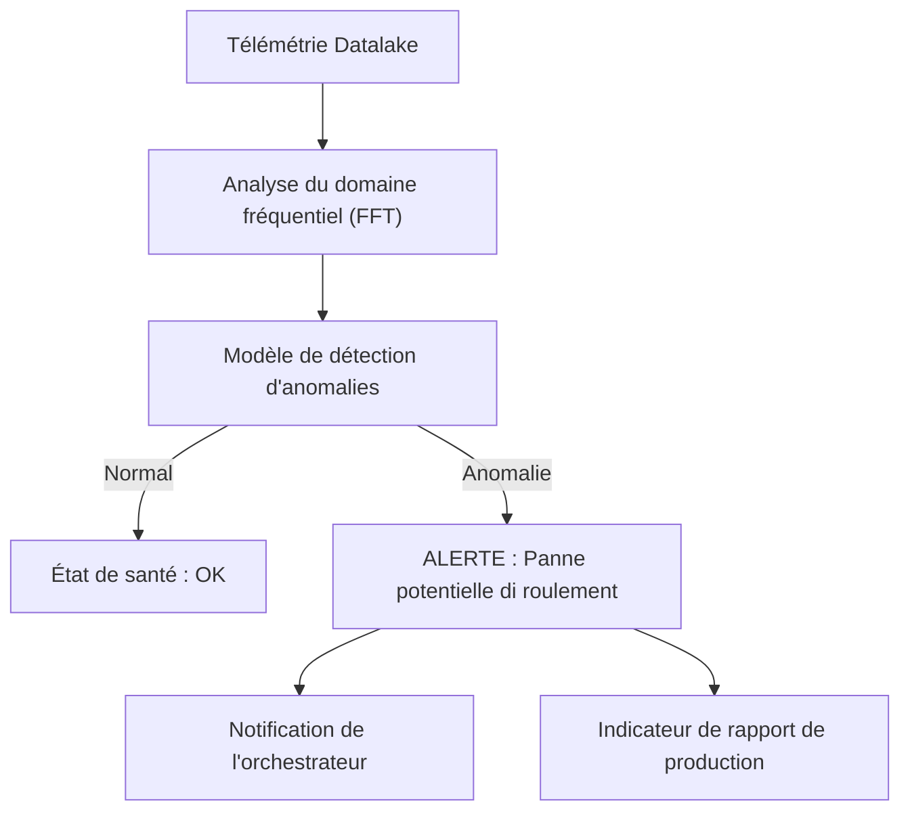

<p align="center">
  
</p>

# 🔍 HYDRA-UMC-ANOMALY-DETECTOR

<p align="center"><a href="README.md">🇺🇸 English</a> | <a href="README_spa.md">🇪🇸 Español</a> | 🇫🇷 <b>Français</b> | <a href="README_ita.md">🇮🇹 Italiano</a> | <a href="README_deu.md">🇩🇪 Deutsch</a> | <a href="README_zho.md">🇨🇳 简体中文</a> | <a href="README_jpn.md">🇯🇵 日本語</a></p>

### 🧠 Maintenance prédictive pilotée par l'IA et analyse des vibrations des moteurs

<p align="left">
  
  
  
</p>

---

## 1. 🛠️ APERÇU TECHNIQUE

**HYDRA-UMC-ANOMALY-DETECTOR** est le gardien proactif de la santé robotique. Il utilise des modèles d'IA pour analyser la télémétrie haute fréquence (vibrations, signatures de courant moteur et profils thermiques) afin de détecter les pannes avant qu'elles ne surviennent.

En surveillant l'« empreinte numérique » di chaque moteur et tête d'outil, il peut identifier l'usure des roulements, les courroies desserrées ou les défaillances de refroidissement des semaines à l'avance, permettant une maintenance programmée au lieu de réparations d'urgence.

### Caractéristiques principales :
* 🔍 **Analyse de signature :** FFT (Fast Fourier Transform) en temps réel des courants moteurs pour détecter un déséquilibre mécanique.
* 📉 **Maintenance prédictive :** Estimation de la RUL (Remaining Useful Life) pilotée par l'IA pour les moteurs NEMA et les outils URTC.
* 🚨 **Système d'alerte précoce :** Déclenche des alertes dans les interfaces Studio et Watch lorsque des modèles anormaux apparaissent.
* 🧬 **Modèles d'apprentissage :** Améliore continuellement la précision de la détection en apprenant de l'historique du Datalake.
* 🏷️ **Versionnage du modèle :** Chaque `Verdict` porte la version de modèle réelle et monotone, ainsi que le seuil sur lequel il a été noté - un réajustement (refit) est un événement réel et traçable. *(implémenté)*
* 📐 **Métriques précision/rappel :** Precision/recall/F1 réels, calculés sur un jeu de données étiqueté (`metrics.py`), pas seulement des affirmations en prose sur la séparation des scores. *(implémenté)*
* 📈 **Détection de dérive simulée :** `DriftMonitor` signale une élévation soutenue réelle de la moyenne glissante, distincte du propre signal d'anomalie d'une seule fenêtre. *(implémenté)*

---

## 2. 🔄 PIPELINE DE DÉTECTION



---

## 3. 🧱 ARCHITECTURE & DÉCISIONS DE CONCEPTION

* **Pourquoi c'est un frère, pas un sous-module, de HYDRA-UMC-DATALAKE.** La détection d'anomalies est une charge de travail analytique en lecture seule sur de la télémétrie déjà stockée - la garder séparée signifie qu'un plantage du détecteur ou une inférence de modèle lente ne bloquent jamais les propres écritures de HYDRA-UMC-TELEMETRY-COLLECTOR dans le même entrepôt.
* **Pourquoi FFT + une base statistique aujourd'hui, pas encore un réseau de neurones entraîné.** Le README appelle cela « piloté par l'IA » - ce qui est réel et fonctionne dans cette première passe est une véritable technique de traitement du signal (`src/hydra_umc_anomaly_detector/fft.py`, la propre FFT de numpy) plus une base statistique par bin de fréquence apprise à partir de fenêtres connues comme saines (`baseline.py`) et un verdict de max-z-score (`detector.py`) - pas un modèle de deep learning entraîné. Cela fonctionne, c'est testé contre de vraies signatures de panne synthétiques, et c'est la bonne fondation sur laquelle construire un modèle appris plus tard (voir `mejoras_futuras.txt`) - mais l'appeler réseau de neurones ici exagérerait ce qui tourne réellement.
* **Pourquoi un max-z-score sur tous les bins, pas un seuil fixe.** Un seuil fixe ('température moteur > 80C') rate la dérive graduelle et déclenche de fausses alarmes sur des pics de charge légitimes - comparer chaque bin du spectre EN DIRECT à la propre base saine APPRISE de ce moteur précis détecte un pic de fréquence nouveau/décalé (une véritable signature de défaut de roulement) sans aucun de ces deux modes d'échec. Le seuil par défaut (10.0) a été choisi à partir d'une séparation empirique réelle, pas deviné - voir le docstring propre de `detector.py` pour les chiffres réels des fixtures de test synthétiques sain-vs-défectueux de ce projet.
* **Comment cela s'intègre dans le reste de l'écosystème.** Un service frère sous HYDRA-UMC-DATALAKE - exécute la détection d'anomalies sur la télémétrie que HYDRA-UMC-TELEMETRY-COLLECTOR y a déjà écrite.
* **Pourquoi `DriftMonitor` est un mécanisme séparé de `AnomalyDetector.score()`, et non un seuil plus grand.** Ils répondent à des questions réelles différentes : « cette fenêtre-CI est-elle anormale » (un verdict ponctuel) contre « la moyenne RÉCENTE a-t-elle discrètement dérivé » (une tendance glissante, robuste face à une seule fenêtre aberrante bruitée). Un véritable test de dérive simulée a découvert et documente honnêtement que, pour la conception max-z-score de ce détecteur, le propre signal d'une seule fenêtre se déclenche en réalité *avant* le signal de dérive glissante pour un défaut d'un nouveau type de fréquence - la vraie valeur de `DriftMonitor` ici est une confirmation de tendance soutenue, pas une alerte plus précoce, et le code le dit ainsi plutôt que de survendre la chose.
* **Pourquoi `metrics.py` calcule precision/recall plutôt que de laisser la qualité du seuil en prose.** Le docstring propre de `detector.py` n'affirmait auparavant que « sain noté jusqu'à ~5.3, défectueux noté dans les centaines » - réel, mais pas un chiffre contre lequel un futur réajustement pourrait faire un test de non-régression. `precision_recall()` sur le même jeu de données réel donne à cela une valeur réelle et vérifiable (1.0/1.0 aujourd'hui).

---

## 📂 STRUCTURE DES RÉPERTOIRES

Service purement logiciel (ML/analytique) sans matériel, firmware ni OS propres; ces dossiers sont omis par la règle de structure du dépôt.

```text
HYDRA-UMC-ANOMALY-DETECTOR/
├── src/hydra_umc_anomaly_detector/  # Code source
│   ├── __init__.py                  # Version du paquet
│   ├── fft.py                       # Spectre réel basé sur la FFT (numpy)
│   ├── baseline.py                  # Profil statistique sain par bin (moyenne/écart-type)
│   ├── detector.py                  # Ajuste un Baseline, note les fenêtres en direct contre lui
│   ├── metrics.py                   # Precision/recall/F1 réels sur un jeu de données étiqueté
│   ├── drift.py                     # Détection réelle de dérive par moyenne glissante
│   ├── api.py                        # Handlers JSON/HTTP simples encapsulant le détecteur
│   └── main.py                       # Point d'entrée : relie tout, démarre le serveur HTTP
├── tests/                   # pytest - correction de la FFT, statistiques du baseline, détection réelle de pannes, métriques, dérive simulée
├── docs/
│   └── API.md               # Référence réelle des endpoints HTTP (requêtes, réponses, codes de statut)
├── images/                  # Médias et diagrammes
├── systemd/
│   └── hydra-umc-anomaly-detector.service # Unité systemd de l'API de détection d'anomalies sur la CM5 locale
├── tools/
│   ├── build_test.py        # Contrôle build/compilation sans gestion de version
│   └── ci_validate.py       # Validation manifest/CHANGELOG/docs utilisée par la CI
├── build/                   # Sortie de build (ignorée par git)
├── pyproject.toml           # Métadonnées du paquet, version, dépendances (numpy)
├── bump_version.py          # Incrément de version type compteur kilométrique (exécuté par le build)
├── bump_manifest_version.py # Synchronise la version de hydra-umc.project.json avec la version native (--sync)
├── build.sh / build.bat     # Build réel : venv + installation éditable + bump + tests
├── run.sh / run.bat         # Exécution réelle : démarre l'API HTTP
└── README.md
```

Élagué du modèle original : `hardware/`, `firmware/` et `os/` — il
s'agit d'un service purement logiciel (paquet Python) sans matériel ni
firmware propres et sans image de système d'exploitation à maintenir.
Voir [`docs/API.md`](docs/API.md) pour la référence complète des
endpoints HTTP.

---

## 4. ⚙️ BUILD ET EXÉCUTION

Nécessite Python >= 3.10. Une véritable détection d'anomalies basée sur
la FFT avec une API HTTP, pas seulement un squelette qui s'importe.

```bash
# Linux/macOS
./build.sh
./run.sh --port 8097

# Windows
build.bat
run.bat --port 8097
```

`build` crée/active un `.venv` local, installe le paquet (éditable, avec
les extras de dev, y compris `numpy`) dedans, vérifie l'import, et exécute
la véritable suite de tests (`pytest`). `run` démarre l'API HTTP et
transmet tout indicateur (`--addr`, `--port`, `--sample-rate`,
`--threshold`).

```bash
# Calibrer contre des fenêtres de signal connues comme saines (tableaux JSON de floats,
# même fréquence d'échantillonnage que --sample-rate)
curl -X POST localhost:8097/baseline/fit -d '{"windows": [[...], [...], ...]}'

# Noter une fenêtre en direct contre le baseline ajusté
curl -X POST localhost:8097/detect -d '{"window": [...]}'
# -> {"score": 6.3, "anomalous": false, "worstBinFreqHz": 276.0}

curl localhost:8097/stats
```

```bash
python -m pytest tests/ -v   # fft.py (le pic d'une onde sinusoidale
                              # connue est correctement trouve, le DC est
                              # vraiment supprime), baseline.py (moyenne/
                              # ecart-type corrects, le plancher d'ecart-type
                              # nul evite une vraie division par zero),
                              # detector.py (la promesse reelle : un signal
                              # de panne synthetique est signale, un signal
                              # d'apparence saine ne l'est pas, avec une
                              # vraie marge de separation, pas un seuil au
                              # couteau), et api.py (allers-retours HTTP
                              # reels via un vrai ThreadingHTTPServer)
```

---

## 🚀 FEUILLE DE ROUTE
* **Phase 1 :** Ingestion à haut débit du Datalake et indexation pour l'analyse historique.
* **Phase 2 :** Compression à la périphérie du collecteur de télémétrie et protocoles de transmission sécurisés.
* **Phase 3 :** Détection d'anomalies à l'aide de l'apprentissage non supervisé et analyse des vibrations du moteur.
* **Phase 4 :** Intégration de l'analyse acoustique pour « entendre » les problèmes mécaniques précoces et informations prédictives de l'IA.

---

## 🔗 Projets Liés

Ce projet fait partie d'un écosystème robotique plus large du même auteur (JuanenRac / Electro Hobby 3D), couvrant firmware, logiciel de contrôle, nœuds IA et outillage de flotte. Bon à savoir, car une demande pourrait en réalité concerner l'un de ces projets plutôt que ce dépôt.

### Famille

**Parent :** **[HYDRA-UMC-DATALAKE](https://github.com/JuanenRac/HYDRA-UMC-DATALAKE)** — le parent d'intégration dont ce détecteur analyse la télémétrie stockée.

**Frères et sœurs :**
- **[HYDRA-UMC-TELEMETRY-COLLECTOR](https://github.com/JuanenRac/HYDRA-UMC-TELEMETRY-COLLECTOR)** — service d'analytique frère, même parent.
- **[HYDRA-UMC-PRODUCTION-REPORTS](https://github.com/JuanenRac/HYDRA-UMC-PRODUCTION-REPORTS)** — service d'analytique frère, même parent.

### Relation Directe (hors de la famille)

- **[HYDRA-UMC-STUDIO](https://github.com/JuanenRac/HYDRA-UMC-STUDIO)** — affiche les véritables alertes d'alerte précoce de ce détecteur directement dans l'UI de contrôle, selon les Caractéristiques principales ci-dessus.
- **[HYDRA-UMC-WATCH](https://github.com/JuanenRac/HYDRA-UMC-WATCH)** — la même surface d'alerte, pour qui surveille la santé de la flotte plutôt que de piloter un robot.
- **[URTC](https://github.com/JuanenRac/URTC)** — l'estimation de la RUL couvre les têtes d'outil URTC, pas seulement les moteurs NEMA des bras eux-mêmes.

### Reste de l'Écosystème

**Plateforme HYDRA-UMC** — la cellule de micro-usine multi-robot
- **[HYDRA-UMC](https://github.com/JuanenRac/HYDRA-UMC)** — la carte mère CM5 + STM32H745 orchestrant jusqu'à 8 bras robotiques.
- **[HYDRA-UMC-SERVER](https://github.com/JuanenRac/HYDRA-UMC-SERVER)** — le backend Express/WebSocket auquel parle chaque client de contrôle.
- **[HYDRA-UMC-STUDIO](https://github.com/JuanenRac/HYDRA-UMC-STUDIO)** — tableau de bord de contrôle web, visualisation 3D multi-robot.
- **[HYDRA-UMC-ANDROID-CONTROL](https://github.com/JuanenRac/HYDRA-UMC-ANDROID-CONTROL)** — application de contrôle Android via Wi-Fi/Bluetooth.
- **[HYDRA-UMC-IOS-CONTROL](https://github.com/JuanenRac/HYDRA-UMC-IOS-CONTROL)** — application de contrôle iOS/iPadOS construite en Flutter.
- **[HYDRA-UMC-SUITE](https://github.com/JuanenRac/HYDRA-UMC-SUITE)** — centre de commande d'essaim de bureau (Python/PySide6).
- **[HYDRA-UMC-EDITOR-URDF](https://github.com/JuanenRac/HYDRA-UMC-EDITOR-URDF)** — éditeur de modèles URDF de bureau pour le catalogue de robots.
- **[HYDRA-UMC-DSI](https://github.com/JuanenRac/HYDRA-UMC-DSI)** — interface tactile native pour l'écran DSI embarqué.

**Plateforme URTC** — le contrôleur de tête d'outil que porte chaque bras HYDRA-UMC
- **[URTC](https://github.com/JuanenRac/URTC)** — contrôleur de tête d'outil sur bus CAN, 25 profils d'outil.
- **[URTC-FLASHER](https://github.com/JuanenRac/URTC-FLASHER)** — outil de bureau de flashage CAN-OTA + SWD/JTAG.
- **[URTC-TESTER](https://github.com/JuanenRac/URTC-TESTER)** — outil de bureau de diagnostic CAN en direct.
- **[URTC-WEB-STUDIO](https://github.com/JuanenRac/URTC-WEB-STUDIO)** — alternative basée navigateur via l'API Web Serial.

**🎥 Nœud de Vision IA (Hailo-8)**
- [HYDRA-UMC-VISION-NODE](https://github.com/JuanenRac/HYDRA-UMC-VISION-NODE)
- [HYDRA-UMC-VISION-STREAMER](https://github.com/JuanenRac/HYDRA-UMC-VISION-STREAMER)
- [HYDRA-UMC-DETECTION-HEF](https://github.com/JuanenRac/HYDRA-UMC-DETECTION-HEF)
- [HYDRA-UMC-SAFETY-ZONES](https://github.com/JuanenRac/HYDRA-UMC-SAFETY-ZONES)
- [HYDRA-UMC-VISUAL-SERVOING-API](https://github.com/JuanenRac/HYDRA-UMC-VISUAL-SERVOING-API)

**🧠 Nœud Cognitif IA (Hailo-10)**
- [HYDRA-UMC-COGNITIVE-NODE](https://github.com/JuanenRac/HYDRA-UMC-COGNITIVE-NODE)
- [HYDRA-UMC-VLA-ENGINE](https://github.com/JuanenRac/HYDRA-UMC-VLA-ENGINE)
- [HYDRA-UMC-VOICE-UI](https://github.com/JuanenRac/HYDRA-UMC-VOICE-UI)
- [HYDRA-UMC-SEMANTIC-PLANNER](https://github.com/JuanenRac/HYDRA-UMC-SEMANTIC-PLANNER)
- [HYDRA-UMC-DOCS-QA](https://github.com/JuanenRac/HYDRA-UMC-DOCS-QA)

**🐝 Orchestration et Essaim**
- [HYDRA-UMC-ORCHESTRATOR](https://github.com/JuanenRac/HYDRA-UMC-ORCHESTRATOR)
- [HYDRA-UMC-SWARM-SYNC](https://github.com/JuanenRac/HYDRA-UMC-SWARM-SYNC)
- [HYDRA-UMC-PATH-PLANNER-3D](https://github.com/JuanenRac/HYDRA-UMC-PATH-PLANNER-3D)
- [HYDRA-UMC-JOB-DISPATCHER](https://github.com/JuanenRac/HYDRA-UMC-JOB-DISPATCHER)
- [HYDRA-UMC-NODE-HEALING](https://github.com/JuanenRac/HYDRA-UMC-NODE-HEALING)

**🎮 Jumeau Numérique et Simulation**
- [HYDRA-UMC-TWIN](https://github.com/JuanenRac/HYDRA-UMC-TWIN)
- [HYDRA-UMC-PHYSICS-REPLICA](https://github.com/JuanenRac/HYDRA-UMC-PHYSICS-REPLICA)
- [HYDRA-UMC-HIL-BRIDGE](https://github.com/JuanenRac/HYDRA-UMC-HIL-BRIDGE)
- [HYDRA-UMC-SYNTHETIC-DATA-GEN](https://github.com/JuanenRac/HYDRA-UMC-SYNTHETIC-DATA-GEN)

**🏭 Passerelle Industrielle**
- [HYDRA-UMC-GATEWAY-INDUSTRIAL](https://github.com/JuanenRac/HYDRA-UMC-GATEWAY-INDUSTRIAL)
- [HYDRA-UMC-OPCUA-SERVER](https://github.com/JuanenRac/HYDRA-UMC-OPCUA-SERVER)
- [HYDRA-UMC-MQTT-BROKER](https://github.com/JuanenRac/HYDRA-UMC-MQTT-BROKER)
- [HYDRA-UMC-MTCONNECT-ADAPTER](https://github.com/JuanenRac/HYDRA-UMC-MTCONNECT-ADAPTER)

**🛠️ Outils Complémentaires**
- [URTC-SMART-RACK](https://github.com/JuanenRac/URTC-SMART-RACK)
- [URTC-VISION-TOOL](https://github.com/JuanenRac/URTC-VISION-TOOL)
- [HYDRA-UMC-WATCH](https://github.com/JuanenRac/HYDRA-UMC-WATCH)
- [HYDRA-UMC-TOOL-CLI](https://github.com/JuanenRac/HYDRA-UMC-TOOL-CLI)
- [HYDRA-UMC-DASHBOARD-AI](https://github.com/JuanenRac/HYDRA-UMC-DASHBOARD-AI)


## 👤 AUTEUR
**JuanenRac** (Electro Hobby 3D)
📧 electrohobby3d@gmail.com
📺 [youtube.com/@electrohobby3d](https://youtube.com/@electrohobby3d)

## 📜 LICENCE
GPL-3.0 - Voir le fichier LICENSE pour plus de détails.
