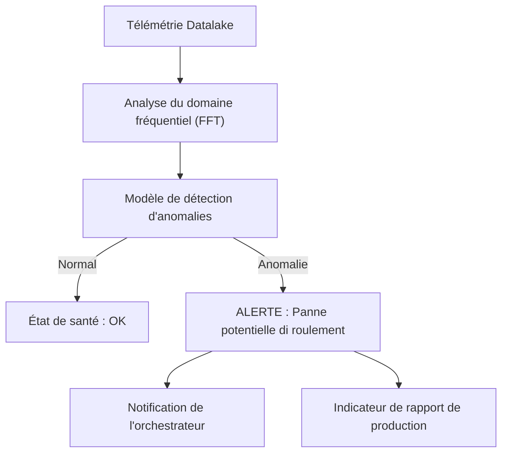

<p align="center">
  
</p>

# 🔍 HYDRA-UMC-ANOMALY-DETECTOR

<p align="center"><a href="README.md">🇺🇸 English</a> | <a href="README_spa.md">🇪🇸 Español</a> | 🇫🇷 <b>Français</b> | <a href="README_ita.md">🇮🇹 Italiano</a> | <a href="README_deu.md">🇩🇪 Deutsch</a> | <a href="README_zho.md">🇨🇳 简体中文</a> | <a href="README_jpn.md">🇯🇵 日本語</a></p>

### 🧠 Maintenance prédictive pilotée par l'IA et analyse des vibrations des moteurs

<p align="left">
  
  
  
</p>

---

## 1. 🛠️ APERÇU TECHNIQUE

**HYDRA-UMC-ANOMALY-DETECTOR** est le gardien proactif de la santé robotique. Il utilise des modèles d'IA pour analyser la télémétrie haute fréquence (vibrations, signatures de courant moteur et profils thermiques) afin de détecter les pannes avant qu'elles ne surviennent.

En surveillant l'« empreinte numérique » di chaque moteur et tête d'outil, il peut identifier l'usure des roulements, les courroies desserrées ou les défaillances de refroidissement des semaines à l'avance, permettant une maintenance programmée au lieu de réparations d'urgence.

### Caractéristiques principales :
* 🔍 **Analyse de signature :** FFT (Fast Fourier Transform) en temps réel des courants moteurs pour détecter un déséquilibre mécanique.
* 📉 **Maintenance prédictive :** Estimation de la RUL (Remaining Useful Life) pilotée par l'IA pour les moteurs NEMA et les outils URTC.
* 🚨 **Système d'alerte précoce :** Déclenche des alertes dans les interfaces Studio et Watch lorsque des modèles anormaux apparaissent.
* 🧬 **Modèles d'apprentissage :** Améliore continuellement la précision de la détection en apprenant de l'historique du Datalake.
* 🏷️ **Versionnage du modèle :** Chaque `Verdict` porte la version de modèle réelle et monotone, ainsi que le seuil sur lequel il a été noté - un réajustement (refit) est un événement réel et traçable. *(implémenté)*
* 📐 **Métriques précision/rappel :** Precision/recall/F1 réels, calculés sur un jeu de données étiqueté (`metrics.py`), pas seulement des affirmations en prose sur la séparation des scores. *(implémenté)*
* 📈 **Détection de dérive simulée :** `DriftMonitor` signale une élévation soutenue réelle de la moyenne glissante, distincte du propre signal d'anomalie d'une seule fenêtre. *(implémenté)*

---

## 2. 🔄 PIPELINE DE DÉTECTION



---

## 3. 🧱 ARCHITECTURE & DÉCISIONS DE CONCEPTION

* **Pourquoi c'est un frère, pas un sous-module, de HYDRA-UMC-DATALAKE.** La détection d'anomalies est une charge de travail analytique en lecture seule sur de la télémétrie déjà stockée - la garder séparée signifie qu'un plantage du détecteur ou une inférence de modèle lente ne bloquent jamais les propres écritures de HYDRA-UMC-TELEMETRY-COLLECTOR dans le même entrepôt.
* **Pourquoi FFT + une base statistique aujourd'hui, pas encore un réseau de neurones entraîné.** Le README appelle cela « piloté par l'IA » - ce qui est réel et fonctionne dans cette première passe est une véritable technique de traitement du signal (`src/hydra_umc_anomaly_detector/fft.py`, la propre FFT de numpy) plus une base statistique par bin de fréquence apprise à partir de fenêtres connues comme saines (`baseline.py`) et un verdict de max-z-score (`detector.py`) - pas un modèle de deep learning entraîné. Cela fonctionne, c'est testé contre de vraies signatures de panne synthétiques, et c'est la bonne fondation sur laquelle construire un modèle appris plus tard (voir la section FEUILLE DE ROUTE ci-dessous) - mais l'appeler réseau de neurones ici exagérerait ce qui tourne réellement.
* **Pourquoi un max-z-score sur tous les bins, pas un seuil fixe.** Un seuil fixe ('température moteur > 80C') rate la dérive graduelle et déclenche de fausses alarmes sur des pics de charge légitimes - comparer chaque bin du spectre EN DIRECT à la propre base saine APPRISE de ce moteur précis détecte un pic de fréquence nouveau/décalé (une véritable signature de défaut de roulement) sans aucun de ces deux modes d'échec. Le seuil par défaut (10.0) a été choisi à partir d'une séparation empirique réelle, pas deviné - voir le docstring propre de `detector.py` pour les chiffres réels des fixtures de test synthétiques sain-vs-défectueux de ce projet.
* **Comment cela s'intègre dans le reste de l'écosystème.** Un service frère sous HYDRA-UMC-DATALAKE - exécute la détection d'anomalies sur la télémétrie que HYDRA-UMC-TELEMETRY-COLLECTOR y a déjà écrite.
* **Pourquoi `DriftMonitor` est un mécanisme séparé de `AnomalyDetector.score()`, et non un seuil plus grand.** Ils répondent à des questions réelles différentes : « cette fenêtre-CI est-elle anormale » (un verdict ponctuel) contre « la moyenne RÉCENTE a-t-elle discrètement dérivé » (une tendance glissante, robuste face à une seule fenêtre aberrante bruitée). Un véritable test de dérive simulée a découvert et documente honnêtement que, pour la conception max-z-score de ce détecteur, le propre signal d'une seule fenêtre se déclenche en réalité *avant* le signal de dérive glissante pour un défaut d'un nouveau type de fréquence - la vraie valeur de `DriftMonitor` ici est une confirmation de tendance soutenue, pas une alerte plus précoce, et le code le dit ainsi plutôt que de survendre la chose.
* **Pourquoi `metrics.py` calcule precision/recall plutôt que de laisser la qualité du seuil en prose.** Le docstring propre de `detector.py` n'affirmait auparavant que « sain noté jusqu'à ~5.3, défectueux noté dans les centaines » - réel, mais pas un chiffre contre lequel un futur réajustement pourrait faire un test de non-régression. `precision_recall()` sur le même jeu de données réel donne à cela une valeur réelle et vérifiable (1.0/1.0 aujourd'hui).

---

## 📂 STRUCTURE DES RÉPERTOIRES

Service purement logiciel (ML/analytique) sans matériel, firmware ni OS propres; ces dossiers sont omis par la règle de structure du dépôt.

```text
HYDRA-UMC-ANOMALY-DETECTOR/
├── src/hydra_umc_anomaly_detector/  # Code source
│   ├── __init__.py                  # Version du paquet
│   ├── fft.py                       # Spectre réel basé sur la FFT (numpy)
│   ├── baseline.py                  # Profil statistique sain par bin (moyenne/écart-type)
│   ├── detector.py                  # Ajuste un Baseline, note les fenêtres en direct contre lui
│   ├── metrics.py                   # Precision/recall/F1 réels sur un jeu de données étiqueté
│   ├── drift.py                     # Détection réelle de dérive par moyenne glissante
│   ├── api.py                        # Handlers JSON/HTTP simples encapsulant le détecteur
│   └── main.py                       # Point d'entrée : relie tout, démarre le serveur HTTP
├── tests/                   # pytest - correction de la FFT, statistiques du baseline, détection réelle de pannes, métriques, dérive simulée
├── docs/
│   └── API.md               # Référence réelle des endpoints HTTP (requêtes, réponses, codes de statut)
├── images/                  # Médias et diagrammes
├── systemd/
│   └── hydra-umc-anomaly-detector.service # Unité systemd de l'API de détection d'anomalies sur la CM5 locale
├── tools/
│   ├── build_test.py        # Contrôle build/compilation sans gestion de version
│   └── ci_validate.py       # Validation manifest/CHANGELOG/docs utilisée par la CI
├── build/                   # Sortie de build (ignorée par git)
├── pyproject.toml           # Métadonnées du paquet, version, dépendances (numpy)
├── bump_version.py          # Incrément de version type compteur kilométrique (exécuté par le build)
├── bump_manifest_version.py # Synchronise la version de hydra-umc.project.json avec la version native (--sync)
├── build.sh / build.bat     # Build réel : venv + installation éditable + bump + tests
├── run.sh / run.bat         # Exécution réelle : démarre l'API HTTP
└── README.md
```

Élagué du modèle original : `hardware/`, `firmware/` et `os/` — il
s'agit d'un service purement logiciel (paquet Python) sans matériel ni
firmware propres et sans image de système d'exploitation à maintenir.
Voir [`docs/API.md`](docs/API.md) pour la référence complète des
endpoints HTTP.

---

## 4. ⚙️ BUILD ET EXÉCUTION

Nécessite Python >= 3.10. Une véritable détection d'anomalies basée sur
la FFT avec une API HTTP, pas seulement un squelette qui s'importe.

```bash
# Linux/macOS
./build.sh
./run.sh --port 8097

# Windows
build.bat
run.bat --port 8097
```

`build` crée/active un `.venv` local, installe le paquet (éditable, avec
les extras de dev, y compris `numpy`) dedans, vérifie l'import, et exécute
la véritable suite de tests (`pytest`). `run` démarre l'API HTTP et
transmet tout indicateur (`--addr`, `--port`, `--sample-rate`,
`--threshold`).

```bash
# Calibrer contre des fenêtres de signal connues comme saines (tableaux JSON de floats,
# même fréquence d'échantillonnage que --sample-rate)
curl -X POST localhost:8097/baseline/fit -d '{"windows": [[...], [...], ...]}'

# Noter une fenêtre en direct contre le baseline ajusté
curl -X POST localhost:8097/detect -d '{"window": [...]}'
# -> {"score": 6.3, "anomalous": false, "worstBinFreqHz": 276.0}

curl localhost:8097/stats
```

```bash
python -m pytest tests/ -v   # fft.py (le pic d'une onde sinusoïdale
                              # connue est correctement trouvé, le DC est
                              # vraiment supprimé), baseline.py (moyenne/
                              # écart-type corrects, le plancher d'écart-type
                              # nul évite une vraie division par zéro),
                              # detector.py (la promesse réelle : un signal
                              # de panne synthétique est signalé, un signal
                              # d'apparence saine ne l'est pas, avec une
                              # vraie marge de séparation, pas un seuil au
                              # couteau), et api.py (allers-retours HTTP
                              # réels via un vrai ThreadingHTTPServer)
```

---

## 🚀 FEUILLE DE ROUTE
* **Phase 1 :** Ingestion à haut débit du Datalake et indexation pour l'analyse historique.
* **Phase 2 :** Compression à la périphérie du collecteur de télémétrie et protocoles de transmission sécurisés.
* **Phase 3 :** Détection d'anomalies à l'aide de l'apprentissage non supervisé et analyse des vibrations du moteur.
* **Phase 4 :** Intégration de l'analyse acoustique pour « entendre » les problèmes mécaniques précoces et informations prédictives de l'IA.

---

## 🔗 Projets Liés

Ce projet fait partie de l'écosystème robotique HYDRA-UMC du même auteur (JuanenRac / Electro Hobby 3D). Bon à savoir, car une demande pourrait en réalité concerner l'un de ceux-ci plutôt que ce dépôt.

**Projet Parent**
- **[HYDRA-UMC-DATALAKE](https://github.com/JuanenRac/HYDRA-UMC-DATALAKE)** — vrai magasin de séries temporelles basé sur sqlite3, avec une vraie API HTTP d'ingestion/requête ; le parent dont ce dépôt est un service d'analytique spécifique, au sein de sa propre couche de données et analytique.

**Projets Frères** — les autres services d'analytique de la propre couche de données et analytique de HYDRA-UMC-DATALAKE
- **[HYDRA-UMC-TELEMETRY-COLLECTOR](https://github.com/JuanenRac/HYDRA-UMC-TELEMETRY-COLLECTOR)** — vrai pipeline d'ingestion CAN/WebSocket vers DATALAKE, avec déduplication par séquence.
- **[HYDRA-UMC-PRODUCTION-REPORTS](https://github.com/JuanenRac/HYDRA-UMC-PRODUCTION-REPORTS)** — vrai calcul OEE/disponibilité sur l'historique de DATALAKE, avec export CSV reproductible.

**Directement Liés**
- **[HYDRA-UMC-STUDIO](https://github.com/JuanenRac/HYDRA-UMC-STUDIO)** — tableau de bord de contrôle web avec visualisation 3D multi-robot en temps réel — affiche les vraies alertes précoces de ce détecteur directement dans l'interface de contrôle.
- **[HYDRA-UMC-WATCH](https://github.com/JuanenRac/HYDRA-UMC-WATCH)** — application compagnon WearOS avec de vraies alertes haptiques et un relais vocal vers le téléphone jumelé — la même surface d'alerte, pour quiconque surveille la santé de la flotte plutôt que de piloter un robot.
- **[URTC](https://github.com/JuanenRac/URTC)** — firmware pour la carte physique Universal Robot Tool Controller, plus de 25 profils d'outil sur bus CAN — l'estimation de la RUL couvre ici aussi les propres têtes d'outil d'URTC, pas seulement les moteurs NEMA des bras eux-mêmes.

**Fait Également Partie de l'Écosystème**

*Matériel & Plateforme de Base*
- **[HYDRA-UMC](https://github.com/JuanenRac/HYDRA-UMC)** — la carte mère physique du bras robotique : hôte CM5 + coprocesseur STM32H745 double cœur, coordonnant jusqu'à 8 bras-outils via CAN-OTA/SPI-OTA.
- **[HYDRA-UMC-OS](https://github.com/JuanenRac/HYDRA-UMC-OS)** — couche produit reproductible sur Raspberry Pi OS pour le CM5 : agent en lecture seule, config/profils validés, provisionnement WiFi de premier contact.
- **[HYDRA-UMC-SDK](https://github.com/JuanenRac/HYDRA-UMC-SDK)** — le contrat JSON-Schema partagé et la barrière de sécurité contre laquelle chaque bridge valide ses commandes.

*Backend Central & Clients*
- **[HYDRA-UMC-SERVER](https://github.com/JuanenRac/HYDRA-UMC-SERVER)** — le vrai backend headless (REST/WebSocket) auquel parle réellement chaque client de contrôle.
- **[HYDRA-UMC-SUITE](https://github.com/JuanenRac/HYDRA-UMC-SUITE)** — centre de commande d'essaim de bureau (PySide6) pour plusieurs serveurs à la fois, empaqueté en exécutable autonome.
- **[HYDRA-UMC-ANDROID-CONTROL](https://github.com/JuanenRac/HYDRA-UMC-ANDROID-CONTROL)** — application de contrôle Android native avec connexion biométrique et un compagnon Wear OS jumelé.
- **[HYDRA-UMC-IOS-CONTROL](https://github.com/JuanenRac/HYDRA-UMC-IOS-CONTROL)** — application de contrôle iOS/iPadOS (Flutter) avec synchronisation WebSocket en temps réel.
- **[HYDRA-UMC-DSI](https://github.com/JuanenRac/HYDRA-UMC-DSI)** — interface tactile native pour l'écran tactile DSI 7" embarqué, intégrée directement sur le CM5.
- **[HYDRA-UMC-EDITOR-URDF](https://github.com/JuanenRac/HYDRA-UMC-EDITOR-URDF)** — créateur/éditeur graphique de bureau pour URDF qui envoie les modèles terminés vers le propre catalogue de STUDIO.
- **[HYDRA-UMC-BRIDGE-AMR](https://github.com/JuanenRac/HYDRA-UMC-BRIDGE-AMR)** — frontière de coordination pour les flottes AGV/AMR via un éditeur MQTT VDA 5050 réel.
- **[HYDRA-UMC-BRIDGE-CNC](https://github.com/JuanenRac/HYDRA-UMC-BRIDGE-CNC)** — coordinateur haut niveau pour cellules CNC avec accès réel au statut/octets de contrôle GRBL.
- **[HYDRA-UMC-BRIDGE-DROIDS](https://github.com/JuanenRac/HYDRA-UMC-BRIDGE-DROIDS)** — frontière de coordination pour droïdes à pattes/humanoïdes, avec un véritable émetteur de commandes Boston Dynamics Spot.
- **[HYDRA-UMC-BRIDGE-LASER](https://github.com/JuanenRac/HYDRA-UMC-BRIDGE-LASER)** — coordinateur de sécurité pour cellules laser lisant 3 vraies sécurités GPIO de clé/enceinte/verrouillage.
- **[HYDRA-UMC-BRIDGE-OPENPNP](https://github.com/JuanenRac/HYDRA-UMC-BRIDGE-OPENPNP)** — coordinateur haut niveau sûr pour le flux de cartes du pick-and-place OpenPnP.
- **[HYDRA-UMC-BRIDGE-PRINTER3D](https://github.com/JuanenRac/HYDRA-UMC-BRIDGE-PRINTER3D)** — frontière de coordination sûre pour imprimantes 3D Moonraker/Klipper, avec de vraies commandes de tâche contrôlées.
- **[HYDRA-UMC-BRIDGE-ROS2](https://github.com/JuanenRac/HYDRA-UMC-BRIDGE-ROS2)** — coordinateur de sécurité avec un vrai transport ROS 2 rclpy à importation paresseuse.
- **[HYDRA-UMC-BRIDGE-UAV](https://github.com/JuanenRac/HYDRA-UMC-BRIDGE-UAV)** — frontière de coordination pour UAV équipés de caméra, avec un véritable émetteur de commandes MAVLink.

*Plateforme d'Outils URTC*
- **[URTC-FLASHER](https://github.com/JuanenRac/URTC-FLASHER)** — outil de bureau à interface graphique pour flasher les cartes URTC, CAN-OTA plus SWD/JTAG puce complète.
- **[URTC-TESTER](https://github.com/JuanenRac/URTC-TESTER)** — outil de bureau de diagnostic CAN-bus en direct pour cartes URTC, un panneau par profil d'outil.
- **[URTC-WEB-STUDIO](https://github.com/JuanenRac/URTC-WEB-STUDIO)** — alternative basée navigateur à URTC-TESTER via la Web Serial API, sans installation locale.

*Nœud IA de Vision (Hailo-8)*
- **[HYDRA-UMC-VISION-NODE](https://github.com/JuanenRac/HYDRA-UMC-VISION-NODE)** — hub d'intégration pour le pipeline de vision Hailo-8, avec une vraie vérification de disponibilité matérielle par étape.
- **[HYDRA-UMC-DETECTION-HEF](https://github.com/JuanenRac/HYDRA-UMC-DETECTION-HEF)** — registre réel de modèles compilés avec vérification de chargement sécurisé par architecture Hailo/checksum.
- **[HYDRA-UMC-VISION-STREAMER](https://github.com/JuanenRac/HYDRA-UMC-VISION-STREAMER)** — générateur réel de pipeline GStreamer + config MediaMTX, avec une vraie frontière d'intégration HailoRT.
- **[HYDRA-UMC-VISUAL-SERVOING-API](https://github.com/JuanenRac/HYDRA-UMC-VISUAL-SERVOING-API)** — vraie loi de correction Position-Based Visual Servoing, verrouillée sur l'état de zone en amont.
- **[HYDRA-UMC-SAFETY-ZONES](https://github.com/JuanenRac/HYDRA-UMC-SAFETY-ZONES)** — vraie vérification de violation de zone et demande d'E-STOP, avec application de la fraîcheur de calibration.

*Nœud IA Cognitif (Hailo-10)*
- **[HYDRA-UMC-COGNITIVE-NODE](https://github.com/JuanenRac/HYDRA-UMC-COGNITIVE-NODE)** — hub d'intégration pour le pipeline cognitif Hailo-10 (orchestration LLM/VLA/voix).
- **[HYDRA-UMC-VLA-ENGINE](https://github.com/JuanenRac/HYDRA-UMC-VLA-ENGINE)** — vrai encodage/décodage de jetons d'action et génération de trajectoire pour un modèle Vision-Language-Action.
- **[HYDRA-UMC-VOICE-UI](https://github.com/JuanenRac/HYDRA-UMC-VOICE-UI)** — vrai front-end vocal (VAD + analyseur d'intention) avec un relais Watch borné et soumis à confirmation.
- **[HYDRA-UMC-SEMANTIC-PLANNER](https://github.com/JuanenRac/HYDRA-UMC-SEMANTIC-PLANNER)** — vraie décomposition de tâches basée sur des règles et récupération sémantique d'erreurs sur les codes d'erreur MCU.
- **[HYDRA-UMC-DOCS-QA](https://github.com/JuanenRac/HYDRA-UMC-DOCS-QA)** — vraie recherche documentaire TF-IDF (bibliothèque standard uniquement) sur les propres documents Markdown de cet écosystème.

*Orchestration & Essaim*
- **[HYDRA-UMC-ORCHESTRATOR](https://github.com/JuanenRac/HYDRA-UMC-ORCHESTRATOR)** — hub d'intégration avec un vrai contrat de rapport de santé gRPC/Protobuf et une machine à états de mission.
- **[HYDRA-UMC-JOB-DISPATCHER](https://github.com/JuanenRac/HYDRA-UMC-JOB-DISPATCHER)** — vraie file de tâches basée sur la priorité avec déduplication, via une vraie API HTTP.
- **[HYDRA-UMC-NODE-HEALING](https://github.com/JuanenRac/HYDRA-UMC-NODE-HEALING)** — vrai chien de garde de santé de flotte basé sur gRPC, avec retry/backoff et détection d'incohérence d'identité.
- **[HYDRA-UMC-PATH-PLANNER-3D](https://github.com/JuanenRac/HYDRA-UMC-PATH-PLANNER-3D)** — vrai planificateur de trajectoire 3D basé sur RRT, avec vraie validation des collisions obstacle/espace de travail.
- **[HYDRA-UMC-SWARM-SYNC](https://github.com/JuanenRac/HYDRA-UMC-SWARM-SYNC)** — vraie synchronisation d'état CRDT LWW-Element-Map, testée par propriétés pour la convergence multi-cellule.

*Jumeau Numérique & Simulation*
- **[HYDRA-UMC-TWIN](https://github.com/JuanenRac/HYDRA-UMC-TWIN)** — hub d'intégration pour le moteur de jumeau numérique, avec un vrai contrat de synchronisation par compatibilité de version.
- **[HYDRA-UMC-HIL-BRIDGE](https://github.com/JuanenRac/HYDRA-UMC-HIL-BRIDGE)** — vrai verrouillage de sécurité hardware-in-the-loop routant les commandes entre simulation et matériel réel.
- **[HYDRA-UMC-PHYSICS-REPLICA](https://github.com/JuanenRac/HYDRA-UMC-PHYSICS-REPLICA)** — vraie cinématique directe et validation des limites articulaires sur un vrai sous-ensemble URDF.
- **[HYDRA-UMC-SYNTHETIC-DATA-GEN](https://github.com/JuanenRac/HYDRA-UMC-SYNTHETIC-DATA-GEN)** — vrai générateur procédural de scènes 2D avec export d'annotations YOLO/COCO.

*Passerelle Industrielle*
- **[HYDRA-UMC-GATEWAY-INDUSTRIAL](https://github.com/JuanenRac/HYDRA-UMC-GATEWAY-INDUSTRIAL)** — hub d'intégration relayant vers les protocoles industriels, avec une vraie couche de liste blanche de commandes/contre-pression.
- **[HYDRA-UMC-OPCUA-SERVER](https://github.com/JuanenRac/HYDRA-UMC-OPCUA-SERVER)** — vrai espace d'adressage OPC-UA, vérifié avec une vraie session client du protocole binaire.
- **[HYDRA-UMC-MQTT-BROKER](https://github.com/JuanenRac/HYDRA-UMC-MQTT-BROKER)** — vrai broker MQTT avec authentification par client optionnelle et ACL de sujets.
- **[HYDRA-UMC-MTCONNECT-ADAPTER](https://github.com/JuanenRac/HYDRA-UMC-MTCONNECT-ADAPTER)** — vrais points de terminaison XML MTConnect `/probe` et `/current`, avec sortie en mode dégradé.

*Outils Complémentaires & Opérations de l'Écosystème*
- **[HYDRA-UMC-DASHBOARD-AI](https://github.com/JuanenRac/HYDRA-UMC-DASHBOARD-AI)** — panneaux Smart Summaries et Anomaly Highlighting sur DATALAKE/ANOMALY-DETECTOR, avec un repli statistique honnête.
- **[HYDRA-UMC-TOOL-CLI](https://github.com/JuanenRac/HYDRA-UMC-TOOL-CLI)** — CLI de flotte avec un vrai contrat de codes de sortie stable, un vrai client en direct de la propre API de HYDRA-UMC-SERVER.
- **[URTC-SMART-RACK](https://github.com/JuanenRac/URTC-SMART-RACK)** — firmware pour un rack de montage de cartes avec décodage réel d'ID d'outil et logique de préchauffage Smart Idle.
- **[URTC-VISION-TOOL](https://github.com/JuanenRac/URTC-VISION-TOOL)** — firmware plus un vrai compagnon de vision Python pour une tête d'outil d'inspection thermique/RGB.
- **[HYDRA-UMC-UPDATER](https://github.com/JuanenRac/HYDRA-UMC-UPDATER)** — outil administratif de bureau qui découvre, clone et met à jour chaque dépôt de cet écosystème.


---

## 📚 Documentation & Communauté

- **[CONTRIBUTING.md](CONTRIBUTING.md)** — pile technologique et lignes directrices de codage pour une pull request.
- **[CODE_OF_CONDUCT.md](CODE_OF_CONDUCT.md)** — les normes de comportement attendues dans cette communauté.
- **[SECURITY.md](SECURITY.md)** — comment signaler une vulnérabilité, et les véritables axes de sécurité de ce projet.
- **[SUPPORT.md](SUPPORT.md)** — où poser des questions et signaler des bugs.
- **[LICENSE.md](LICENSE.md)** — la licence propre de ce projet.

## 👤 AUTEUR
**JuanenRac** (Electro Hobby 3D)
📧 electrohobby3d@gmail.com
📺 [youtube.com/@electrohobby3d](https://youtube.com/@electrohobby3d)

## 📜 LICENCE
GPL-3.0 - Voir le fichier LICENSE pour plus de détails.
