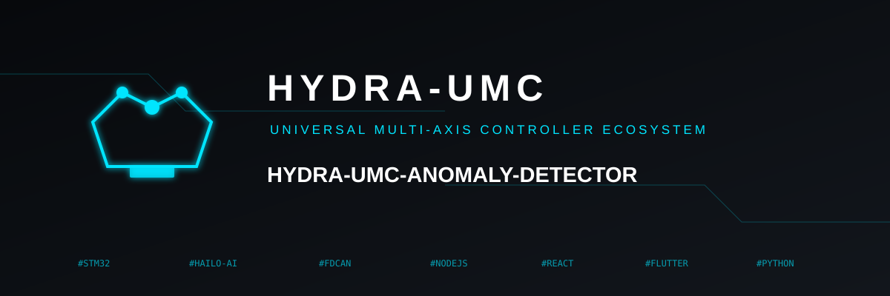
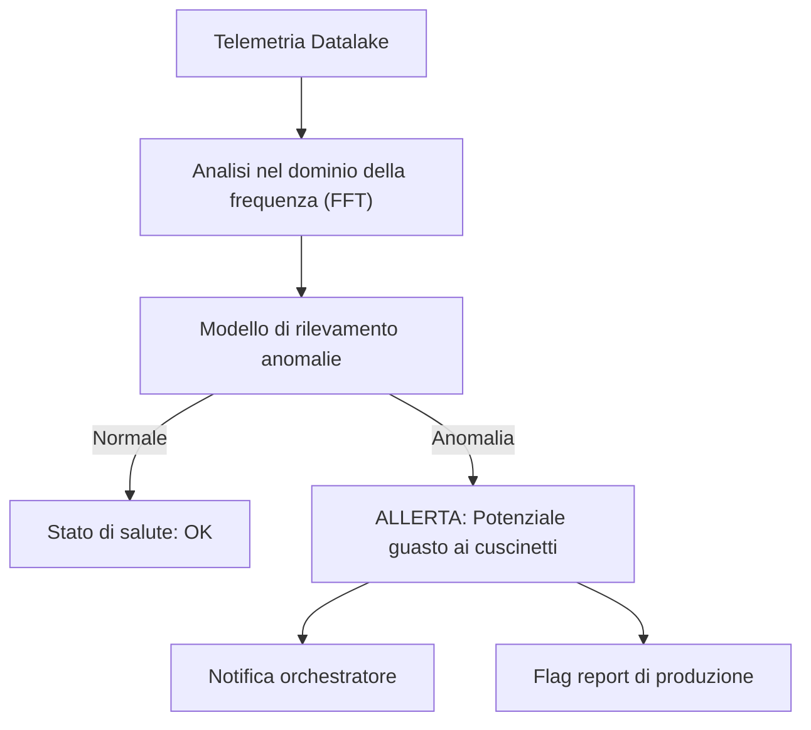

<p align="center">
  
</p>

# 🔍 HYDRA-UMC-ANOMALY-DETECTOR

<p align="center"><a href="README.md">🇺🇸 English</a> | <a href="README_spa.md">🇪🇸 Español</a> | <a href="README_fra.md">🇫🇷 Français</a> | 🇮🇹 <b>Italiano</b> | <a href="README_deu.md">🇩🇪 Deutsch</a> | <a href="README_zho.md">🇨🇳 简体中文</a> | <a href="README_jpn.md">🇯🇵 日本語</a></p>

### 🧠 Manutenzione predittiva guidata dall'IA e analisi delle vibrazioni del motore

<p align="left">
  
  
  
</p>

---

## 1. 🛠️ PANORAMICA TECNICA

**HYDRA-UMC-ANOMALY-DETECTOR** è il guardiano proattivo della salute robotica. Utilizza modelli AI per analizzare la telemetria ad alta frequenza (vibrazioni, firme di corrente del motore e profili termici) per rilevare i guasti prima che accadano.

Monitorando l'«impronta digitale» di ogni motore e testina dello strumento, può identificare l'usura dei cuscinetti, le cinghie allentate o i guasti al raffreddamento con settimane di anticipo, consentendo una manutenzione programmata invece di riparazioni di emergenza.

### Caratteristiche principali:
* 🔍 **Analisi della firma:** FFT (Fast Fourier Transform) in tempo reale delle correnti del motore per rilevare squilibri meccanici.
* 📉 **Manutenzione predittiva:** Stima RUL (Remaining Useful Life) guidata dall'IA per motori NEMA e strumenti URTC.
* 🚨 **Sistema di allerta precoce:** Attiva avvisi nelle interfacce Studio e Watch quando emergono schemi anormali.
* 🧬 **Modelli di apprendimento:** Migliora continuamente l'accuratezza del rilevamento imparando dalla cronologia del Datalake.
* 🏷️ **Versionamento del modello:** Ogni `Verdict` porta con sé la versione reale e monotona del modello e la soglia rispetto a cui è stato valutato - un riadattamento (refit) è un evento reale e tracciabile. *(implementato)*
* 📐 **Metriche di precisione/recall:** Precision/recall/F1 reali, calcolati su un fixture etichettato (`metrics.py`), non solo affermazioni in prosa sulla separazione dei punteggi. *(implementato)*
* 📈 **Rilevamento di deriva simulata:** `DriftMonitor` segnala un innalzamento sostenuto reale della media mobile, distinto dal flag di anomalia proprio di una singola finestra. *(implementato)*

---

## 2. 🔄 PIPELINE DI RILEVAMENTO



---

## 3. 🧱 ARCHITETTURA E DECISIONI DI PROGETTAZIONE

* **Perché è fratello, non un sottomodulo, di HYDRA-UMC-DATALAKE.** Il rilevamento anomalie è un carico di lavoro analitico di sola lettura su telemetria già memorizzata - tenerlo separato significa che un crash del rilevatore o un'inferenza di modello lenta non bloccano mai le scritture proprie di HYDRA-UMC-TELEMETRY-COLLECTOR nello stesso archivio.
* **Perché FFT + una base statistica oggi, non ancora una rete neurale addestrata.** Il README lo chiama "guidato dall'IA" - ciò che è reale e funzionante in questa prima passata è una vera tecnica di elaborazione del segnale (`src/hydra_umc_anomaly_detector/fft.py`, la FFT propria di numpy) più una base statistica per bin di frequenza appresa da finestre note come sane (`baseline.py`) e un verdetto di max-z-score (`detector.py`) - non un modello di deep learning addestrato. Funziona, è testato contro vere firme di guasto sintetiche, ed è la base corretta su cui costruire un modello appreso più avanti (vedi `mejoras_futuras.txt`) - ma chiamarlo rete neurale qui esagererebbe ciò che realmente gira.
* **Perché un max-z-score su tutti i bin, non una soglia fissa.** Una soglia fissa ('temperatura motore > 80C') si perde la deriva graduale e genera falsi allarmi su picchi di carico legittimi - confrontare ogni bin dello spettro DAL VIVO con la base sana APPRESA propria di questo motore rileva un picco di frequenza nuovo/spostato (una vera firma di guasto ai cuscinetti) senza nessuna di queste due modalità di fallimento. La soglia predefinita (10.0) è stata scelta a partire da una separazione empirica reale, non indovinata - vedi il docstring proprio di `detector.py` per i numeri reali dai fixture di test sintetici sano-vs-difettoso di questo progetto.
* **Come si inserisce nel resto dell'ecosistema.** Un servizio fratello sotto HYDRA-UMC-DATALAKE - esegue il rilevamento anomalie sulla telemetria che HYDRA-UMC-TELEMETRY-COLLECTOR ha già scritto lì.
* **Perché `DriftMonitor` è un meccanismo separato da `AnomalyDetector.score()`, e non una soglia più grande.** Rispondono a domande reali diverse: "questa finestra è anomala" (un verdetto puntuale) contro "la media RECENTE si è spostata silenziosamente" (una tendenza mobile, robusta rispetto a una singola finestra anomala rumorosa). Un vero test di deriva simulata ha scoperto e documenta onestamente che, per il design max-z-score di questo rilevatore, il flag proprio di una singola finestra scatta in realtà *prima* del segnale di deriva mobile per un guasto di un nuovo tipo di frequenza - il vero valore di `DriftMonitor` qui è una conferma di tendenza sostenuta, non un allarme più precoce, e il codice lo dichiara così invece di sopravvenderlo.
* **Perché `metrics.py` calcola precision/recall invece di lasciare la qualità della soglia come prosa.** Il docstring proprio di `detector.py` prima affermava solo "sano valutato fino a ~5.3, difettoso valutato nelle centinaia" - reale, ma non un numero contro cui un futuro ritaratura potesse fare un test di regressione. `precision_recall()` sullo stesso fixture reale dà a questo un valore reale e verificabile (1.0/1.0 oggi).

---

## 📂 STRUTTURA DELLE CARTELLE

Servizio puramente software (ML/analisi) senza hardware, firmware o OS propri; queste cartelle sono omesse dalla politica di struttura del repository.

```text
HYDRA-UMC-ANOMALY-DETECTOR/
├── src/hydra_umc_anomaly_detector/  # Codice sorgente
│   ├── __init__.py                  # Versione del pacchetto
│   ├── fft.py                       # Spettro reale basato su FFT (numpy)
│   ├── baseline.py                  # Profilo statistico sano per bin (media/std)
│   ├── detector.py                  # Adatta un Baseline, valuta finestre dal vivo contro di esso
│   ├── metrics.py                   # Precision/recall/F1 reali su un fixture etichettato
│   ├── drift.py                     # Rilevamento reale di deriva tramite media mobile
│   ├── api.py                        # Handler JSON/HTTP semplici che avvolgono il detector
│   └── main.py                       # Punto di ingresso: collega tutto, avvia il server HTTP
├── tests/                   # pytest - correttezza FFT, statistiche del baseline, rilevamento reale di guasti, metriche, deriva simulata
├── docs/
│   └── API.md               # Riferimento reale degli endpoint HTTP (richieste, risposte, codici di stato)
├── build/                   # Output di build (ignorato da git)
├── pyproject.toml           # Metadati del pacchetto, versione, dipendenze (numpy)
├── bump_version.py          # Incremento di versione stile contachilometri (eseguito dal build)
├── build.sh / build.bat     # Build reale: venv + installazione editable + bump + test
├── run.sh / run.bat         # Esecuzione reale: avvia l'API HTTP
└── README.md
```

Rimossi dal template originale: `hardware/`, `firmware/`, `os/`,
`images/` e `scripts/` — è un servizio puramente software (pacchetto
Python) senza hardware o firmware propri, senza un'immagine del sistema
operativo da mantenere, e senza contenuto di media/script di utilità
ancora sufficiente da giustificare cartelle proprie. Vedi
[`docs/API.md`](docs/API.md) per il riferimento completo degli endpoint HTTP.

---

## 4. ⚙️ BUILD ED ESECUZIONE

Richiede Python >= 3.10. Rilevamento reale di anomalie basato su FFT con
API HTTP, non solo uno scheletro che si importa.

```bash
# Linux/macOS
./build.sh
./run.sh --port 8097

# Windows
build.bat
run.bat --port 8097
```

`build` crea/attiva un `.venv` locale, installa il pacchetto (editable, con
gli extra di dev, incluso `numpy`) al suo interno, verifica l'import, ed
esegue la vera suite di test (`pytest`). `run` avvia l'API HTTP e inoltra
qualsiasi flag (`--addr`, `--port`, `--sample-rate`, `--threshold`).

```bash
# Calibrare contro finestre di segnale note come sane (array JSON di float,
# stessa frequenza di campionamento di --sample-rate)
curl -X POST localhost:8097/baseline/fit -d '{"windows": [[...], [...], ...]}'

# Valutare una finestra dal vivo contro il baseline adattato
curl -X POST localhost:8097/detect -d '{"window": [...]}'
# -> {"score": 6.3, "anomalous": false, "worstBinFreqHz": 276.0}

curl localhost:8097/stats
```

```bash
python -m pytest tests/ -v   # fft.py (il picco di un'onda sinusoidale
                              # nota viene trovato correttamente, la DC
                              # viene davvero scartata), baseline.py
                              # (media/std corrette, il pavimento di std
                              # zero evita una vera divisione per zero),
                              # detector.py (la vera promessa: un segnale
                              # di guasto sintetico viene segnalato, uno
                              # dall'aspetto sano no, con un vero margine
                              # di separazione, non una soglia sul filo),
                              # e api.py (round-trip HTTP reali via un
                              # vero ThreadingHTTPServer)
```

---

## 🚀 ROADMAP
* **Fase 1:** Ingestione ad alto throughput del Datalake e indicizzazione per l'analisi storica.
* **Fase 2:** Compressione edge del collettore di telemetria e protocolli di trasmissione sicuri.
* **Fase 3:** Rilevamento delle anomalie tramite apprendimento non supervisionato e analisi delle vibrazioni del motore.
* **Fase 4:** Integrazione dell'analisi acustica per «sentire» tempestivamente i problemi meccanici e approfondimenti predittivi dell'IA.

---

## 🔗 Progetti Correlati

Questo progetto fa parte di un ecosistema robotico più ampio dello stesso autore (JuanenRac / Electro Hobby 3D), che copre firmware, software di controllo, nodi IA e strumenti di flotta. Utile saperlo, perché una richiesta potrebbe in realtà riguardare uno di questi progetti anziché questo repository.

### Famiglia

**Genitore:** **[HYDRA-UMC-DATALAKE](https://github.com/JuanenRac/HYDRA-UMC-DATALAKE)** — il genitore di integrazione la cui telemetria memorizzata analizza questo rilevatore.

**Fratelli:**
- **[HYDRA-UMC-TELEMETRY-COLLECTOR](https://github.com/JuanenRac/HYDRA-UMC-TELEMETRY-COLLECTOR)** — servizio di analytics fratello, stesso genitore.
- **[HYDRA-UMC-PRODUCTION-REPORTS](https://github.com/JuanenRac/HYDRA-UMC-PRODUCTION-REPORTS)** — servizio di analytics fratello, stesso genitore.

### Relazione Diretta (fuori dalla famiglia)

Questo progetto non ha relazioni dirette fuori dalla famiglia Dati e Analisi (secondo la mappa delle relazioni dell'ecosistema) - vedi "Resto dell'Ecosistema" sotto per tutto il resto.

### Resto dell'Ecosistema

**Piattaforma HYDRA-UMC** — la cella di micro-fabbrica multi-robot
- **[HYDRA-UMC](https://github.com/JuanenRac/HYDRA-UMC)** — la scheda madre CM5 + STM32H745 che orchestra fino a 8 bracci robotici.
- **[HYDRA-UMC-SERVER](https://github.com/JuanenRac/HYDRA-UMC-SERVER)** — il backend Express/WebSocket con cui parla ogni client di controllo.
- **[HYDRA-UMC-STUDIO](https://github.com/JuanenRac/HYDRA-UMC-STUDIO)** — dashboard di controllo web, visualizzazione 3D multi-robot.
- **[HYDRA-UMC-ANDROID-CONTROL](https://github.com/JuanenRac/HYDRA-UMC-ANDROID-CONTROL)** — app di controllo Android via Wi-Fi/Bluetooth.
- **[HYDRA-UMC-IOS-CONTROL](https://github.com/JuanenRac/HYDRA-UMC-IOS-CONTROL)** — app di controllo iOS/iPadOS costruita in Flutter.
- **[HYDRA-UMC-SUITE](https://github.com/JuanenRac/HYDRA-UMC-SUITE)** — centro di comando sciame desktop (Python/PySide6).
- **[HYDRA-UMC-EDITOR-URDF](https://github.com/JuanenRac/HYDRA-UMC-EDITOR-URDF)** — editor desktop di modelli URDF per il catalogo robot.
- **[HYDRA-UMC-DSI](https://github.com/JuanenRac/HYDRA-UMC-DSI)** — interfaccia touch nativa per lo schermo DSI a bordo.

**Piattaforma URTC** — il controller della testa utensile che ogni braccio HYDRA-UMC porta con sé
- **[URTC](https://github.com/JuanenRac/URTC)** — controller testa utensile su bus CAN, 25 profili utensile.
- **[URTC-FLASHER](https://github.com/JuanenRac/URTC-FLASHER)** — strumento desktop di flashing CAN-OTA + SWD/JTAG.
- **[URTC-TESTER](https://github.com/JuanenRac/URTC-TESTER)** — strumento desktop di diagnostica CAN live.
- **[URTC-WEB-STUDIO](https://github.com/JuanenRac/URTC-WEB-STUDIO)** — alternativa basata su browser via Web Serial API.

**🎥 Nodo di Visione IA (Hailo-8)**
- [HYDRA-UMC-VISION-NODE](https://github.com/JuanenRac/HYDRA-UMC-VISION-NODE)
- [HYDRA-UMC-VISION-STREAMER](https://github.com/JuanenRac/HYDRA-UMC-VISION-STREAMER)
- [HYDRA-UMC-DETECTION-HEF](https://github.com/JuanenRac/HYDRA-UMC-DETECTION-HEF)
- [HYDRA-UMC-SAFETY-ZONES](https://github.com/JuanenRac/HYDRA-UMC-SAFETY-ZONES)
- [HYDRA-UMC-VISUAL-SERVOING-API](https://github.com/JuanenRac/HYDRA-UMC-VISUAL-SERVOING-API)

**🧠 Nodo IA Cognitiva (Hailo-10)**
- [HYDRA-UMC-COGNITIVE-NODE](https://github.com/JuanenRac/HYDRA-UMC-COGNITIVE-NODE)
- [HYDRA-UMC-VLA-ENGINE](https://github.com/JuanenRac/HYDRA-UMC-VLA-ENGINE)
- [HYDRA-UMC-VOICE-UI](https://github.com/JuanenRac/HYDRA-UMC-VOICE-UI)
- [HYDRA-UMC-SEMANTIC-PLANNER](https://github.com/JuanenRac/HYDRA-UMC-SEMANTIC-PLANNER)
- [HYDRA-UMC-DOCS-QA](https://github.com/JuanenRac/HYDRA-UMC-DOCS-QA)

**🐝 Orchestrazione e Sciame**
- [HYDRA-UMC-ORCHESTRATOR](https://github.com/JuanenRac/HYDRA-UMC-ORCHESTRATOR)
- [HYDRA-UMC-SWARM-SYNC](https://github.com/JuanenRac/HYDRA-UMC-SWARM-SYNC)
- [HYDRA-UMC-PATH-PLANNER-3D](https://github.com/JuanenRac/HYDRA-UMC-PATH-PLANNER-3D)
- [HYDRA-UMC-JOB-DISPATCHER](https://github.com/JuanenRac/HYDRA-UMC-JOB-DISPATCHER)
- [HYDRA-UMC-NODE-HEALING](https://github.com/JuanenRac/HYDRA-UMC-NODE-HEALING)

**🎮 Gemello Digitale e Simulazione**
- [HYDRA-UMC-TWIN](https://github.com/JuanenRac/HYDRA-UMC-TWIN)
- [HYDRA-UMC-PHYSICS-REPLICA](https://github.com/JuanenRac/HYDRA-UMC-PHYSICS-REPLICA)
- [HYDRA-UMC-HIL-BRIDGE](https://github.com/JuanenRac/HYDRA-UMC-HIL-BRIDGE)
- [HYDRA-UMC-SYNTHETIC-DATA-GEN](https://github.com/JuanenRac/HYDRA-UMC-SYNTHETIC-DATA-GEN)

**🏭 Gateway Industriale**
- [HYDRA-UMC-GATEWAY-INDUSTRIAL](https://github.com/JuanenRac/HYDRA-UMC-GATEWAY-INDUSTRIAL)
- [HYDRA-UMC-OPCUA-SERVER](https://github.com/JuanenRac/HYDRA-UMC-OPCUA-SERVER)
- [HYDRA-UMC-MQTT-BROKER](https://github.com/JuanenRac/HYDRA-UMC-MQTT-BROKER)
- [HYDRA-UMC-MTCONNECT-ADAPTER](https://github.com/JuanenRac/HYDRA-UMC-MTCONNECT-ADAPTER)

**🛠️ Strumenti Complementari**
- [URTC-SMART-RACK](https://github.com/JuanenRac/URTC-SMART-RACK)
- [URTC-VISION-TOOL](https://github.com/JuanenRac/URTC-VISION-TOOL)
- [HYDRA-UMC-WATCH](https://github.com/JuanenRac/HYDRA-UMC-WATCH)
- [HYDRA-UMC-TOOL-CLI](https://github.com/JuanenRac/HYDRA-UMC-TOOL-CLI)
- [HYDRA-UMC-DASHBOARD-AI](https://github.com/JuanenRac/HYDRA-UMC-DASHBOARD-AI)


## 👤 AUTORE
**JuanenRac** (Electro Hobby 3D)
📧 electrohobby3d@gmail.com

## 📜 LICENZA
GPL-3.0 - Vedere LICENSE per i dettagli.
