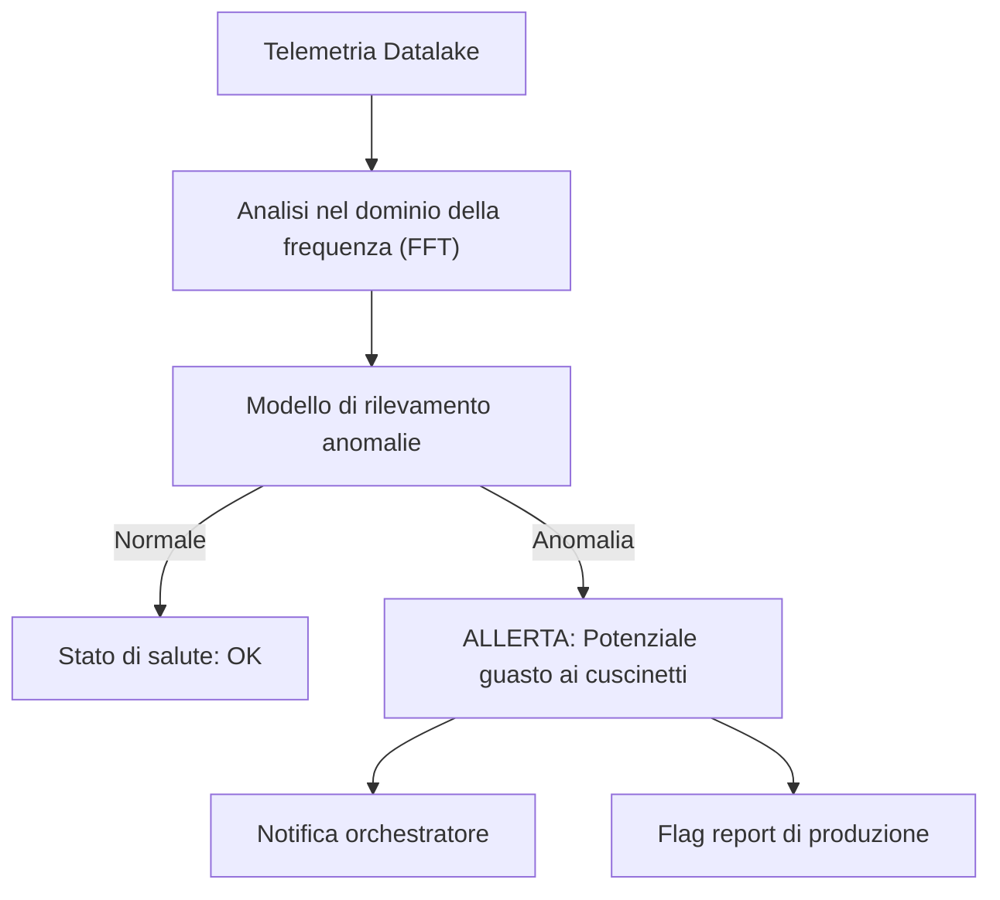

<p align="center">
  
</p>

# 🔍 HYDRA-UMC-ANOMALY-DETECTOR

<p align="center"><a href="README.md">🇺🇸 English</a> | <a href="README_spa.md">🇪🇸 Español</a> | <a href="README_fra.md">🇫🇷 Français</a> | 🇮🇹 <b>Italiano</b> | <a href="README_deu.md">🇩🇪 Deutsch</a> | <a href="README_zho.md">🇨🇳 简体中文</a> | <a href="README_jpn.md">🇯🇵 日本語</a></p>

### 🧠 Manutenzione predittiva guidata dall'IA e analisi delle vibrazioni del motore

<p align="left">
  
  
  
</p>

---

## 1. 🛠️ PANORAMICA TECNICA

**HYDRA-UMC-ANOMALY-DETECTOR** è il guardiano proattivo della salute robotica. Utilizza modelli AI per analizzare la telemetria ad alta frequenza (vibrazioni, firme di corrente del motore e profili termici) per rilevare i guasti prima che accadano.

Monitorando l'«impronta digitale» di ogni motore e testina dello strumento, può identificare l'usura dei cuscinetti, le cinghie allentate o i guasti al raffreddamento con settimane di anticipo, consentendo una manutenzione programmata invece di riparazioni di emergenza.

### Caratteristiche principali:
* 🔍 **Analisi della firma:** FFT (Fast Fourier Transform) in tempo reale delle correnti del motore per rilevare squilibri meccanici.
* 📉 **Manutenzione predittiva:** Stima RUL (Remaining Useful Life) guidata dall'IA per motori NEMA e strumenti URTC.
* 🚨 **Sistema di allerta precoce:** Attiva avvisi nelle interfacce Studio e Watch quando emergono schemi anormali.
* 🧬 **Modelli di apprendimento:** Migliora continuamente l'accuratezza del rilevamento imparando dalla cronologia del Datalake.
* 🏷️ **Versionamento del modello:** Ogni `Verdict` porta con sé la versione reale e monotona del modello e la soglia rispetto a cui è stato valutato - un riadattamento (refit) è un evento reale e tracciabile. *(implementato)*
* 📐 **Metriche di precisione/recall:** Precision/recall/F1 reali, calcolati su un fixture etichettato (`metrics.py`), non solo affermazioni in prosa sulla separazione dei punteggi. *(implementato)*
* 📈 **Rilevamento di deriva simulata:** `DriftMonitor` segnala un innalzamento sostenuto reale della media mobile, distinto dal flag di anomalia proprio di una singola finestra. *(implementato)*

---

## 2. 🔄 PIPELINE DI RILEVAMENTO



---

## 3. 🧱 ARCHITETTURA E DECISIONI DI PROGETTAZIONE

* **Perché è fratello, non un sottomodulo, di HYDRA-UMC-DATALAKE.** Il rilevamento anomalie è un carico di lavoro analitico di sola lettura su telemetria già memorizzata - tenerlo separato significa che un crash del rilevatore o un'inferenza di modello lenta non bloccano mai le scritture proprie di HYDRA-UMC-TELEMETRY-COLLECTOR nello stesso archivio.
* **Perché FFT + una base statistica oggi, non ancora una rete neurale addestrata.** Il README lo chiama "guidato dall'IA" - ciò che è reale e funzionante in questa prima passata è una vera tecnica di elaborazione del segnale (`src/hydra_umc_anomaly_detector/fft.py`, la FFT propria di numpy) più una base statistica per bin di frequenza appresa da finestre note come sane (`baseline.py`) e un verdetto di max-z-score (`detector.py`) - non un modello di deep learning addestrato. Funziona, è testato contro vere firme di guasto sintetiche, ed è la base corretta su cui costruire un modello appreso più avanti (vedi la sezione TABELLA DI MARCIA più sotto) - ma chiamarlo rete neurale qui esagererebbe ciò che realmente gira.
* **Perché un max-z-score su tutti i bin, non una soglia fissa.** Una soglia fissa ('temperatura motore > 80C') si perde la deriva graduale e genera falsi allarmi su picchi di carico legittimi - confrontare ogni bin dello spettro DAL VIVO con la base sana APPRESA propria di questo motore rileva un picco di frequenza nuovo/spostato (una vera firma di guasto ai cuscinetti) senza nessuna di queste due modalità di fallimento. La soglia predefinita (10.0) è stata scelta a partire da una separazione empirica reale, non indovinata - vedi il docstring proprio di `detector.py` per i numeri reali dai fixture di test sintetici sano-vs-difettoso di questo progetto.
* **Come si inserisce nel resto dell'ecosistema.** Un servizio fratello sotto HYDRA-UMC-DATALAKE - esegue il rilevamento anomalie sulla telemetria che HYDRA-UMC-TELEMETRY-COLLECTOR ha già scritto lì.
* **Perché `DriftMonitor` è un meccanismo separato da `AnomalyDetector.score()`, e non una soglia più grande.** Rispondono a domande reali diverse: "questa finestra è anomala" (un verdetto puntuale) contro "la media RECENTE si è spostata silenziosamente" (una tendenza mobile, robusta rispetto a una singola finestra anomala rumorosa). Un vero test di deriva simulata ha scoperto e documenta onestamente che, per il design max-z-score di questo rilevatore, il flag proprio di una singola finestra scatta in realtà *prima* del segnale di deriva mobile per un guasto di un nuovo tipo di frequenza - il vero valore di `DriftMonitor` qui è una conferma di tendenza sostenuta, non un allarme più precoce, e il codice lo dichiara così invece di sopravvenderlo.
* **Perché `metrics.py` calcola precision/recall invece di lasciare la qualità della soglia come prosa.** Il docstring proprio di `detector.py` prima affermava solo "sano valutato fino a ~5.3, difettoso valutato nelle centinaia" - reale, ma non un numero contro cui un futuro ritaratura potesse fare un test di regressione. `precision_recall()` sullo stesso fixture reale dà a questo un valore reale e verificabile (1.0/1.0 oggi).

---

## 📂 STRUTTURA DELLE CARTELLE

Servizio puramente software (ML/analisi) senza hardware, firmware o OS propri; queste cartelle sono omesse dalla politica di struttura del repository.

```text
HYDRA-UMC-ANOMALY-DETECTOR/
├── src/hydra_umc_anomaly_detector/  # Codice sorgente
│   ├── __init__.py                  # Versione del pacchetto
│   ├── fft.py                       # Spettro reale basato su FFT (numpy)
│   ├── baseline.py                  # Profilo statistico sano per bin (media/std)
│   ├── detector.py                  # Adatta un Baseline, valuta finestre dal vivo contro di esso
│   ├── metrics.py                   # Precision/recall/F1 reali su un fixture etichettato
│   ├── drift.py                     # Rilevamento reale di deriva tramite media mobile
│   ├── api.py                        # Handler JSON/HTTP semplici che avvolgono il detector
│   └── main.py                       # Punto di ingresso: collega tutto, avvia il server HTTP
├── tests/                   # pytest - correttezza FFT, statistiche del baseline, rilevamento reale di guasti, metriche, deriva simulata
├── docs/
│   └── API.md               # Riferimento reale degli endpoint HTTP (richieste, risposte, codici di stato)
├── images/                  # Media e diagrammi
├── systemd/
│   └── hydra-umc-anomaly-detector.service # Unità systemd della API di rilevamento anomalie sulla CM5 locale
├── tools/
│   ├── build_test.py        # Controllo build/compilazione senza incremento di versione
│   └── ci_validate.py       # Validazione manifest/CHANGELOG/docs usata dalla CI
├── build/                   # Output di build (ignorato da git)
├── pyproject.toml           # Metadati del pacchetto, versione, dipendenze (numpy)
├── bump_version.py          # Incremento di versione stile contachilometri (eseguito dal build)
├── bump_manifest_version.py # Sincronizza la versione di hydra-umc.project.json con quella nativa (--sync)
├── build.sh / build.bat     # Build reale: venv + installazione editable + bump + test
├── run.sh / run.bat         # Esecuzione reale: avvia l'API HTTP
└── README.md
```

Rimossi dal template originale: `hardware/`, `firmware/` e `os/` — è un
servizio puramente software (pacchetto Python) senza hardware o firmware
propri e senza un'immagine del sistema operativo da mantenere. Vedi
[`docs/API.md`](docs/API.md) per il riferimento completo degli endpoint HTTP.

---

## 4. ⚙️ BUILD ED ESECUZIONE

Richiede Python >= 3.10. Rilevamento reale di anomalie basato su FFT con
API HTTP, non solo uno scheletro che si importa.

```bash
# Linux/macOS
./build.sh
./run.sh --port 8097

# Windows
build.bat
run.bat --port 8097
```

`build` crea/attiva un `.venv` locale, installa il pacchetto (editable, con
gli extra di dev, incluso `numpy`) al suo interno, verifica l'import, ed
esegue la vera suite di test (`pytest`). `run` avvia l'API HTTP e inoltra
qualsiasi flag (`--addr`, `--port`, `--sample-rate`, `--threshold`).

```bash
# Calibrare contro finestre di segnale note come sane (array JSON di float,
# stessa frequenza di campionamento di --sample-rate)
curl -X POST localhost:8097/baseline/fit -d '{"windows": [[...], [...], ...]}'

# Valutare una finestra dal vivo contro il baseline adattato
curl -X POST localhost:8097/detect -d '{"window": [...]}'
# -> {"score": 6.3, "anomalous": false, "worstBinFreqHz": 276.0}

curl localhost:8097/stats
```

```bash
python -m pytest tests/ -v   # fft.py (il picco di un'onda sinusoidale
                              # nota viene trovato correttamente, la DC
                              # viene davvero scartata), baseline.py
                              # (media/std corrette, il pavimento di std
                              # zero evita una vera divisione per zero),
                              # detector.py (la vera promessa: un segnale
                              # di guasto sintetico viene segnalato, uno
                              # dall'aspetto sano no, con un vero margine
                              # di separazione, non una soglia sul filo),
                              # e api.py (round-trip HTTP reali via un
                              # vero ThreadingHTTPServer)
```

---

## 🚀 TABELLA DI MARCIA
* **Fase 1:** Ingestione ad alto throughput del Datalake e indicizzazione per l'analisi storica.
* **Fase 2:** Compressione edge del collettore di telemetria e protocolli di trasmissione sicuri.
* **Fase 3:** Rilevamento delle anomalie tramite apprendimento non supervisionato e analisi delle vibrazioni del motore.
* **Fase 4:** Integrazione dell'analisi acustica per «sentire» tempestivamente i problemi meccanici e approfondimenti predittivi dell'IA.

---

## 🔗 Progetti Correlati

Questo progetto fa parte dell'ecosistema robotico HYDRA-UMC dello stesso autore (JuanenRac / Electro Hobby 3D). Vale la pena conoscerlo, poiché una richiesta potrebbe in realtà riguardare uno di questi invece di questo repository.

**Progetto Padre**
- **[HYDRA-UMC-DATALAKE](https://github.com/JuanenRac/HYDRA-UMC-DATALAKE)** — vero archivio di serie temporali basato su sqlite3, con una vera API HTTP di ingestione/query; il genitore di cui questo repository è un servizio di analisi specifico, all'interno del proprio livello di dati e analisi.

**Progetti Fratelli** — gli altri servizi di analisi del livello di dati e analisi proprio di HYDRA-UMC-DATALAKE
- **[HYDRA-UMC-TELEMETRY-COLLECTOR](https://github.com/JuanenRac/HYDRA-UMC-TELEMETRY-COLLECTOR)** — vera pipeline di ingestione CAN/WebSocket verso DATALAKE, con deduplicazione per sequenza.
- **[HYDRA-UMC-PRODUCTION-REPORTS](https://github.com/JuanenRac/HYDRA-UMC-PRODUCTION-REPORTS)** — vero calcolo OEE/disponibilità sullo storico di DATALAKE, con esportazione CSV riproducibile.

**Direttamente Correlati**
- **[HYDRA-UMC-STUDIO](https://github.com/JuanenRac/HYDRA-UMC-STUDIO)** — dashboard di controllo web con visualizzazione 3D multi-robot in tempo reale — mostra i veri avvisi di allerta precoce di questo rilevatore direttamente nell'interfaccia di controllo.
- **[HYDRA-UMC-WATCH](https://github.com/JuanenRac/HYDRA-UMC-WATCH)** — app companion WearOS con avvisi aptici reali e un relay vocale verso il telefono abbinato — la stessa superficie di allerta, per chi sta monitorando la salute della flotta invece di guidare un robot.
- **[URTC](https://github.com/JuanenRac/URTC)** — firmware per la scheda fisica dell'Universal Robot Tool Controller, oltre 25 profili utensile su bus CAN — la stima RUL qui copre anche le proprie teste utensile di URTC, non solo i motori NEMA dei bracci stessi.

**Fa Anche Parte dell'Ecosistema**

*Hardware e Piattaforma di Base*
- **[HYDRA-UMC](https://github.com/JuanenRac/HYDRA-UMC)** — la scheda madre fisica del braccio robotico: host CM5 + coprocessore STM32H745 dual-core, che coordina fino a 8 bracci utensile via CAN-OTA/SPI-OTA.
- **[HYDRA-UMC-OS](https://github.com/JuanenRac/HYDRA-UMC-OS)** — livello prodotto riproducibile su Raspberry Pi OS per il CM5: agente in sola lettura, config/profili validati, provisioning WiFi al primo contatto.
- **[HYDRA-UMC-SDK](https://github.com/JuanenRac/HYDRA-UMC-SDK)** — il contratto JSON-Schema condiviso e la barriera di sicurezza contro cui ogni bridge valida i propri comandi.

*Backend Centrale e Client*
- **[HYDRA-UMC-SERVER](https://github.com/JuanenRac/HYDRA-UMC-SERVER)** — il vero backend headless (REST/WebSocket) con cui parla davvero ogni client di controllo.
- **[HYDRA-UMC-SUITE](https://github.com/JuanenRac/HYDRA-UMC-SUITE)** — centro di comando sciame desktop (PySide6) per più server contemporaneamente, pacchettizzato come eseguibile standalone.
- **[HYDRA-UMC-ANDROID-CONTROL](https://github.com/JuanenRac/HYDRA-UMC-ANDROID-CONTROL)** — app di controllo nativa per Android con login biometrico e un companion Wear OS abbinato.
- **[HYDRA-UMC-IOS-CONTROL](https://github.com/JuanenRac/HYDRA-UMC-IOS-CONTROL)** — app di controllo per iOS/iPadOS (Flutter) con sincronizzazione WebSocket in tempo reale.
- **[HYDRA-UMC-DSI](https://github.com/JuanenRac/HYDRA-UMC-DSI)** — interfaccia touch nativa per il touchscreen DSI da 7" a bordo, incorporata direttamente nel CM5.
- **[HYDRA-UMC-EDITOR-URDF](https://github.com/JuanenRac/HYDRA-UMC-EDITOR-URDF)** — creatore/editor grafico desktop di URDF che invia i modelli finiti al catalogo di STUDIO.
- **[HYDRA-UMC-BRIDGE-AMR](https://github.com/JuanenRac/HYDRA-UMC-BRIDGE-AMR)** — barriera di coordinamento per flotte AGV/AMR tramite un publisher MQTT VDA 5050 reale.
- **[HYDRA-UMC-BRIDGE-CNC](https://github.com/JuanenRac/HYDRA-UMC-BRIDGE-CNC)** — coordinatore ad alto livello per celle CNC con accesso reale a stato/byte di controllo GRBL.
- **[HYDRA-UMC-BRIDGE-DROIDS](https://github.com/JuanenRac/HYDRA-UMC-BRIDGE-DROIDS)** — barriera di coordinamento per droidi con zampe/umanoidi, con un vero mittente di comandi per Boston Dynamics Spot.
- **[HYDRA-UMC-BRIDGE-LASER](https://github.com/JuanenRac/HYDRA-UMC-BRIDGE-LASER)** — coordinatore di sicurezza per celle laser che legge 3 salvaguardie GPIO reali di chiave/involucro/interblocco.
- **[HYDRA-UMC-BRIDGE-OPENPNP](https://github.com/JuanenRac/HYDRA-UMC-BRIDGE-OPENPNP)** — coordinatore ad alto livello sicuro per il flusso schede del pick-and-place OpenPnP.
- **[HYDRA-UMC-BRIDGE-PRINTER3D](https://github.com/JuanenRac/HYDRA-UMC-BRIDGE-PRINTER3D)** — barriera di coordinamento sicura per stampanti 3D Moonraker/Klipper, con comandi di lavoro reali e controllati.
- **[HYDRA-UMC-BRIDGE-ROS2](https://github.com/JuanenRac/HYDRA-UMC-BRIDGE-ROS2)** — coordinatore di sicurezza con un vero trasporto ROS 2 rclpy, importato in modo lazy.
- **[HYDRA-UMC-BRIDGE-UAV](https://github.com/JuanenRac/HYDRA-UMC-BRIDGE-UAV)** — barriera di coordinamento per UAV dotati di fotocamera, con un vero mittente di comandi MAVLink.

*Piattaforma Strumenti URTC*
- **[URTC-FLASHER](https://github.com/JuanenRac/URTC-FLASHER)** — strumento desktop con GUI per il flashing delle schede URTC, CAN-OTA più SWD/JTAG a chip intero.
- **[URTC-TESTER](https://github.com/JuanenRac/URTC-TESTER)** — strumento desktop di diagnostica CAN-bus dal vivo per schede URTC, un pannello per profilo utensile.
- **[URTC-WEB-STUDIO](https://github.com/JuanenRac/URTC-WEB-STUDIO)** — alternativa basata su browser a URTC-TESTER tramite la Web Serial API, senza installazione locale.

*Nodo IA Visione (Hailo-8)*
- **[HYDRA-UMC-VISION-NODE](https://github.com/JuanenRac/HYDRA-UMC-VISION-NODE)** — hub di integrazione per la pipeline di visione Hailo-8, con un vero controllo di prontezza hardware per fase.
- **[HYDRA-UMC-DETECTION-HEF](https://github.com/JuanenRac/HYDRA-UMC-DETECTION-HEF)** — registro reale di modelli compilati con verifica di caricamento sicuro per architettura Hailo/checksum.
- **[HYDRA-UMC-VISION-STREAMER](https://github.com/JuanenRac/HYDRA-UMC-VISION-STREAMER)** — generatore reale di pipeline GStreamer + config MediaMTX, con una vera barriera di integrazione HailoRT.
- **[HYDRA-UMC-VISUAL-SERVOING-API](https://github.com/JuanenRac/HYDRA-UMC-VISUAL-SERVOING-API)** — vera legge di correzione Position-Based Visual Servoing, con cancello di sicurezza sullo stato di zona a monte.
- **[HYDRA-UMC-SAFETY-ZONES](https://github.com/JuanenRac/HYDRA-UMC-SAFETY-ZONES)** — vero controllo di violazione zona e richiesta E-STOP, con imposizione della freschezza di calibrazione.

*Nodo IA Cognitivo (Hailo-10)*
- **[HYDRA-UMC-COGNITIVE-NODE](https://github.com/JuanenRac/HYDRA-UMC-COGNITIVE-NODE)** — hub di integrazione per la pipeline cognitiva Hailo-10 (orchestrazione LLM/VLA/voce).
- **[HYDRA-UMC-VLA-ENGINE](https://github.com/JuanenRac/HYDRA-UMC-VLA-ENGINE)** — vera codifica/decodifica di token d'azione e generazione di traiettoria per un modello Vision-Language-Action.
- **[HYDRA-UMC-VOICE-UI](https://github.com/JuanenRac/HYDRA-UMC-VOICE-UI)** — vero front-end vocale (VAD + parser di intenti) con un relay verso Watch limitato e soggetto a conferma.
- **[HYDRA-UMC-SEMANTIC-PLANNER](https://github.com/JuanenRac/HYDRA-UMC-SEMANTIC-PLANNER)** — vera scomposizione dei task basata su regole e recupero semantico degli errori sui codici errore MCU.
- **[HYDRA-UMC-DOCS-QA](https://github.com/JuanenRac/HYDRA-UMC-DOCS-QA)** — vera ricerca documentale TF-IDF (solo libreria standard) sui documenti Markdown di questo ecosistema.

*Orchestrazione e Sciame*
- **[HYDRA-UMC-ORCHESTRATOR](https://github.com/JuanenRac/HYDRA-UMC-ORCHESTRATOR)** — hub di integrazione con un vero contratto di health-report gRPC/Protobuf e una macchina a stati di missione.
- **[HYDRA-UMC-JOB-DISPATCHER](https://github.com/JuanenRac/HYDRA-UMC-JOB-DISPATCHER)** — vera coda di lavori basata su priorità con deduplicazione, su una vera API HTTP.
- **[HYDRA-UMC-NODE-HEALING](https://github.com/JuanenRac/HYDRA-UMC-NODE-HEALING)** — vero watchdog di salute della flotta basato su gRPC, con retry/backoff e rilevamento di discrepanza d'identità.
- **[HYDRA-UMC-PATH-PLANNER-3D](https://github.com/JuanenRac/HYDRA-UMC-PATH-PLANNER-3D)** — vero pianificatore di percorsi 3D basato su RRT, con vera validazione delle collisioni ostacolo/spazio di lavoro.
- **[HYDRA-UMC-SWARM-SYNC](https://github.com/JuanenRac/HYDRA-UMC-SWARM-SYNC)** — vera sincronizzazione di stato CRDT LWW-Element-Map, con property test per la convergenza multi-cella.

*Gemello Digitale e Simulazione*
- **[HYDRA-UMC-TWIN](https://github.com/JuanenRac/HYDRA-UMC-TWIN)** — hub di integrazione per il motore di gemello digitale, con un vero contratto di sincronizzazione per compatibilità di versione.
- **[HYDRA-UMC-HIL-BRIDGE](https://github.com/JuanenRac/HYDRA-UMC-HIL-BRIDGE)** — vero interblocco di sicurezza hardware-in-the-loop che instrada i comandi tra simulazione e hardware reale.
- **[HYDRA-UMC-PHYSICS-REPLICA](https://github.com/JuanenRac/HYDRA-UMC-PHYSICS-REPLICA)** — vera cinematica diretta e validazione dei limiti articolari su un vero sottoinsieme URDF.
- **[HYDRA-UMC-SYNTHETIC-DATA-GEN](https://github.com/JuanenRac/HYDRA-UMC-SYNTHETIC-DATA-GEN)** — vero generatore procedurale di scene 2D con esportazione di annotazioni YOLO/COCO.

*Gateway Industriale*
- **[HYDRA-UMC-GATEWAY-INDUSTRIAL](https://github.com/JuanenRac/HYDRA-UMC-GATEWAY-INDUSTRIAL)** — hub di integrazione che inoltra ai protocolli industriali, con un vero livello di allowlist dei comandi/backpressure.
- **[HYDRA-UMC-OPCUA-SERVER](https://github.com/JuanenRac/HYDRA-UMC-OPCUA-SERVER)** — vero spazio di indirizzi OPC-UA, verificato con una vera sessione client del protocollo binario.
- **[HYDRA-UMC-MQTT-BROKER](https://github.com/JuanenRac/HYDRA-UMC-MQTT-BROKER)** — vero broker MQTT con autenticazione opzionale per client e ACL sui topic.
- **[HYDRA-UMC-MTCONNECT-ADAPTER](https://github.com/JuanenRac/HYDRA-UMC-MTCONNECT-ADAPTER)** — veri endpoint XML `/probe` e `/current` di MTConnect, con output in modalità degradata.

*Strumenti Complementari e Operazioni dell'Ecosistema*
- **[HYDRA-UMC-DASHBOARD-AI](https://github.com/JuanenRac/HYDRA-UMC-DASHBOARD-AI)** — pannelli Smart Summaries e Anomaly Highlighting su DATALAKE/ANOMALY-DETECTOR, con un fallback statistico onesto.
- **[HYDRA-UMC-TOOL-CLI](https://github.com/JuanenRac/HYDRA-UMC-TOOL-CLI)** — CLI di flotta con un vero e stabile contratto di exit-code, un client live reale della stessa API di HYDRA-UMC-SERVER.
- **[URTC-SMART-RACK](https://github.com/JuanenRac/URTC-SMART-RACK)** — firmware per un rack di montaggio schede con decodifica reale dell'ID utensile e logica di preriscaldamento Smart Idle.
- **[URTC-VISION-TOOL](https://github.com/JuanenRac/URTC-VISION-TOOL)** — firmware più un vero companion di visione Python per una testa utensile di ispezione termica/RGB.
- **[HYDRA-UMC-UPDATER](https://github.com/JuanenRac/HYDRA-UMC-UPDATER)** — strumento amministrativo desktop che scopre, clona e aggiorna ogni repository di questo ecosistema.
- **[HYDRA-UMC-OS-REBUILDER](https://github.com/JuanenRac/HYDRA-UMC-OS-REBUILDER)** — strumento desktop Windows/Linux che costruisce un'immagine della CM5 pronta da scrivere, precaricata con le versioni più aggiornate dell'ecosistema, con configurazione di primo avvio Wi-Fi/utente/SSH in stile Raspberry Pi Imager.


---

## 📚 Documentazione e Comunità

- **[CONTRIBUTING.md](CONTRIBUTING.md)** — stack tecnologico e linee guida di codifica per una pull request.
- **[CODE_OF_CONDUCT.md](CODE_OF_CONDUCT.md)** — gli standard di comportamento attesi in questa comunità.
- **[SECURITY.md](SECURITY.md)** — come segnalare una vulnerabilità, e le reali aree di attenzione sulla sicurezza di questo progetto.
- **[SUPPORT.md](SUPPORT.md)** — dove porre domande e segnalare bug.
- **[LICENSE.md](LICENSE.md)** — la licenza propria di questo progetto.

## 👤 AUTORE
**JuanenRac** (Electro Hobby 3D)
📧 electrohobby3d@gmail.com
📺 [youtube.com/@electrohobby3d](https://youtube.com/@electrohobby3d)

## 📜 LICENZA
GPL-3.0 - Vedere LICENSE per i dettagli.
