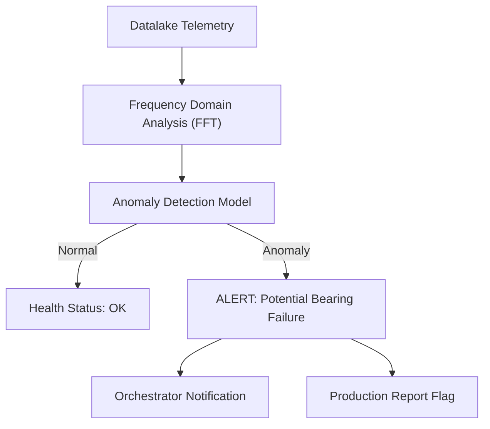

<p align="center">
  
</p>

# 🔍 HYDRA-UMC-ANOMALY-DETECTOR

<p align="center"><a href="README.md">🇺🇸 English</a> | <a href="README_spa.md">🇪🇸 Español</a> | <a href="README_fra.md">🇫🇷 Français</a> | <a href="README_ita.md">🇮🇹 Italiano</a> | <a href="README_deu.md">🇩🇪 Deutsch</a> | <a href="README_zho.md">🇨🇳 简体中文</a> | 🇯🇵 <b>日本語</b></p>

### 🧠 AI 駆動の予知保全とモーター振動分析

<p align="left">
  
  
  
</p>

---

## 1. 🛠️ 技術概要

**HYDRA-UMC-ANOMALY-DETECTOR** は、ロボットの健全性を守る積極的な
守護者です。AI モデルを使用して高頻度のテレメトリ（振動、モーター
電流の特徴、熱プロファイル）を分析し、故障が発生する前にそれを検知
します。

すべてのモーターとツールヘッドの「デジタル指紋」を監視することで、
軸受の摩耗、ベルトの緩み、冷却系の故障を数週間前から識別でき、緊急
修理ではなく計画的な保守を可能にします。

### 主な機能：
* 🔍 **特徴分析：** モーター電流のリアルタイム FFT（高速フーリエ変換）による機械的不均衡の検知。
* 📉 **予知保全：** NEMA モーターと URTC 工具向けの AI 駆動の RUL（残存有効寿命）推定。
* 🚨 **早期警報システム：** 異常なパターンが現れた際、Studio と Watch インターフェースにアラートをトリガーします。
* 🧬 **学習モデル：** データレイクの履歴から継続的に学習し、検知精度を向上させます。
* 🏷️ **モデルバージョニング：** すべての `Verdict` は、実際に採点されたモデルバージョンと閾値を、単調増加する本物の値として保持します——リフィット（再学習）は本物の、追跡可能なイベントです。*(実装済み)*
* 📐 **精度/再現率メトリクス：** ラベル付きフィクスチャ(`metrics.py`)に基づいて計算された本物の precision/recall/F1 であり、スコアの分離についての文章による主張だけではありません。*(実装済み)*
* 📈 **シミュレートされたドリフト検知：** `DriftMonitor` は、個々のウィンドウ自体の異常フラグとは異なる、本物の持続的な移動平均の上昇を検知します。*(実装済み)*

---

## 2. 🔄 検知パイプライン



---

## 3. 🧱 アーキテクチャと設計上の決定

* **HYDRA-UMC-DATALAKE のサブモジュールではなく兄弟プロジェクトである理由。** 異常検知は、既に保存されたテレメトリに対する読み取り専用の分析ワークロードです——独立させておくことで、検出器のクラッシュや遅いモデル推論が、HYDRA-UMC-TELEMETRY-COLLECTOR による同じストアへの書き込みをブロックすることは決してありません。
* **今日は FFT + 統計的ベースラインであり、まだ学習済みニューラルネットワークではない理由。** README はこれを「AI 駆動」と呼んでいます——この最初のパスで本物であり実際に動いているのは、本物の信号処理技術(`src/hydra_umc_anomaly_detector/fft.py`、numpy 自体の FFT)に加え、既知の健全なウィンドウから学習した周波数ビンごとの統計的ベースライン(`baseline.py`)、そして max-z-score による判定(`detector.py`)です——学習済みのディープラーニングモデルではありません。実際に動作し、本プロジェクト自身の合成的な故障信号に対して実際にテストされており、後で学習モデルを構築する際の正しい土台です(`mejoras_futuras.txt` を参照)——しかしここでニューラルネットワークと呼ぶと、実際に動いている内容を過大に評価することになります。
* **固定閾値ではなく、すべてのビンにわたる max-z-score である理由。** 固定閾値(「モーター温度 > 80°C」)は、緩やかなドリフトを見逃し、正当な負荷スパイクに誤警報を出します——ライブのスペクトルの各ビンを、この特定のモーター自体の学習済みの健全なベースラインと比較することで、新しい/シフトした周波数ピーク(本物の軸受欠陥の特徴)を、この 2 つの失敗モードのいずれも発生させずに検知できます。デフォルトの閾値(10.0)は、実際の経験的な分離度から選ばれたものであり、推測ではありません——実際の数値は、このプロジェクトの合成の健全 vs 故障テストフィクスチャの実データとして `detector.py` 自身の docstring を参照してください。
* **エコシステムの他の部分との関係。** HYDRA-UMC-DATALAKE の下の兄弟サービスです——HYDRA-UMC-TELEMETRY-COLLECTOR が既にそこに書き込んだテレメトリに対して異常検知を実行します。
* **`DriftMonitor` が `AnomalyDetector.score()` とは別のメカニズムであり、単に大きな閾値ではない理由。** 両者は異なる本物の問いに答えます——「このウィンドウが異常かどうか」(一回限りの判定)と、「直近の平均が静かにシフトしたかどうか」(単一のノイズの多い外れ値ウィンドウに対して頑健な、移動的な傾向)です。実際のシミュレートされたドリフトテストにより、この検出器の max-z-score 設計では、新しい周波数タイプの故障に対して、単一ウィンドウ自体のフラグが移動ドリフト信号よりも*先に*発火することが判明し、その事実が正直に文書化されています——ここでの `DriftMonitor` の本当の価値は、より早い警告ではなく持続的な傾向の確認であり、コード自体もそれを誇張せずそのように述べています。
* **`metrics.py` が閾値の品質を文章のままにせず precision/recall を計算する理由。** `detector.py` 自身の docstring は、以前は「健全なものは最大で約 5.3、故障のあるものは数百のスコアになる」としか主張していませんでした——本物ではありますが、将来の再調整に対して回帰テストできる数値ではありませんでした。同じ本物のフィクスチャに対する `precision_recall()` は、これに本物の、検証可能な値(現在は 1.0/1.0)を与えます。

---

## 📂 リポジトリ構成

純粋なソフトウェアサービス（ML/分析）——独自のハードウェア/ファーム
ウェア/OS を持たず、テンプレートから省略されています（エコシステムの
リポジトリ構造ポリシーに従って省略されています）。

```text
HYDRA-UMC-ANOMALY-DETECTOR/
├── src/hydra_umc_anomaly_detector/  # ソースコード
│   ├── __init__.py                  # パッケージバージョン
│   ├── fft.py                       # 本物の FFT ベースのスペクトル(numpy)
│   ├── baseline.py                  # ビンごとの健全な統計プロファイル(平均/標準偏差)
│   ├── detector.py                  # Baseline をフィットし、ライブウィンドウをそれに対して採点
│   ├── metrics.py                   # ラベル付きフィクスチャに基づく本物の precision/recall/F1
│   ├── drift.py                     # 移動平均による本物のドリフト検知
│   ├── api.py                        # detector を包む単純な JSON/HTTP ハンドラー
│   └── main.py                       # エントリポイント：すべてを接続し、HTTP サーバーを起動
├── tests/                   # pytest - FFT の正しさ、baseline の統計、実際の故障検知、メトリクス、シミュレートされたドリフト
├── docs/
│   └── API.md               # 本物の HTTP エンドポイントリファレンス（リクエスト、レスポンス、ステータスコード）
├── images/                  # メディアと図版
├── systemd/
│   └── hydra-umc-anomaly-detector.service # CM5 上のローカル異常検知 API 用 systemd ユニット
├── tools/
│   ├── build_test.py        # バージョンを更新しないビルド/コンパイル確認
│   └── ci_validate.py       # CI が使用する manifest/CHANGELOG/docs の検証
├── build/                   # ビルド出力（gitignore 対象）
├── pyproject.toml           # パッケージメタデータ、バージョン、依存関係(numpy)
├── bump_version.py          # オドメーター式バージョンインクリメント（ビルドが実行）
├── bump_manifest_version.py # hydra-umc.project.json のバージョンをネイティブ側と同期（--sync）
├── build.sh / build.bat     # 実際のビルド：venv + editable インストール + バージョンインクリメント + テスト
├── run.sh / run.bat         # 実際の実行：HTTP API を起動
└── README.md
```

元のテンプレートから省略：`hardware/`、`firmware/`、`os/` —— これは
純粋なソフトウェアサービス(Python パッケージ)であり、専用のハードウェアや
ファームウェア、維持すべきオペレーティングシステムイメージもありません。
完全な HTTP エンドポイントリファレンスは [`docs/API.md`](docs/API.md) を参照。

---

## 4. ⚙️ ビルドと実行

Python >= 3.10 が必要です。コンパイルできるだけの骨組みではなく、
HTTP API を備えた本物の FFT ベースの異常検知です。

```bash
# Linux/macOS
./build.sh
./run.sh --port 8097

# Windows
build.bat
run.bat --port 8097
```

`build` はローカルの `.venv` を作成/アクティブ化し、パッケージを
(editable、`numpy` を含む dev 拡張込みで)その中にインストールし、
インポートを検証し、本物のテストスイート(`pytest`)を実行します。
`run` は HTTP API を起動し、すべてのフラグ(`--addr`、`--port`、
`--sample-rate`、`--threshold`)をそのまま渡します。

```bash
# 既知の健全な信号ウィンドウに対してキャリブレーションする(float の JSON 配列、--sample-rate と同じサンプルレート)
curl -X POST localhost:8097/baseline/fit -d '{"windows": [[...], [...], ...]}'

# フィットした baseline に対してライブウィンドウを採点する
curl -X POST localhost:8097/detect -d '{"window": [...]}'
# -> {"score": 6.3, "anomalous": false, "worstBinFreqHz": 276.0}

curl localhost:8097/stats
```

```bash
python -m pytest tests/ -v   # fft.py(既知の正弦波のピーク周波数が正しく
                              # 検出され、DC が本当に除外されることを検証)、
                              # baseline.py(正しい平均/標準偏差、ゼロ標準偏差
                              # の下限が本物のゼロ除算を防ぐことを検証)、
                              # detector.py(実際の約束：合成の故障信号が
                              # フラグ付けされ、健全に見える信号はされない、
                              # 際どい閾値ではなく本物の分離マージンを伴う)、
                              # そして api.py(本物の ThreadingHTTPServer に
                              # 対する本物の HTTP 往復テスト)
```

---

## 🚀 ロードマップ
* **フェーズ 1：** 履歴分析のためのデータレイクの高スループット取り込みとインデックス作成。
* **フェーズ 2：** テレメトリコレクターのエッジ圧縮と安全な送信プロトコル。
* **フェーズ 3：** 教師なし学習とモーター振動分析を用いた異常検知。
* **フェーズ 4：** 早期の機械的問題を「聞き取る」音響分析の統合と、AI 駆動の予測的インサイト。

---

## 🔗 関連プロジェクト

本プロジェクトは、同一著者（JuanenRac / Electro Hobby 3D）による、
ファームウェア、制御ソフトウェア、AI ノード、フリート管理ツールにまたがる、
より大きなロボティクスエコシステムの一部です。ご要望が実際にはこれらの
プロジェクトのいずれかに関するものであり、本リポジトリのものではない
可能性もあるため、知っておく価値があります。

### プロジェクトファミリー

**親プロジェクト：** **[HYDRA-UMC-DATALAKE](https://github.com/JuanenRac/HYDRA-UMC-DATALAKE)** —— 本検出器が保存されたテレメトリを分析する統合親プロジェクト。

**兄弟プロジェクト：**
- **[HYDRA-UMC-TELEMETRY-COLLECTOR](https://github.com/JuanenRac/HYDRA-UMC-TELEMETRY-COLLECTOR)** —— 同じ親プロジェクトを持つ兄弟分析サービス。
- **[HYDRA-UMC-PRODUCTION-REPORTS](https://github.com/JuanenRac/HYDRA-UMC-PRODUCTION-REPORTS)** —— 同じ親プロジェクトを持つ兄弟分析サービス。

### 直接関連（ファミリー外）

- **[HYDRA-UMC-STUDIO](https://github.com/JuanenRac/HYDRA-UMC-STUDIO)** —— 本検知器の実際の早期警告アラートを、上記の主な機能に記載の通り、制御UIに直接表示します。
- **[HYDRA-UMC-WATCH](https://github.com/JuanenRac/HYDRA-UMC-WATCH)** —— ロボットを操縦する人ではなく、フリートの健全性を監視する人向けに、同じアラート表示を提供します。
- **[URTC](https://github.com/JuanenRac/URTC)** —— RUL推定は、アーム自体のNEMAモーターだけでなく、URTCツールヘッドもカバーします。

### エコシステムのその他のプロジェクト

**HYDRA-UMC プラットフォーム** — マルチロボット・マイクロファクトリーセル
- **[HYDRA-UMC](https://github.com/JuanenRac/HYDRA-UMC)** — 最大 8 台のロボットアームを統括する CM5 + STM32H745 マザーボード。
- **[HYDRA-UMC-SERVER](https://github.com/JuanenRac/HYDRA-UMC-SERVER)** — すべての制御クライアントが接続する Express/WebSocket バックエンド。
- **[HYDRA-UMC-STUDIO](https://github.com/JuanenRac/HYDRA-UMC-STUDIO)** — Web ベースの制御ダッシュボード、マルチロボット 3D 可視化。
- **[HYDRA-UMC-ANDROID-CONTROL](https://github.com/JuanenRac/HYDRA-UMC-ANDROID-CONTROL)** — Wi-Fi/Bluetooth 経由の Android 制御アプリ。
- **[HYDRA-UMC-IOS-CONTROL](https://github.com/JuanenRac/HYDRA-UMC-IOS-CONTROL)** — Flutter で構築された iOS/iPadOS 制御アプリ。
- **[HYDRA-UMC-SUITE](https://github.com/JuanenRac/HYDRA-UMC-SUITE)** — デスクトップ版群制御コマンドセンター（Python/PySide6）。
- **[HYDRA-UMC-EDITOR-URDF](https://github.com/JuanenRac/HYDRA-UMC-EDITOR-URDF)** — ロボットカタログ向けのデスクトップ版 URDF モデルエディター。
- **[HYDRA-UMC-DSI](https://github.com/JuanenRac/HYDRA-UMC-DSI)** — 機載 DSI タッチスクリーン用のネイティブタッチ UI。

**URTC プラットフォーム** — すべての HYDRA-UMC ロボットアームが搭載するツールヘッドコントローラー
- **[URTC](https://github.com/JuanenRac/URTC)** — CAN バスツールヘッドコントローラー、25 種類のツールプロファイル。
- **[URTC-FLASHER](https://github.com/JuanenRac/URTC-FLASHER)** — デスクトップ版 CAN-OTA + SWD/JTAG フラッシュツール。
- **[URTC-TESTER](https://github.com/JuanenRac/URTC-TESTER)** — デスクトップ版ライブ CAN バス診断ツール。
- **[URTC-WEB-STUDIO](https://github.com/JuanenRac/URTC-WEB-STUDIO)** — Web Serial API によるブラウザベースの代替版。

**🎥 ビジョン AI ノード（Hailo-8）**
- [HYDRA-UMC-VISION-NODE](https://github.com/JuanenRac/HYDRA-UMC-VISION-NODE)
- [HYDRA-UMC-VISION-STREAMER](https://github.com/JuanenRac/HYDRA-UMC-VISION-STREAMER)
- [HYDRA-UMC-DETECTION-HEF](https://github.com/JuanenRac/HYDRA-UMC-DETECTION-HEF)
- [HYDRA-UMC-SAFETY-ZONES](https://github.com/JuanenRac/HYDRA-UMC-SAFETY-ZONES)
- [HYDRA-UMC-VISUAL-SERVOING-API](https://github.com/JuanenRac/HYDRA-UMC-VISUAL-SERVOING-API)

**🧠 認知 AI ノード（Hailo-10）**
- [HYDRA-UMC-COGNITIVE-NODE](https://github.com/JuanenRac/HYDRA-UMC-COGNITIVE-NODE)
- [HYDRA-UMC-VLA-ENGINE](https://github.com/JuanenRac/HYDRA-UMC-VLA-ENGINE)
- [HYDRA-UMC-VOICE-UI](https://github.com/JuanenRac/HYDRA-UMC-VOICE-UI)
- [HYDRA-UMC-SEMANTIC-PLANNER](https://github.com/JuanenRac/HYDRA-UMC-SEMANTIC-PLANNER)
- [HYDRA-UMC-DOCS-QA](https://github.com/JuanenRac/HYDRA-UMC-DOCS-QA)

**🐝 オーケストレーションと群制御**
- [HYDRA-UMC-ORCHESTRATOR](https://github.com/JuanenRac/HYDRA-UMC-ORCHESTRATOR)
- [HYDRA-UMC-SWARM-SYNC](https://github.com/JuanenRac/HYDRA-UMC-SWARM-SYNC)
- [HYDRA-UMC-PATH-PLANNER-3D](https://github.com/JuanenRac/HYDRA-UMC-PATH-PLANNER-3D)
- [HYDRA-UMC-JOB-DISPATCHER](https://github.com/JuanenRac/HYDRA-UMC-JOB-DISPATCHER)
- [HYDRA-UMC-NODE-HEALING](https://github.com/JuanenRac/HYDRA-UMC-NODE-HEALING)

**🎮 デジタルツインとシミュレーション**
- [HYDRA-UMC-TWIN](https://github.com/JuanenRac/HYDRA-UMC-TWIN)
- [HYDRA-UMC-PHYSICS-REPLICA](https://github.com/JuanenRac/HYDRA-UMC-PHYSICS-REPLICA)
- [HYDRA-UMC-HIL-BRIDGE](https://github.com/JuanenRac/HYDRA-UMC-HIL-BRIDGE)
- [HYDRA-UMC-SYNTHETIC-DATA-GEN](https://github.com/JuanenRac/HYDRA-UMC-SYNTHETIC-DATA-GEN)

**🏭 産業用ゲートウェイ**
- [HYDRA-UMC-GATEWAY-INDUSTRIAL](https://github.com/JuanenRac/HYDRA-UMC-GATEWAY-INDUSTRIAL)
- [HYDRA-UMC-OPCUA-SERVER](https://github.com/JuanenRac/HYDRA-UMC-OPCUA-SERVER)
- [HYDRA-UMC-MQTT-BROKER](https://github.com/JuanenRac/HYDRA-UMC-MQTT-BROKER)
- [HYDRA-UMC-MTCONNECT-ADAPTER](https://github.com/JuanenRac/HYDRA-UMC-MTCONNECT-ADAPTER)

**🛠️ 補完ツール**
- [URTC-SMART-RACK](https://github.com/JuanenRac/URTC-SMART-RACK)
- [URTC-VISION-TOOL](https://github.com/JuanenRac/URTC-VISION-TOOL)
- [HYDRA-UMC-WATCH](https://github.com/JuanenRac/HYDRA-UMC-WATCH)
- [HYDRA-UMC-TOOL-CLI](https://github.com/JuanenRac/HYDRA-UMC-TOOL-CLI)
- [HYDRA-UMC-DASHBOARD-AI](https://github.com/JuanenRac/HYDRA-UMC-DASHBOARD-AI)


## 👤 作者
**JuanenRac** (Electro Hobby 3D)
📧 electrohobby3d@gmail.com
📺 [youtube.com/@electrohobby3d](https://youtube.com/@electrohobby3d)

## 📜 ライセンス
GPL-3.0 —— 詳細は LICENSE を参照してください。
