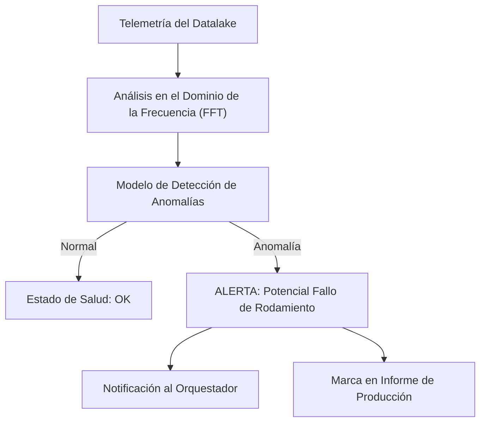

<p align="center">
  
</p>

# 🔍 HYDRA-UMC-ANOMALY-DETECTOR

<p align="center"><a href="README.md">🇺🇸 English</a> | 🇪🇸 <b>Español</b> | <a href="README_fra.md">🇫🇷 Français</a> | <a href="README_ita.md">🇮🇹 Italiano</a> | <a href="README_deu.md">🇩🇪 Deutsch</a> | <a href="README_zho.md">🇨🇳 简体中文</a> | <a href="README_jpn.md">🇯🇵 日本語</a></p>

### 🧠 Mantenimiento Predictivo Basado en IA y Análisis de Vibración de Motores

<p align="left">
  
  
  
</p>

---

## 1. 🛠️ VISIÓN GENERAL TÉCNICA

**HYDRA-UMC-ANOMALY-DETECTOR** es el guardián proactivo de la salud robótica. Utiliza modelos de IA para analizar telemetría de alta frecuencia (vibraciones, firmas de corriente de motor y perfiles térmicos) para detectar fallos antes de que ocurran.

Al monitorizar la "huella digital" de cada motor y cabezal de herramienta, puede identificar el desgaste de rodamientos, correas sueltas o fallos de refrigeración con semanas de antelación, permitiendo un mantenimiento programado en lugar de reparaciones de emergencia.

### Características Clave:
* 🔍 **Análisis de Firmas:** FFT (Transformada Rápida de Fourier) en tiempo real de las corrientes del motor para detectar desequilibrios mecánicos.
* 📉 **Mantenimiento Predictivo:** Estimación RUL (Vida Útil Remanente) impulsada por IA para motores NEMA y herramientas URTC.
* 🚨 **Sistema de Alerta Temprana:** Activa alertas en las interfaces Studio y Watch cuando surgen patrones anormales.
* 🧬 **Modelos de Aprendizaje:** Mejora continuamente la precisión de detección aprendiendo de la historia del Datalake.
* 🏷️ **Versionado de Modelo:** Cada `Verdict` lleva la versión de modelo real y monótona, y el umbral contra el que fue puntuado - un reajuste (refit) es un evento real y trazable. *(implementado)*
* 📐 **Métricas de Precisión/Recall:** Precision/recall/F1 reales, calculados sobre un fixture etiquetado (`metrics.py`), no solo afirmaciones en prosa sobre la separación de puntuaciones. *(implementado)*
* 📈 **Detección de Deriva Simulada:** `DriftMonitor` señala una elevación sostenida real de la media móvil, distinta de la propia marca de anomalía de cualquier ventana individual. *(implementado)*

---

## 2. 🔄 PIPELINE DE DETECCIÓN



---

## 3. 🧱 ARQUITECTURA Y DECISIONES DE DISEÑO

* **Por qué es hermano, no un submódulo, de HYDRA-UMC-DATALAKE.** La detección de anomalías es una carga de trabajo analítica de solo lectura sobre telemetría ya almacenada - mantenerla separada significa que un fallo del detector o una inferencia de modelo lenta nunca bloquean las propias escrituras de HYDRA-UMC-TELEMETRY-COLLECTOR en el mismo almacén.
* **Por qué FFT + una base estadística hoy, no una red neuronal entrenada todavía.** El README lo llama "impulsado por IA" - lo que es real y funciona en esta primera pasada es una técnica real de procesamiento de señales (`src/hydra_umc_anomaly_detector/fft.py`, FFT propio de numpy) más una base estadística por bin de frecuencia aprendida de ventanas conocidas como sanas (`baseline.py`) y un veredicto de max-z-score (`detector.py`) - no un modelo de deep learning entrenado. Funciona, está probado contra firmas de fallo sintéticas reales, y es la base correcta sobre la que construir un modelo aprendido más adelante (ver `mejoras_futuras.txt`) - pero llamarlo red neuronal aquí exageraría lo que realmente corre.
* **Por qué un max-z-score en todos los bins, no un umbral fijo.** Un umbral fijo ('temperatura del motor > 80C') se pierde la deriva gradual y da falsas alarmas ante picos de carga legítimos - comparar cada bin del espectro EN VIVO contra la propia base sana APRENDIDA de este motor concreto detecta un pico de frecuencia nuevo/desplazado (una firma real de fallo de rodamiento) sin ninguno de esos dos fallos. El umbral por defecto (10.0) se eligió a partir de separación empírica real, no adivinado - ver el propio docstring de `detector.py` para las cifras reales de los fixtures de test sintéticos sano-vs-defectuoso de este proyecto.
* **Cómo encaja en el resto del ecosistema.** Un servicio hermano bajo HYDRA-UMC-DATALAKE - ejecuta detección de anomalías sobre la telemetría que HYDRA-UMC-TELEMETRY-COLLECTOR ya escribió ahí.
* **Por qué `DriftMonitor` es un mecanismo separado de `AnomalyDetector.score()`, y no un umbral más grande.** Responden preguntas reales distintas: "¿es ESTA ventana anómala?" (un veredicto puntual) frente a "¿se ha desplazado silenciosamente la media RECIENTE?" (una tendencia móvil, robusta ante una única ventana atípica ruidosa). Un test real de deriva simulada encontró y documenta honestamente que, para el diseño de max-z-score de este detector, la propia marca de una ventana individual en realidad se dispara *antes* que la señal de deriva móvil ante un fallo de tipo de frecuencia nuevo - el valor real de `DriftMonitor` aquí es una confirmación de tendencia sostenida, no una alerta más temprana, y el código lo dice así en vez de sobrevenderlo.
* **Por qué `metrics.py` calcula precision/recall en lugar de dejar la calidad del umbral como prosa.** El propio docstring de `detector.py` antes solo afirmaba "sano puntuó hasta ~5.3, defectuoso puntuó en los cientos" - real, pero no una cifra contra la que un futuro reajuste pudiera hacer un test de regresión. `precision_recall()` sobre el mismo fixture real da a eso un valor real y verificable (1.0/1.0 hoy).

---

## 📂 ESTRUCTURA DE DIRECTORIOS

Servicio de software puro (ML/analítica), sin hardware, firmware ni sistema operativo propios; esas carpetas se omiten por la política de estructura del repositorio.

```text
HYDRA-UMC-ANOMALY-DETECTOR/
├── src/hydra_umc_anomaly_detector/  # Código fuente
│   ├── __init__.py                  # Versión del paquete
│   ├── fft.py                       # Espectro real basado en FFT (numpy)
│   ├── baseline.py                  # Perfil estadistico sano por bin (media/std)
│   ├── detector.py                  # Ajusta un Baseline, puntua ventanas en vivo contra el
│   ├── metrics.py                   # Precision/recall/F1 reales sobre un fixture etiquetado
│   ├── drift.py                     # Deteccion real de deriva por media movil
│   ├── api.py                        # Handlers JSON/HTTP planos que envuelven el detector
│   └── main.py                       # Punto de entrada: conecta todo, arranca el servidor HTTP
├── tests/                   # pytest - correccion de FFT, estadistica del baseline, deteccion real de fallos, metricas, deriva simulada
├── docs/
│   └── API.md               # Referencia real de endpoints HTTP (peticiones, respuestas, codigos de estado)
├── build/                   # Salida de build (ignorada por git)
├── pyproject.toml           # Metadatos del paquete, version, dependencias (numpy)
├── bump_version.py          # Incremento de versión tipo cuentakilómetros (lo ejecuta el build)
├── build.sh / build.bat     # Build real: venv + instalación editable + bump + tests
├── run.sh / run.bat         # Ejecución real: arranca la API HTTP
└── README.md
```

Podado de la plantilla original: `hardware/`, `firmware/`, `os/`,
`images/` y `scripts/` — es un servicio de software puro (paquete Python)
sin hardware ni firmware propios, sin imagen de sistema operativo que
mantener, y sin contenido de medios/scripts de utilidad todavía suficiente
para justificar sus propias carpetas. Ver [`docs/API.md`](docs/API.md)
para la referencia completa de endpoints HTTP.

---

## 4. ⚙️ BUILD Y EJECUCIÓN

Requiere Python >= 3.10. Detección de anomalías real basada en FFT con
API HTTP, no solo un esqueleto que importa.

```bash
# Linux/macOS
./build.sh
./run.sh --port 8097

# Windows
build.bat
run.bat --port 8097
```

`build` crea/activa un `.venv` local, instala el paquete (editable, con
extras de dev, incluyendo `numpy`) en el, verifica la importación, y corre
la suite de tests real (`pytest`). `run` arranca la API HTTP y reenvia
cualquier flag (`--addr`, `--port`, `--sample-rate`, `--threshold`).

```bash
# Calibrar contra ventanas de señal conocidas como sanas (arrays JSON de floats,
# mismo sample rate que --sample-rate)
curl -X POST localhost:8097/baseline/fit -d '{"windows": [[...], [...], ...]}'

# Puntuar una ventana en vivo contra el baseline ajustado
curl -X POST localhost:8097/detect -d '{"window": [...]}'
# -> {"score": 6.3, "anomalous": false, "worstBinFreqHz": 276.0}

curl localhost:8097/stats
```

```bash
python -m pytest tests/ -v   # fft.py (el pico de una onda seno conocida
                              # se encuentra correctamente, la DC se
                              # descarta de verdad), baseline.py (media/std
                              # correctas, el suelo de std-cero evita una
                              # division por cero real), detector.py (la
                              # promesa real: una señal de fallo sintetica
                              # se marca, una que parece sana no - con
                              # margen de separacion real, no un umbral al
                              # filo), y api.py (round-trips HTTP reales
                              # via un ThreadingHTTPServer genuino)
```

---

## 🚀 HOJA DE RUTA
* **Fase 1:** Ingesta de alto rendimiento e indexación del Datalake para análisis histórico.
* **Fase 2:** Compresión en el borde del colector de telemetría y protocolos de transmisión seguros.
* **Fase 3:** Detección de anomalías mediante aprendizaje no supervisado y análisis de vibración de motores.
* **Fase 4:** Integración de análisis acústico para "escuchar" problemas mecánicos tempranos e insights predictivos de IA.

---

## 🔗 Proyectos Relacionados

Este proyecto forma parte de un ecosistema de robótica más amplio del mismo autor (JuanenRac / Electro Hobby 3D), que abarca firmware, software de control, nodos de IA y herramientas de flota. Vale la pena conocerlo, ya que una petición podría en realidad ser sobre uno de estos proyectos en vez de sobre este repositorio.

### Familia

**Padre:** **[HYDRA-UMC-DATALAKE](https://github.com/JuanenRac/HYDRA-UMC-DATALAKE)** — el padre de integración cuya telemetría almacenada analiza este detector.

**Hermanos:**
- **[HYDRA-UMC-TELEMETRY-COLLECTOR](https://github.com/JuanenRac/HYDRA-UMC-TELEMETRY-COLLECTOR)** — servicio de analítica hermano, mismo padre.
- **[HYDRA-UMC-PRODUCTION-REPORTS](https://github.com/JuanenRac/HYDRA-UMC-PRODUCTION-REPORTS)** — servicio de analítica hermano, mismo padre.

### Relación Directa (fuera de la familia)

- **[HYDRA-UMC-STUDIO](https://github.com/JuanenRac/HYDRA-UMC-STUDIO)** — muestra las alertas reales de aviso temprano de este detector directamente en la UI de control, según las Características Clave de arriba.
- **[HYDRA-UMC-WATCH](https://github.com/JuanenRac/HYDRA-UMC-WATCH)** — la misma superficie de alertas, para quien esté vigilando la salud de la flota en vez de conducir un robot.
- **[URTC](https://github.com/JuanenRac/URTC)** — la estimación de RUL cubre los cabezales de herramienta URTC, no solo los motores NEMA de los propios brazos.

### Resto del Ecosistema

**Plataforma HYDRA-UMC** — la célula de micro-fábrica multi-robot
- **[HYDRA-UMC](https://github.com/JuanenRac/HYDRA-UMC)** — la placa base CM5 + STM32H745 que orquesta hasta 8 brazos robóticos.
- **[HYDRA-UMC-SERVER](https://github.com/JuanenRac/HYDRA-UMC-SERVER)** — el backend Express/WebSocket con el que habla cada cliente de control.
- **[HYDRA-UMC-STUDIO](https://github.com/JuanenRac/HYDRA-UMC-STUDIO)** — panel de control web, visualización 3D multi-robot.
- **[HYDRA-UMC-ANDROID-CONTROL](https://github.com/JuanenRac/HYDRA-UMC-ANDROID-CONTROL)** — app de control Android por Wi-Fi/Bluetooth.
- **[HYDRA-UMC-IOS-CONTROL](https://github.com/JuanenRac/HYDRA-UMC-IOS-CONTROL)** — app de control iOS/iPadOS construida en Flutter.
- **[HYDRA-UMC-SUITE](https://github.com/JuanenRac/HYDRA-UMC-SUITE)** — centro de mando de enjambre de escritorio (Python/PySide6).
- **[HYDRA-UMC-EDITOR-URDF](https://github.com/JuanenRac/HYDRA-UMC-EDITOR-URDF)** — editor de modelos URDF de escritorio para el catálogo de robots.
- **[HYDRA-UMC-DSI](https://github.com/JuanenRac/HYDRA-UMC-DSI)** — interfaz táctil nativa para la pantalla DSI integrada.

**Plataforma URTC** — el controlador de cabezal de herramienta que lleva cada brazo HYDRA-UMC
- **[URTC](https://github.com/JuanenRac/URTC)** — controlador de cabezal de herramienta CAN, 25 perfiles de herramienta.
- **[URTC-FLASHER](https://github.com/JuanenRac/URTC-FLASHER)** — herramienta de escritorio de flasheo CAN-OTA + SWD/JTAG.
- **[URTC-TESTER](https://github.com/JuanenRac/URTC-TESTER)** — herramienta de escritorio de diagnóstico CAN en vivo.
- **[URTC-WEB-STUDIO](https://github.com/JuanenRac/URTC-WEB-STUDIO)** — alternativa basada en navegador vía Web Serial API.

**🎥 Nodo de IA de Visión (Hailo-8)**
- [HYDRA-UMC-VISION-NODE](https://github.com/JuanenRac/HYDRA-UMC-VISION-NODE)
- [HYDRA-UMC-VISION-STREAMER](https://github.com/JuanenRac/HYDRA-UMC-VISION-STREAMER)
- [HYDRA-UMC-DETECTION-HEF](https://github.com/JuanenRac/HYDRA-UMC-DETECTION-HEF)
- [HYDRA-UMC-SAFETY-ZONES](https://github.com/JuanenRac/HYDRA-UMC-SAFETY-ZONES)
- [HYDRA-UMC-VISUAL-SERVOING-API](https://github.com/JuanenRac/HYDRA-UMC-VISUAL-SERVOING-API)

**🧠 Nodo de IA Cognitiva (Hailo-10)**
- [HYDRA-UMC-COGNITIVE-NODE](https://github.com/JuanenRac/HYDRA-UMC-COGNITIVE-NODE)
- [HYDRA-UMC-VLA-ENGINE](https://github.com/JuanenRac/HYDRA-UMC-VLA-ENGINE)
- [HYDRA-UMC-VOICE-UI](https://github.com/JuanenRac/HYDRA-UMC-VOICE-UI)
- [HYDRA-UMC-SEMANTIC-PLANNER](https://github.com/JuanenRac/HYDRA-UMC-SEMANTIC-PLANNER)
- [HYDRA-UMC-DOCS-QA](https://github.com/JuanenRac/HYDRA-UMC-DOCS-QA)

**🐝 Orquestación y Enjambre**
- [HYDRA-UMC-ORCHESTRATOR](https://github.com/JuanenRac/HYDRA-UMC-ORCHESTRATOR)
- [HYDRA-UMC-SWARM-SYNC](https://github.com/JuanenRac/HYDRA-UMC-SWARM-SYNC)
- [HYDRA-UMC-PATH-PLANNER-3D](https://github.com/JuanenRac/HYDRA-UMC-PATH-PLANNER-3D)
- [HYDRA-UMC-JOB-DISPATCHER](https://github.com/JuanenRac/HYDRA-UMC-JOB-DISPATCHER)
- [HYDRA-UMC-NODE-HEALING](https://github.com/JuanenRac/HYDRA-UMC-NODE-HEALING)

**🎮 Gemelo Digital y Simulación**
- [HYDRA-UMC-TWIN](https://github.com/JuanenRac/HYDRA-UMC-TWIN)
- [HYDRA-UMC-PHYSICS-REPLICA](https://github.com/JuanenRac/HYDRA-UMC-PHYSICS-REPLICA)
- [HYDRA-UMC-HIL-BRIDGE](https://github.com/JuanenRac/HYDRA-UMC-HIL-BRIDGE)
- [HYDRA-UMC-SYNTHETIC-DATA-GEN](https://github.com/JuanenRac/HYDRA-UMC-SYNTHETIC-DATA-GEN)

**🏭 Pasarela Industrial**
- [HYDRA-UMC-GATEWAY-INDUSTRIAL](https://github.com/JuanenRac/HYDRA-UMC-GATEWAY-INDUSTRIAL)
- [HYDRA-UMC-OPCUA-SERVER](https://github.com/JuanenRac/HYDRA-UMC-OPCUA-SERVER)
- [HYDRA-UMC-MQTT-BROKER](https://github.com/JuanenRac/HYDRA-UMC-MQTT-BROKER)
- [HYDRA-UMC-MTCONNECT-ADAPTER](https://github.com/JuanenRac/HYDRA-UMC-MTCONNECT-ADAPTER)

**🛠️ Herramientas Complementarias**
- [URTC-SMART-RACK](https://github.com/JuanenRac/URTC-SMART-RACK)
- [URTC-VISION-TOOL](https://github.com/JuanenRac/URTC-VISION-TOOL)
- [HYDRA-UMC-WATCH](https://github.com/JuanenRac/HYDRA-UMC-WATCH)
- [HYDRA-UMC-TOOL-CLI](https://github.com/JuanenRac/HYDRA-UMC-TOOL-CLI)
- [HYDRA-UMC-DASHBOARD-AI](https://github.com/JuanenRac/HYDRA-UMC-DASHBOARD-AI)


## 👤 AUTOR
**JuanenRac** (Electro Hobby 3D)
📧 electrohobby3d@gmail.com
📺 [youtube.com/@electrohobby3d](https://youtube.com/@electrohobby3d)

## 📜 LICENCIA
GPL-3.0 - Ver archivo LICENSE para más detalles.
