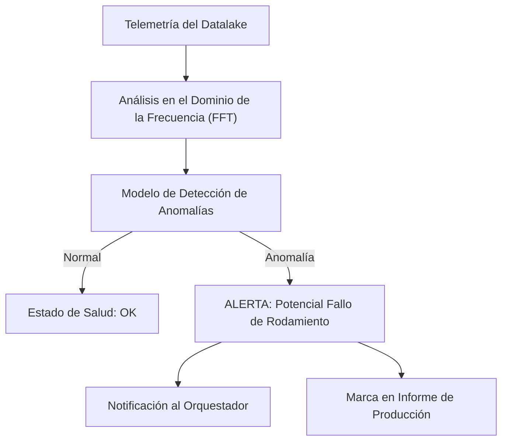

<p align="center">
  
</p>

# 🔍 HYDRA-UMC-ANOMALY-DETECTOR

<p align="center"><a href="README.md">🇺🇸 English</a> | 🇪🇸 <b>Español</b> | <a href="README_fra.md">🇫🇷 Français</a> | <a href="README_ita.md">🇮🇹 Italiano</a> | <a href="README_deu.md">🇩🇪 Deutsch</a> | <a href="README_zho.md">🇨🇳 简体中文</a> | <a href="README_jpn.md">🇯🇵 日本語</a></p>

### 🧠 Mantenimiento Predictivo Basado en IA y Análisis de Vibración de Motores

<p align="left">
  
  
  
</p>

---

## 1. 🛠️ VISIÓN GENERAL TÉCNICA

**HYDRA-UMC-ANOMALY-DETECTOR** es el guardián proactivo de la salud robótica. Utiliza modelos de IA para analizar telemetría de alta frecuencia (vibraciones, firmas de corriente de motor y perfiles térmicos) para detectar fallos antes de que ocurran.

Al monitorizar la "huella digital" de cada motor y cabezal de herramienta, puede identificar el desgaste de rodamientos, correas sueltas o fallos de refrigeración con semanas de antelación, permitiendo un mantenimiento programado en lugar de reparaciones de emergencia.

### Características Clave:
* 🔍 **Análisis de Firmas:** FFT (Transformada Rápida de Fourier) en tiempo real de las corrientes del motor para detectar desequilibrios mecánicos.
* 📉 **Mantenimiento Predictivo:** Estimación RUL (Vida Útil Remanente) impulsada por IA para motores NEMA y herramientas URTC.
* 🚨 **Sistema de Alerta Temprana:** Activa alertas en las interfaces Studio y Watch cuando surgen patrones anormales.
* 🧬 **Modelos de Aprendizaje:** Mejora continuamente la precisión de detección aprendiendo de la historia del Datalake.
* 🏷️ **Versionado de Modelo:** Cada `Verdict` lleva la versión de modelo real y monótona, y el umbral contra el que fue puntuado - un reajuste (refit) es un evento real y trazable. *(implementado)*
* 📐 **Métricas de Precisión/Recall:** Precision/recall/F1 reales, calculados sobre un fixture etiquetado (`metrics.py`), no solo afirmaciones en prosa sobre la separación de puntuaciones. *(implementado)*
* 📈 **Detección de Deriva Simulada:** `DriftMonitor` señala una elevación sostenida real de la media móvil, distinta de la propia marca de anomalía de cualquier ventana individual. *(implementado)*

---

## 2. 🔄 PIPELINE DE DETECCIÓN



---

## 3. 🧱 ARQUITECTURA Y DECISIONES DE DISEÑO

* **Por qué es hermano, no un submódulo, de HYDRA-UMC-DATALAKE.** La detección de anomalías es una carga de trabajo analítica de solo lectura sobre telemetría ya almacenada - mantenerla separada significa que un fallo del detector o una inferencia de modelo lenta nunca bloquean las propias escrituras de HYDRA-UMC-TELEMETRY-COLLECTOR en el mismo almacén.
* **Por qué FFT + una base estadística hoy, no una red neuronal entrenada todavía.** El README lo llama "impulsado por IA" - lo que es real y funciona en esta primera pasada es una técnica real de procesamiento de señales (`src/hydra_umc_anomaly_detector/fft.py`, FFT propio de numpy) más una base estadística por bin de frecuencia aprendida de ventanas conocidas como sanas (`baseline.py`) y un veredicto de max-z-score (`detector.py`) - no un modelo de deep learning entrenado. Funciona, está probado contra firmas de fallo sintéticas reales, y es la base correcta sobre la que construir un modelo aprendido más adelante (ver `mejoras_futuras.txt`) - pero llamarlo red neuronal aquí exageraría lo que realmente corre.
* **Por qué un max-z-score en todos los bins, no un umbral fijo.** Un umbral fijo ('temperatura del motor > 80C') se pierde la deriva gradual y da falsas alarmas ante picos de carga legítimos - comparar cada bin del espectro EN VIVO contra la propia base sana APRENDIDA de este motor concreto detecta un pico de frecuencia nuevo/desplazado (una firma real de fallo de rodamiento) sin ninguno de esos dos fallos. El umbral por defecto (10.0) se eligió a partir de separación empírica real, no adivinado - ver el propio docstring de `detector.py` para las cifras reales de los fixtures de test sintéticos sano-vs-defectuoso de este proyecto.
* **Cómo encaja en el resto del ecosistema.** Un servicio hermano bajo HYDRA-UMC-DATALAKE - ejecuta detección de anomalías sobre la telemetría que HYDRA-UMC-TELEMETRY-COLLECTOR ya escribió ahí.
* **Por qué `DriftMonitor` es un mecanismo separado de `AnomalyDetector.score()`, y no un umbral más grande.** Responden preguntas reales distintas: "¿es ESTA ventana anómala?" (un veredicto puntual) frente a "¿se ha desplazado silenciosamente la media RECIENTE?" (una tendencia móvil, robusta ante una única ventana atípica ruidosa). Un test real de deriva simulada encontró y documenta honestamente que, para el diseño de max-z-score de este detector, la propia marca de una ventana individual en realidad se dispara *antes* que la señal de deriva móvil ante un fallo de tipo de frecuencia nuevo - el valor real de `DriftMonitor` aquí es una confirmación de tendencia sostenida, no una alerta más temprana, y el código lo dice así en vez de sobrevenderlo.
* **Por qué `metrics.py` calcula precision/recall en lugar de dejar la calidad del umbral como prosa.** El propio docstring de `detector.py` antes solo afirmaba "sano puntuó hasta ~5.3, defectuoso puntuó en los cientos" - real, pero no una cifra contra la que un futuro reajuste pudiera hacer un test de regresión. `precision_recall()` sobre el mismo fixture real da a eso un valor real y verificable (1.0/1.0 hoy).

---

## 📂 ESTRUCTURA DE DIRECTORIOS

Servicio de software puro (ML/analítica), sin hardware, firmware ni sistema operativo propios; esas carpetas se omiten por la política de estructura del repositorio.

```text
HYDRA-UMC-ANOMALY-DETECTOR/
├── src/hydra_umc_anomaly_detector/  # Código fuente
│   ├── __init__.py                  # Versión del paquete
│   ├── fft.py                       # Espectro real basado en FFT (numpy)
│   ├── baseline.py                  # Perfil estadistico sano por bin (media/std)
│   ├── detector.py                  # Ajusta un Baseline, puntua ventanas en vivo contra el
│   ├── metrics.py                   # Precision/recall/F1 reales sobre un fixture etiquetado
│   ├── drift.py                     # Deteccion real de deriva por media movil
│   ├── api.py                        # Handlers JSON/HTTP planos que envuelven el detector
│   └── main.py                       # Punto de entrada: conecta todo, arranca el servidor HTTP
├── tests/                   # pytest - correccion de FFT, estadistica del baseline, deteccion real de fallos, metricas, deriva simulada
├── docs/
│   └── API.md               # Referencia real de endpoints HTTP (peticiones, respuestas, codigos de estado)
├── images/                  # Medios y diagramas
├── systemd/
│   └── hydra-umc-anomaly-detector.service # Unidad systemd de la API de detección de anomalías en la CM5 local
├── tools/
│   ├── build_test.py        # Comprobación de build/compilación sin subir versión
│   └── ci_validate.py       # Validación de manifest/CHANGELOG/docs usada por la CI
├── build/                   # Salida de build (ignorada por git)
├── pyproject.toml           # Metadatos del paquete, version, dependencias (numpy)
├── bump_version.py          # Incremento de versión tipo cuentakilómetros (lo ejecuta el build)
├── bump_manifest_version.py # Sincroniza la versión de hydra-umc.project.json con la nativa (--sync)
├── build.sh / build.bat     # Build real: venv + instalación editable + bump + tests
├── run.sh / run.bat         # Ejecución real: arranca la API HTTP
└── README.md
```

Podado de la plantilla original: `hardware/`, `firmware/` y `os/` — es un
servicio de software puro (paquete Python) sin hardware ni firmware
propios y sin imagen de sistema operativo que mantener. Ver
[`docs/API.md`](docs/API.md) para la referencia completa de endpoints HTTP.

---

## 4. ⚙️ BUILD Y EJECUCIÓN

Requiere Python >= 3.10. Detección de anomalías real basada en FFT con
API HTTP, no solo un esqueleto que importa.

```bash
# Linux/macOS
./build.sh
./run.sh --port 8097

# Windows
build.bat
run.bat --port 8097
```

`build` crea/activa un `.venv` local, instala el paquete (editable, con
extras de dev, incluyendo `numpy`) en el, verifica la importación, y corre
la suite de tests real (`pytest`). `run` arranca la API HTTP y reenvia
cualquier flag (`--addr`, `--port`, `--sample-rate`, `--threshold`).

```bash
# Calibrar contra ventanas de señal conocidas como sanas (arrays JSON de floats,
# mismo sample rate que --sample-rate)
curl -X POST localhost:8097/baseline/fit -d '{"windows": [[...], [...], ...]}'

# Puntuar una ventana en vivo contra el baseline ajustado
curl -X POST localhost:8097/detect -d '{"window": [...]}'
# -> {"score": 6.3, "anomalous": false, "worstBinFreqHz": 276.0}

curl localhost:8097/stats
```

```bash
python -m pytest tests/ -v   # fft.py (el pico de una onda seno conocida
                              # se encuentra correctamente, la DC se
                              # descarta de verdad), baseline.py (media/std
                              # correctas, el suelo de std-cero evita una
                              # division por cero real), detector.py (la
                              # promesa real: una señal de fallo sintetica
                              # se marca, una que parece sana no - con
                              # margen de separacion real, no un umbral al
                              # filo), y api.py (round-trips HTTP reales
                              # via un ThreadingHTTPServer genuino)
```

---

## 🚀 HOJA DE RUTA
* **Fase 1:** Ingesta de alto rendimiento e indexación del Datalake para análisis histórico.
* **Fase 2:** Compresión en el borde del colector de telemetría y protocolos de transmisión seguros.
* **Fase 3:** Detección de anomalías mediante aprendizaje no supervisado y análisis de vibración de motores.
* **Fase 4:** Integración de análisis acústico para "escuchar" problemas mecánicos tempranos e insights predictivos de IA.

---

## 🔗 Proyectos Relacionados

Este proyecto es parte del ecosistema de robótica HYDRA-UMC del mismo autor (JuanenRac / Electro Hobby 3D). Vale la pena conocerlo, ya que una petición podría en realidad ser sobre alguno de estos en vez de sobre este repositorio.

**Proyecto Padre**
- **[HYDRA-UMC-DATALAKE](https://github.com/JuanenRac/HYDRA-UMC-DATALAKE)** — almacén de series temporales real respaldado por sqlite3, con una API HTTP real de ingesta/consulta; el padre del que este repositorio es un servicio de analítica específico, dentro de su propia capa de datos y analítica.

**Proyectos Hermanos** — los demás servicios de analítica de la propia capa de datos y analítica de HYDRA-UMC-DATALAKE
- **[HYDRA-UMC-TELEMETRY-COLLECTOR](https://github.com/JuanenRac/HYDRA-UMC-TELEMETRY-COLLECTOR)** — pipeline real de ingesta CAN/WebSocket hacia DATALAKE, con deduplicación por secuencia.
- **[HYDRA-UMC-PRODUCTION-REPORTS](https://github.com/JuanenRac/HYDRA-UMC-PRODUCTION-REPORTS)** — cálculo real de OEE/disponibilidad sobre el histórico de DATALAKE, con exportación CSV reproducible.

**Directamente Relacionados**
- **[HYDRA-UMC-STUDIO](https://github.com/JuanenRac/HYDRA-UMC-STUDIO)** — panel de control web con visualización 3D multi-robot en tiempo real — muestra las alertas reales de aviso temprano de este detector directamente en la interfaz de control.
- **[HYDRA-UMC-WATCH](https://github.com/JuanenRac/HYDRA-UMC-WATCH)** — app compañera de WearOS con alertas hápticas reales y un relé de voz al teléfono emparejado — la misma superficie de alerta, para quien esté vigilando la salud de la flota en vez de conducir un robot.
- **[URTC](https://github.com/JuanenRac/URTC)** — firmware para la placa física del Universal Robot Tool Controller, más de 25 perfiles de herramienta por bus CAN — la estimación de RUL aquí cubre también los propios cabezales de herramienta de URTC, no solo los motores NEMA de los propios brazos.

**También Forma Parte del Ecosistema**

*Hardware y Plataforma Base*
- **[HYDRA-UMC](https://github.com/JuanenRac/HYDRA-UMC)** — la placa madre física del brazo robótico: host CM5 + coprocesador STM32H745 de doble núcleo, coordinando hasta 8 brazos herramienta por CAN-OTA/SPI-OTA.
- **[HYDRA-UMC-OS](https://github.com/JuanenRac/HYDRA-UMC-OS)** — capa de producto reproducible sobre Raspberry Pi OS para el CM5: agente de solo lectura, config/perfiles validados, aprovisionamiento WiFi de primer contacto.
- **[HYDRA-UMC-SDK](https://github.com/JuanenRac/HYDRA-UMC-SDK)** — el contrato JSON-Schema compartido y la barrera de seguridad contra la que cada bridge valida sus comandos.

*Backend Central y Clientes*
- **[HYDRA-UMC-SERVER](https://github.com/JuanenRac/HYDRA-UMC-SERVER)** — el backend headless real (REST/WebSocket) con el que habla de verdad cada cliente de control.
- **[HYDRA-UMC-SUITE](https://github.com/JuanenRac/HYDRA-UMC-SUITE)** — centro de mando de enjambre de escritorio (PySide6) para varios servidores a la vez, empaquetado como ejecutable independiente.
- **[HYDRA-UMC-ANDROID-CONTROL](https://github.com/JuanenRac/HYDRA-UMC-ANDROID-CONTROL)** — app nativa de control para Android con inicio de sesión biométrico y un compañero Wear OS emparejado.
- **[HYDRA-UMC-IOS-CONTROL](https://github.com/JuanenRac/HYDRA-UMC-IOS-CONTROL)** — app de control para iOS/iPadOS (Flutter) con sincronización en tiempo real por WebSocket.
- **[HYDRA-UMC-DSI](https://github.com/JuanenRac/HYDRA-UMC-DSI)** — interfaz táctil nativa para la pantalla táctil DSI de 7" a bordo, embebida en el propio CM5.
- **[HYDRA-UMC-EDITOR-URDF](https://github.com/JuanenRac/HYDRA-UMC-EDITOR-URDF)** — creador/editor gráfico de URDF de escritorio que envía los modelos terminados al propio catálogo de STUDIO.
- **[HYDRA-UMC-BRIDGE-AMR](https://github.com/JuanenRac/HYDRA-UMC-BRIDGE-AMR)** — barrera de coordinación para flotas AGV/AMR mediante un publicador MQTT VDA 5050 real.
- **[HYDRA-UMC-BRIDGE-CNC](https://github.com/JuanenRac/HYDRA-UMC-BRIDGE-CNC)** — coordinador de alto nivel para celdas CNC con acceso real a estado/bytes de control GRBL.
- **[HYDRA-UMC-BRIDGE-DROIDS](https://github.com/JuanenRac/HYDRA-UMC-BRIDGE-DROIDS)** — barrera de coordinación para droides con patas/humanoides, con un emisor de comandos real para Boston Dynamics Spot.
- **[HYDRA-UMC-BRIDGE-LASER](https://github.com/JuanenRac/HYDRA-UMC-BRIDGE-LASER)** — coordinador de seguridad para celdas láser que lee 3 salvaguardas GPIO reales de llave/carcasa/enclavamiento.
- **[HYDRA-UMC-BRIDGE-OPENPNP](https://github.com/JuanenRac/HYDRA-UMC-BRIDGE-OPENPNP)** — coordinador de alto nivel seguro para el flujo de placas de pick-and-place OpenPnP.
- **[HYDRA-UMC-BRIDGE-PRINTER3D](https://github.com/JuanenRac/HYDRA-UMC-BRIDGE-PRINTER3D)** — barrera de coordinación segura para impresoras 3D Moonraker/Klipper, con comandos de trabajo reales y controlados.
- **[HYDRA-UMC-BRIDGE-ROS2](https://github.com/JuanenRac/HYDRA-UMC-BRIDGE-ROS2)** — coordinador de seguridad con un transporte ROS 2 rclpy real, importado de forma perezosa.
- **[HYDRA-UMC-BRIDGE-UAV](https://github.com/JuanenRac/HYDRA-UMC-BRIDGE-UAV)** — barrera de coordinación para UAV equipados con cámara, con un emisor de comandos MAVLink real.

*Plataforma de Herramientas URTC*
- **[URTC-FLASHER](https://github.com/JuanenRac/URTC-FLASHER)** — herramienta de escritorio con GUI para flashear placas URTC, CAN-OTA más SWD/JTAG de chip completo.
- **[URTC-TESTER](https://github.com/JuanenRac/URTC-TESTER)** — herramienta de escritorio de diagnóstico CAN-bus en vivo para placas URTC, un panel por perfil de herramienta.
- **[URTC-WEB-STUDIO](https://github.com/JuanenRac/URTC-WEB-STUDIO)** — alternativa basada en navegador a URTC-TESTER mediante la Web Serial API, sin instalación local.

*Nodo IA de Visión (Hailo-8)*
- **[HYDRA-UMC-VISION-NODE](https://github.com/JuanenRac/HYDRA-UMC-VISION-NODE)** — nodo de integración para el pipeline de visión Hailo-8, con una comprobación real de disponibilidad de hardware por etapa.
- **[HYDRA-UMC-DETECTION-HEF](https://github.com/JuanenRac/HYDRA-UMC-DETECTION-HEF)** — registro real de modelos compilados con verificación de carga segura por arquitectura Hailo/checksum.
- **[HYDRA-UMC-VISION-STREAMER](https://github.com/JuanenRac/HYDRA-UMC-VISION-STREAMER)** — generador real de pipeline GStreamer + config MediaMTX, con una frontera de integración HailoRT real.
- **[HYDRA-UMC-VISUAL-SERVOING-API](https://github.com/JuanenRac/HYDRA-UMC-VISUAL-SERVOING-API)** — ley de corrección real de Position-Based Visual Servoing, con puerta de seguridad según el estado de zona previo.
- **[HYDRA-UMC-SAFETY-ZONES](https://github.com/JuanenRac/HYDRA-UMC-SAFETY-ZONES)** — comprobación real de invasión de zona y solicitud de E-STOP, con exigencia de vigencia de calibración.

*Nodo IA Cognitivo (Hailo-10)*
- **[HYDRA-UMC-COGNITIVE-NODE](https://github.com/JuanenRac/HYDRA-UMC-COGNITIVE-NODE)** — nodo de integración para el pipeline cognitivo Hailo-10 (orquestación de LLM/VLA/voz).
- **[HYDRA-UMC-VLA-ENGINE](https://github.com/JuanenRac/HYDRA-UMC-VLA-ENGINE)** — codificación/decodificación real de tokens de acción y generación de trayectoria para un modelo Vision-Language-Action.
- **[HYDRA-UMC-VOICE-UI](https://github.com/JuanenRac/HYDRA-UMC-VOICE-UI)** — front-end de voz real (VAD + analizador de intención) con un relé a Watch acotado y con confirmación.
- **[HYDRA-UMC-SEMANTIC-PLANNER](https://github.com/JuanenRac/HYDRA-UMC-SEMANTIC-PLANNER)** — descomposición real de tareas basada en reglas y recuperación semántica de errores sobre códigos de error del MCU.
- **[HYDRA-UMC-DOCS-QA](https://github.com/JuanenRac/HYDRA-UMC-DOCS-QA)** — búsqueda real de documentos TF-IDF (solo librería estándar) sobre los propios documentos Markdown de este ecosistema.

*Orquestación y Enjambre*
- **[HYDRA-UMC-ORCHESTRATOR](https://github.com/JuanenRac/HYDRA-UMC-ORCHESTRATOR)** — nodo de integración con un contrato real de informe de salud gRPC/Protobuf y una máquina de estados de misión.
- **[HYDRA-UMC-JOB-DISPATCHER](https://github.com/JuanenRac/HYDRA-UMC-JOB-DISPATCHER)** — cola de trabajos real basada en prioridad con deduplicación, sobre una API HTTP real.
- **[HYDRA-UMC-NODE-HEALING](https://github.com/JuanenRac/HYDRA-UMC-NODE-HEALING)** — watchdog de salud de flota real basado en gRPC, con reintento/backoff y detección de discrepancia de identidad.
- **[HYDRA-UMC-PATH-PLANNER-3D](https://github.com/JuanenRac/HYDRA-UMC-PATH-PLANNER-3D)** — planificador de rutas 3D real basado en RRT, con validación real de colisión de obstáculos/espacio de trabajo.
- **[HYDRA-UMC-SWARM-SYNC](https://github.com/JuanenRac/HYDRA-UMC-SWARM-SYNC)** — sincronización de estado real mediante CRDT LWW-Element-Map, con pruebas de propiedades para convergencia multi-celda.

*Gemelo Digital y Simulación*
- **[HYDRA-UMC-TWIN](https://github.com/JuanenRac/HYDRA-UMC-TWIN)** — nodo de integración para el motor de gemelo digital, con un contrato real de sincronización por compatibilidad de versión.
- **[HYDRA-UMC-HIL-BRIDGE](https://github.com/JuanenRac/HYDRA-UMC-HIL-BRIDGE)** — enclavamiento de seguridad real hardware-in-the-loop que enruta comandos entre simulación y hardware real.
- **[HYDRA-UMC-PHYSICS-REPLICA](https://github.com/JuanenRac/HYDRA-UMC-PHYSICS-REPLICA)** — cinemática directa real y validación de límites articulares sobre un subconjunto real de URDF.
- **[HYDRA-UMC-SYNTHETIC-DATA-GEN](https://github.com/JuanenRac/HYDRA-UMC-SYNTHETIC-DATA-GEN)** — generador real de escenas 2D procedurales con exportación de anotaciones YOLO/COCO.

*Pasarela Industrial*
- **[HYDRA-UMC-GATEWAY-INDUSTRIAL](https://github.com/JuanenRac/HYDRA-UMC-GATEWAY-INDUSTRIAL)** — nodo de integración que retransmite a protocolos industriales, con una capa real de lista blanca de comandos/contrapresión.
- **[HYDRA-UMC-OPCUA-SERVER](https://github.com/JuanenRac/HYDRA-UMC-OPCUA-SERVER)** — espacio de direcciones OPC-UA real, verificado con una sesión de cliente real del protocolo binario.
- **[HYDRA-UMC-MQTT-BROKER](https://github.com/JuanenRac/HYDRA-UMC-MQTT-BROKER)** — broker MQTT real con autenticación por cliente opcional y ACL de tópicos.
- **[HYDRA-UMC-MTCONNECT-ADAPTER](https://github.com/JuanenRac/HYDRA-UMC-MTCONNECT-ADAPTER)** — endpoints XML reales `/probe` y `/current` de MTConnect, con salida en modo degradado.

*Herramientas Complementarias y Operaciones del Ecosistema*
- **[HYDRA-UMC-DASHBOARD-AI](https://github.com/JuanenRac/HYDRA-UMC-DASHBOARD-AI)** — paneles de Resúmenes Inteligentes y Resaltado de Anomalías sobre DATALAKE/ANOMALY-DETECTOR, con un respaldo estadístico honesto.
- **[HYDRA-UMC-TOOL-CLI](https://github.com/JuanenRac/HYDRA-UMC-TOOL-CLI)** — CLI de flota con un contrato real y estable de códigos de salida, cliente real y en vivo de la propia API de HYDRA-UMC-SERVER.
- **[URTC-SMART-RACK](https://github.com/JuanenRac/URTC-SMART-RACK)** — firmware para un rack de montaje de placas con decodificación real de ID de herramienta y lógica de precalentamiento Smart Idle.
- **[URTC-VISION-TOOL](https://github.com/JuanenRac/URTC-VISION-TOOL)** — firmware más un compañero de visión real en Python para un cabezal de inspección térmica/RGB.
- **[HYDRA-UMC-UPDATER](https://github.com/JuanenRac/HYDRA-UMC-UPDATER)** — herramienta administrativa de escritorio que descubre, clona y actualiza cada repositorio de este ecosistema.


## 👤 AUTOR
**JuanenRac** (Electro Hobby 3D)
📧 electrohobby3d@gmail.com
📺 [youtube.com/@electrohobby3d](https://youtube.com/@electrohobby3d)

## 📜 LICENCIA
GPL-3.0 - Ver archivo LICENSE para más detalles.
