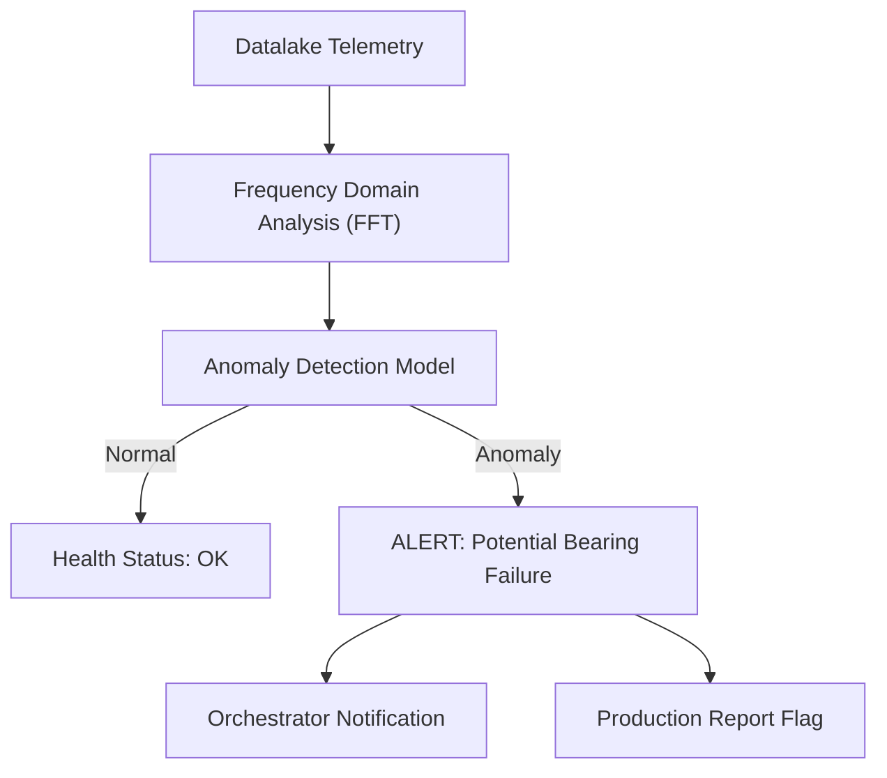

<p align="center">
  
</p>

# 🔍 HYDRA-UMC-ANOMALY-DETECTOR

<p align="center"><a href="README.md">🇺🇸 English</a> | <a href="README_spa.md">🇪🇸 Español</a> | <a href="README_fra.md">🇫🇷 Français</a> | <a href="README_ita.md">🇮🇹 Italiano</a> | <a href="README_deu.md">🇩🇪 Deutsch</a> | 🇨🇳 <b>简体中文</b> | <a href="README_jpn.md">🇯🇵 日本語</a></p>

### 🧠 AI 驱动的预测性维护与电机振动分析

<p align="left">
  
  
  
</p>

---

## 1. 🛠️ 技术概述

**HYDRA-UMC-ANOMALY-DETECTOR** 是机器人健康状态的主动守护者。它使用 AI
模型分析高频遥测数据（振动、电机电流特征和热剖面），在故障发生之前
检测出来。

通过监控每个电机和刀头的"数字指纹"，它能够提前数周识别出轴承磨损、
皮带松动或散热故障，从而实现计划性维护而非紧急抢修。

### 关键特性：
* 🔍 **特征分析：** 对电机电流进行实时 FFT（快速傅里叶变换）以检测机械不平衡。
* 📉 **预测性维护：** AI 驱动的 RUL（剩余使用寿命）估算，适用于 NEMA 电机和 URTC 工具。
* 🚨 **早期预警系统：** 当出现异常模式时，在 Studio 和 Watch 界面触发告警。
* 🧬 **学习模型：** 通过从数据湖的历史数据中学习，持续提升检测精度。
* 🏷️ **模型版本管理：** 每个 `Verdict` 都携带真实的、单调递增的模型版本以及对其评分所依据的阈值——一次重新拟合（refit）是一个真实的、可追溯的事件。*(已实现)*
* 📐 **精确率/召回率指标：** 基于标注测试样本（`metrics.py`）计算得到的真实 precision/recall/F1，而非仅是关于分数分离度的文字描述。*(已实现)*
* 📈 **模拟漂移检测：** `DriftMonitor` 标记出真实的、持续的滚动均值抬升，这与任何单一窗口自身的异常标记不同。*(已实现)*

---

## 2. 🔄 检测流水线



---

## 3. 🧱 架构与设计决策

* **为何这是 HYDRA-UMC-DATALAKE 的兄弟项目，而非子模块。** 异常检测是针对已存储遥测数据的只读分析工作负载——将其保持独立，意味着检测器崩溃或缓慢的模型推理永远不会阻塞 HYDRA-UMC-TELEMETRY-COLLECTOR 向同一存储的写入操作。
* **为何今天是 FFT + 统计基线，而非训练好的神经网络。** README 称之为“AI 驱动”——在这第一阶段真实且已经运行的，是一种真正的信号处理技术（`src/hydra_umc_anomaly_detector/fft.py`，numpy 自带的 FFT）加上从已知健康窗口学习得到的、按频率 bin 划分的统计基线（`baseline.py`），以及一个 max-z-score 判定（`detector.py`）——而不是一个训练好的深度学习模型。它是可用的，已针对真实的合成故障特征进行了测试，也是日后在其之上构建学习模型的正确基础（见 `mejoras_futuras.txt`）——但在这里称其为神经网络会夸大实际运行的内容。
* **为何是所有 bin 上的 max-z-score，而非固定阈值。** 固定阈值（“电机温度 > 80°C”）会漏检渐进式漂移，并对合理的负载峰值产生误报——将实时频谱的每个 bin 与这台具体电机自身学习到的健康基线进行比较，可以检测出一个新的/偏移的频率峰值（真实的轴承缺陷特征），而不会出现这两种失败模式中的任何一种。默认阈值（10.0）是根据真实的经验分离结果选定的，而非凭空猜测——具体数字见 `detector.py` 自身文档字符串中本项目健康-vs-故障合成测试样本的实测数据。
* **这如何融入生态系统的其余部分。** 作为 HYDRA-UMC-DATALAKE 下的同级服务——对 HYDRA-UMC-TELEMETRY-COLLECTOR 已写入其中的遥测数据运行异常检测。
* **为何 `DriftMonitor` 是与 `AnomalyDetector.score()` 相互独立的机制，而非一个更大的阈值。** 二者回答的是不同的真实问题：“这个窗口是否异常”（一次性判定）与“最近的平均值是否已惄然偏移”（一种滚动趋势，对单个噪声异常窗口具有鲁棒性）。一次真实的模拟漂移测试发现并如实记录了：对于该检测器的 max-z-score 设计，面对一种新频率类型的故障，单一窗口自身的标记实际上会*先于*滚动漂移信号触发——`DriftMonitor` 在此的真实价值在于对持续趋势的确认，而非更早的预警，代码本身也是这样说明的，而不是夸大其词。
* **为何 `metrics.py` 计算 precision/recall，而不是把阈值质量留作文字描述。** `detector.py` 自身的文档字符串过去只声称“健康样本得分最高约 5.3，故障样本得分为数百”——是真实的，但不是一个未来重新调优时可以据以做回归测试的数字。`precision_recall()` 基于同一个真实测试样本给出了一个真实的、可核验的数值（目前为 1.0/1.0）。

---

## 📂 目录结构

纯软件服务（机器学习/分析）——没有自己的硬件/固件/操作系统，已从模板中
省略，遵循仓库结构策略）。

```text
HYDRA-UMC-ANOMALY-DETECTOR/
├── src/hydra_umc_anomaly_detector/  # 源代码
│   ├── __init__.py                  # 包版本
│   ├── fft.py                       # 基于真实 FFT 的频谱（numpy）
│   ├── baseline.py                  # 按 bin 划分的健康统计画像（均值/标准差）
│   ├── detector.py                  # 拟合一个 Baseline，对实时窗口打分
│   ├── metrics.py                   # 基于标注测试样本的真实 precision/recall/F1
│   ├── drift.py                     # 真实的滚动均值漂移检测
│   ├── api.py                        # 封装 detector 的简单 JSON/HTTP 处理器
│   └── main.py                       # 入口点：连接一切，启动 HTTP 服务器
├── tests/                   # pytest——FFT 正确性、baseline 统计、真实故障检测、指标、模拟漂移
├── docs/
│   └── API.md               # 真实的 HTTP 端点参考（请求、响应、状态码）
├── build/                   # 构建输出（已被 gitignore）
├── pyproject.toml           # 包元数据、版本、依赖项（numpy）
├── bump_version.py          # 里程表式版本递增（由构建运行）
├── build.sh / build.bat     # 真实构建：venv + 可编辑安装 + 版本递增 + 测试
├── run.sh / run.bat         # 真实运行：启动 HTTP API
└── README.md
```

从原始模板中省略：`hardware/`、`firmware/`、`os/`、
`images/` 和 `scripts/`——这是一个纯软件服务（Python 包），没有专属
硬件或固件，没有需要维护的操作系统镜像，目前也还没有足够多的媒体/
实用脚本内容值得为它们单独建立文件夹。完整的 HTTP 端点参考见
[`docs/API.md`](docs/API.md)。

---

## 4. ⚙️ 构建与运行

需要 Python >= 3.10。一个真正基于 FFT 的异常检测，带有 HTTP API，
而不只是一个能导入的骨架。

```bash
# Linux/macOS
./build.sh
./run.sh --port 8097

# Windows
build.bat
run.bat --port 8097
```

`build` 创建/激活本地 `.venv`，以可编辑模式（含 dev 附加项，包括
`numpy`）安装该包，验证导入，并运行真实的测试套件（`pytest`）。`run`
启动 HTTP API，并转发任何标志（`--addr`、`--port`、`--sample-rate`、
`--threshold`）。

```bash
# 针对已知健康的信号窗口进行校准（浮点数的 JSON 数组，与 --sample-rate 相同的采样率）
curl -X POST localhost:8097/baseline/fit -d '{"windows": [[...], [...], ...]}'

# 对一个实时窗口按已拟合的 baseline 打分
curl -X POST localhost:8097/detect -d '{"window": [...]}'
# -> {"score": 6.3, "anomalous": false, "worstBinFreqHz": 276.0}

curl localhost:8097/stats
```

```bash
python -m pytest tests/ -v   # fft.py（正确找到已知正弦波的峰值频率，
                              # DC 被真正丢弃）、baseline.py（均值/标准差
                              # 正确，零标准差下限防止真实的除零错误）、
                              # detector.py（真正的承诺：合成故障信号被
                              # 标记，看似健康的信号不被标记，具有真实的
                              # 分离余量，而非临界阈值），以及 api.py
                              # （通过真实的 ThreadingHTTPServer 的真实
                              # HTTP 往返测试）
```

---

## 🚀 路线图
* **第一阶段：** 数据湖的高吞吐量摄取和索引，用于历史分析。
* **第二阶段：** 遥测采集器的边缘压缩和安全传输协议。
* **第三阶段：** 使用无监督学习和电机振动分析进行异常检测。
* **第四阶段：** 集成声学分析以"听出"早期机械问题，以及 AI 驱动的预测性洞察。

---

## 🔗 相关项目

本项目是同一作者（JuanenRac / Electro Hobby 3D）打造的更大规模机器人生态
系统的一部分，涵盖固件、控制软件、AI 节点和车队工具。值得了解，因为某个
需求实际上可能是关于这些项目之一，而非本仓库。

### 项目族

**父项目：** **[HYDRA-UMC-DATALAKE](https://github.com/JuanenRac/HYDRA-UMC-DATALAKE)** —— 本检测器所分析其存储遥测数据的集成父项目。

**同族项目：**
- **[HYDRA-UMC-TELEMETRY-COLLECTOR](https://github.com/JuanenRac/HYDRA-UMC-TELEMETRY-COLLECTOR)** —— 同级分析服务，同一父项目。
- **[HYDRA-UMC-PRODUCTION-REPORTS](https://github.com/JuanenRac/HYDRA-UMC-PRODUCTION-REPORTS)** —— 同级分析服务，同一父项目。

### 直接相关（项目族之外）

本项目在 数据与分析 系列之外没有直接关联的项目（根据生态系统自身
的关系图谱）——其余所有内容请见下方"生态系统的其余部分"。

### 生态系统的其余部分

**HYDRA-UMC 平台** —— 多机器人微工厂单元
- **[HYDRA-UMC](https://github.com/JuanenRac/HYDRA-UMC)** —— 协调最多 8 条机械臂的 CM5 + STM32H745 主板。
- **[HYDRA-UMC-SERVER](https://github.com/JuanenRac/HYDRA-UMC-SERVER)** —— 每个控制客户端所对接的 Express/WebSocket 后端。
- **[HYDRA-UMC-STUDIO](https://github.com/JuanenRac/HYDRA-UMC-STUDIO)** —— 基于 Web 的控制仪表盘，多机器人 3D 可视化。
- **[HYDRA-UMC-ANDROID-CONTROL](https://github.com/JuanenRac/HYDRA-UMC-ANDROID-CONTROL)** —— 通过 Wi-Fi/蓝牙的 Android 控制应用。
- **[HYDRA-UMC-IOS-CONTROL](https://github.com/JuanenRac/HYDRA-UMC-IOS-CONTROL)** —— 基于 Flutter 构建的 iOS/iPadOS 控制应用。
- **[HYDRA-UMC-SUITE](https://github.com/JuanenRac/HYDRA-UMC-SUITE)** —— 桌面端集群指挥中心（Python/PySide6）。
- **[HYDRA-UMC-EDITOR-URDF](https://github.com/JuanenRac/HYDRA-UMC-EDITOR-URDF)** —— 用于机器人目录的桌面端 URDF 模型编辑器。
- **[HYDRA-UMC-DSI](https://github.com/JuanenRac/HYDRA-UMC-DSI)** —— 机载 DSI 触摸屏的原生触控 UI。

**URTC 平台** —— 每台 HYDRA-UMC 机械臂搭载的工具头控制器
- **[URTC](https://github.com/JuanenRac/URTC)** —— CAN 总线工具头控制器，25 种工具配置。
- **[URTC-FLASHER](https://github.com/JuanenRac/URTC-FLASHER)** —— 桌面端 CAN-OTA + SWD/JTAG 刷写工具。
- **[URTC-TESTER](https://github.com/JuanenRac/URTC-TESTER)** —— 桌面端实时 CAN 总线诊断工具。
- **[URTC-WEB-STUDIO](https://github.com/JuanenRac/URTC-WEB-STUDIO)** —— 通过 Web Serial API 的浏览器端替代方案。

**🎥 视觉 AI 节点（Hailo-8）**
- [HYDRA-UMC-VISION-NODE](https://github.com/JuanenRac/HYDRA-UMC-VISION-NODE)
- [HYDRA-UMC-VISION-STREAMER](https://github.com/JuanenRac/HYDRA-UMC-VISION-STREAMER)
- [HYDRA-UMC-DETECTION-HEF](https://github.com/JuanenRac/HYDRA-UMC-DETECTION-HEF)
- [HYDRA-UMC-SAFETY-ZONES](https://github.com/JuanenRac/HYDRA-UMC-SAFETY-ZONES)
- [HYDRA-UMC-VISUAL-SERVOING-API](https://github.com/JuanenRac/HYDRA-UMC-VISUAL-SERVOING-API)

**🧠 认知 AI 节点（Hailo-10）**
- [HYDRA-UMC-COGNITIVE-NODE](https://github.com/JuanenRac/HYDRA-UMC-COGNITIVE-NODE)
- [HYDRA-UMC-VLA-ENGINE](https://github.com/JuanenRac/HYDRA-UMC-VLA-ENGINE)
- [HYDRA-UMC-VOICE-UI](https://github.com/JuanenRac/HYDRA-UMC-VOICE-UI)
- [HYDRA-UMC-SEMANTIC-PLANNER](https://github.com/JuanenRac/HYDRA-UMC-SEMANTIC-PLANNER)
- [HYDRA-UMC-DOCS-QA](https://github.com/JuanenRac/HYDRA-UMC-DOCS-QA)

**🐝 编排与集群**
- [HYDRA-UMC-ORCHESTRATOR](https://github.com/JuanenRac/HYDRA-UMC-ORCHESTRATOR)
- [HYDRA-UMC-SWARM-SYNC](https://github.com/JuanenRac/HYDRA-UMC-SWARM-SYNC)
- [HYDRA-UMC-PATH-PLANNER-3D](https://github.com/JuanenRac/HYDRA-UMC-PATH-PLANNER-3D)
- [HYDRA-UMC-JOB-DISPATCHER](https://github.com/JuanenRac/HYDRA-UMC-JOB-DISPATCHER)
- [HYDRA-UMC-NODE-HEALING](https://github.com/JuanenRac/HYDRA-UMC-NODE-HEALING)

**🎮 数字孪生与仿真**
- [HYDRA-UMC-TWIN](https://github.com/JuanenRac/HYDRA-UMC-TWIN)
- [HYDRA-UMC-PHYSICS-REPLICA](https://github.com/JuanenRac/HYDRA-UMC-PHYSICS-REPLICA)
- [HYDRA-UMC-HIL-BRIDGE](https://github.com/JuanenRac/HYDRA-UMC-HIL-BRIDGE)
- [HYDRA-UMC-SYNTHETIC-DATA-GEN](https://github.com/JuanenRac/HYDRA-UMC-SYNTHETIC-DATA-GEN)

**🏭 工业网关**
- [HYDRA-UMC-GATEWAY-INDUSTRIAL](https://github.com/JuanenRac/HYDRA-UMC-GATEWAY-INDUSTRIAL)
- [HYDRA-UMC-OPCUA-SERVER](https://github.com/JuanenRac/HYDRA-UMC-OPCUA-SERVER)
- [HYDRA-UMC-MQTT-BROKER](https://github.com/JuanenRac/HYDRA-UMC-MQTT-BROKER)
- [HYDRA-UMC-MTCONNECT-ADAPTER](https://github.com/JuanenRac/HYDRA-UMC-MTCONNECT-ADAPTER)

**🛠️ 配套工具**
- [URTC-SMART-RACK](https://github.com/JuanenRac/URTC-SMART-RACK)
- [URTC-VISION-TOOL](https://github.com/JuanenRac/URTC-VISION-TOOL)
- [HYDRA-UMC-WATCH](https://github.com/JuanenRac/HYDRA-UMC-WATCH)
- [HYDRA-UMC-TOOL-CLI](https://github.com/JuanenRac/HYDRA-UMC-TOOL-CLI)
- [HYDRA-UMC-DASHBOARD-AI](https://github.com/JuanenRac/HYDRA-UMC-DASHBOARD-AI)


## 👤 作者
**JuanenRac**（Electro Hobby 3D）
📧 electrohobby3d@gmail.com

## 📜 许可证
GPL-3.0 —— 详见 LICENSE。
